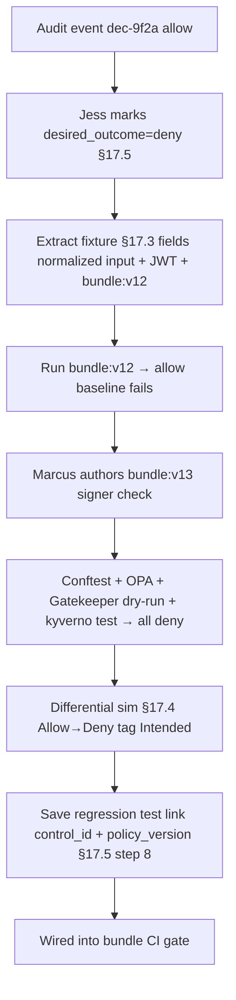

# DT-51 — Create regression test from an audit event (intended behavior test)

**Personas:** Marcus (Platform Security Engineer), Jess (SRE / Cluster Operator)
**Spec sections:** §17.5 Policy Authoring Test Cases from Audit Logs, §17.2 Intended Behavior Test, §17.3 Audit-Driven Simulation Requirements, §17.4 Differential Simulation Semantics
**Type:** Mid-level
**Pre-condition:** Control `SC-IMG-001` is enforced via Gatekeeper + OPA on `bundle:v12`. Audit event `dec-9f2a…` (Deployment in `payments-prod`) was `allow` because the policy did not check signer identity. Jess flagged it in the Audit Correlation View as "should have been blocked."
**Trigger:** Jess opens the audit event and clicks "Create test case from event" in the GUI.

## Steps
1. Jess selects audit row `dec-9f2a…`, marks `desired_outcome=deny`, reason "signer not in approved set" (§17.5 step 2).
2. Platform extracts §17.3 fields — normalized input, JWT claims, `policy_bundle_version=bundle:v12`, `control_id=SC-IMG-001`, `external_data_refs=signer-allowlist:v3`, `replay_completeness=complete` — and materializes a `PolicyTestFixture` keyed off `decision_id` (§17.5 step 3). Fixture is scoped to `payments-prod` per §17A.5.
3. Baseline run: `bundle:v12` returns `allow` ≠ `desired_outcome=deny` — test fails as expected (§17.5 step 6).
4. Marcus opens the fixture in the Rego Explorer, authors `bundle:v13` adding `signer in approved_signers`, commits as draft (§17.5 step 4).
5. Platform runs §17.5 step 5 suite: Conftest CLI, offline OPA eval, Gatekeeper dry-run replay, and `kyverno test` for the parallel image-verification rule. All four return `deny` naming `SC-IMG-001`.
6. Marcus runs §17.4 differential simulation `bundle:v12`→`bundle:v13` over 30 days of `payments-prod` events. Target event flips Allow→Deny ("Newly blocked"); Marcus tags `Intended enforcement`.
7. Fixture is persisted as a regression test linked to `control_id=SC-IMG-001` and `policy_version=bundle:v13`, recording `created_from_event=dec-9f2a…`, `desired_outcome=deny`, `author=jess`, `policy_author=marcus` (§17.5 steps 7–8).
8. Test is wired into bundle CI; future promotions against `SC-IMG-001` must satisfy it.

## Success criteria (testable)
- Fixture is extracted from the audit event with all §17.3 fields and `replay_completeness=complete`; if any required field is missing, the result is marked incomplete (§17.3) and the fixture is rejected.
- Pre-patch run: `bundle:v12` returns `allow` (the failing baseline). Post-patch run: `bundle:v13` returns `deny` across Conftest, OPA, Gatekeeper dry-run, and `kyverno test`.
- Differential simulation classifies the target `decision_id` as "Newly blocked" and accepts the `Intended enforcement` tag (§17.4).
- The saved regression test stores `control_id`, `policy_version`, `desired_outcome`, and the source `decision_id`, and is retrievable by all three keys (§17.5 step 8).
- Subsequent CI run of `bundle:v13` reruns the fixture and passes; a hypothetical `bundle:v14` that drops the signer check fails CI on this fixture.

## Flowchart

## Notes
Related: HL-03 (incident → regression loop), DT-25 (`replay_completeness`), DT-52 (false-positive companion). Fixtures inherit the source event's scope metadata (§17A.5) so cross-namespace replay is blocked.
