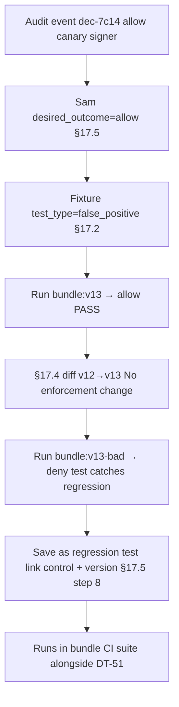

# DT-52 — False positive test confirms a previously-supported pattern still works

**Personas:** Marcus (Platform Security Engineer), Sam (Application Developer)
**Spec sections:** §17.2 False Positive Test, §17.4 Differential Simulation Semantics (Allow→Allow, Allow→Deny tagging), §17.5 Policy Authoring Test Cases from Audit Logs
**Type:** Low-level
**Pre-condition:** Marcus has just authored `bundle:v13` adding signer-identity enforcement for `SC-IMG-001` (see DT-51). Sam's team-payments canary deploy in `payments-dev` is a known-good historical pattern: it uses the approved `team-payments-canary` signer and was correctly allowed by `bundle:v12`. The audit event is `decision_id=dec-7c14…`, outcome `allow`, `replay_completeness=complete`.
**Trigger:** Sam supplies the canary deploy event to Marcus in the policy review with the assertion "this must keep working."

## Steps
1. In the §17.5 GUI, Sam selects `dec-7c14…` and marks `desired_outcome=allow` with reason "approved canary signer; must not regress." The platform extracts the §17.3 fixture (normalized input, JWT claims with `groups=team-payments`, `external_data_refs=signer-allowlist:v3`).
2. Marcus opens the fixture, tags it `test_type=false_positive` per §17.2, and links it to `control_id=SC-IMG-001`.
3. The platform runs `bundle:v13` against the fixture via Conftest and offline OPA eval; both return `outcome=allow`, matching `desired_outcome` — the false-positive test passes.
4. The platform runs the same fixture against `bundle:v12` for the §17.4 differential row: previous=Allow, new=Allow → classification "No enforcement change." Marcus accepts the default tag (no action needed).
5. To prove the test is meaningful, Marcus runs it against a deliberately broken `bundle:v13-bad` that allowlists only `team-platform-canary`. The fixture flips Allow→Deny ("Newly blocked"); Marcus tags it `Potential false positive` (§17.4) and confirms the test would have caught the regression. The bad bundle is discarded.
6. The fixture is saved as a regression test (§17.5 steps 7–8) with `test_type=false_positive`, `desired_outcome=allow`, `control_id=SC-IMG-001`, `policy_version=bundle:v13`, `source_event=dec-7c14…`, `submitted_by=sam`, `owner=marcus`. It is added alongside the DT-51 intended-behavior test in the bundle's CI suite.

## Success criteria (testable)
- `bundle:v13` evaluation of the fixture returns `outcome=allow`, equal to `desired_outcome=allow` (§17.2 pass condition).
- §17.4 differential classification of `bundle:v12` vs `bundle:v13` over this fixture is "No enforcement change."
- A counterfactual broken bundle that removes the `team-payments-canary` signer causes the test to fail with classification "Newly blocked" / `Potential false positive`.
- Saved regression test carries `test_type=false_positive`, is keyed to `control_id` and `policy_version`, and shows up in the bundle CI suite alongside intended-behavior tests.
- The fixture is scope-tagged to `payments-dev` per §17A.5 and is not retrievable by users outside `payments-*` scope.

## Flowchart

## Notes
Pairs with DT-51: every Allow→Deny intended-enforcement test should have at least one false-positive counterpart per §17.1 ("does not block supported behavior"). Sam can submit fixtures but cannot author policy; the `owner` field reflects that split.
