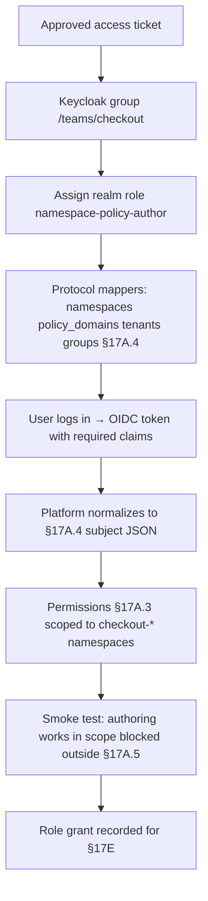

# DT-53 — Grant Namespace Policy Author role to a new app team via Keycloak

**Personas:** Marcus (Platform Security Engineer)
**Spec sections:** §17A.2 Role Model (Namespace Policy Author), §17A.3 Permission Primitives, §17A.4 Keycloak Integration (required claims), §17A.1 (GUI/API + storage enforcement)
**Type:** Low-level
**Pre-condition:** Keycloak realm `platform` is the IdP for the Governance Console. The platform reads the normalized §17A.4 subject. Team `team-checkout` owns namespaces `checkout-prod` and `checkout-dev` in tenant `checkout`, domain `runtime-security`.
**Trigger:** Marcus receives an approved ticket: "Grant team-checkout the Namespace Policy Author role."

## Steps
1. Marcus creates Keycloak group `/teams/checkout` and syncs the team's users from the corporate IdP.
2. Marcus assigns realm role `namespace-policy-author` to `/teams/checkout` so it appears in `realm_access.roles` (§17A.4).
3. Marcus configures three protocol mappers on the platform client: a hardcoded mapper sets `namespaces=["checkout-prod","checkout-dev"]` and `tenants=["checkout"]`; an attribute mapper sets `policy_domains=["runtime-security"]`; the group mapper emits `groups=["/teams/checkout"]` (§17A.4 required claims).
4. A team-checkout developer logs in. The OIDC token carries `sub`, `preferred_username`, `email`, `groups`, `realm_access.roles=[…,"namespace-policy-author"]`, `namespaces`, `policy_domains`, `tenants`.
5. The platform normalizes the token into the §17A.4 subject JSON with `roles=["namespace-policy-author"]` and the scope claims above.
6. Marcus verifies in "My Access" that the user has `policy:view`, `policy:edit`, `policy:test`, `policy:simulate` (§17A.3) on those namespaces and lacks `policy:promote-enforce` globally.
7. Smoke test: the user opens the Namespace Authoring View, drafts a policy in `checkout-dev`, runs Namespace Simulation — both succeed. A read attempt on `payments-prod` is denied at both API and storage layers (§17A.1, §17A.5).
8. Marcus records the grant in the audit trail (subject, role, scope, granted_by, ticket ref) for §17E reporting.

## Success criteria (testable)
- A team-checkout user's access token contains all §17A.4 required claims, with `namespaces` and `policy_domains` set as specified.
- The normalized subject seen by the platform matches the §17A.4 example shape, with `roles` including `namespace-policy-author`.
- The user can author, test, and simulate policies in `checkout-prod`/`checkout-dev`; the user cannot in any other namespace (verified via both GUI and direct API call).
- A direct storage-layer query for objects outside `checkout-*` returns empty/403 (§17A.5), confirming the scope is enforced below the GUI.
- The role grant is auditable: subject, role, scope, granted_by, and timestamp are persisted.

## Flowchart

## Notes
Related: HL-04 (developer onboarding), HL-16 (Keycloak claim evolution), DT-55 (storage-scope penetration test). If `namespaces` claim is missing, the platform must treat the subject as having zero namespace scope, not "all."
