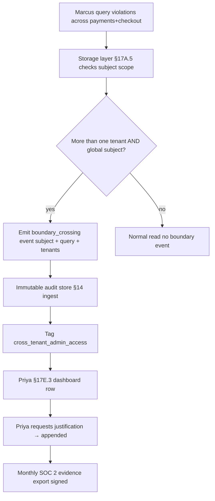

# DT-54 — Audit a global admin's cross-tenant boundary crossing

**Personas:** Priya (Compliance & GRC Lead), Marcus (Platform Security Engineer)
**Spec sections:** §17A.5 (admins auditable when crossing tenant boundaries), §17A.2 Platform Governance Admin, §17A.1, §14, §17E.3
**Type:** Mid-level
**Pre-condition:** Marcus holds `platform-governance-admin` (§17A.2), globally scoped. Tenants `payments` and `checkout` have disjoint namespace/policy-domain scopes; every stored object carries §17A.5 authorization metadata. Priya has read-only Compliance Analyst across all tenants.
**Trigger:** During incident investigation Marcus runs an ad-hoc Console query for violations across both tenants in the last 24h.

## Steps
1. Marcus issues `violations where tenant in ["payments","checkout"] and ts > now-24h`. The §17A.5 storage layer checks the query's tenant set against Marcus's subject scope (`tenants=["*"]`) and accepts the read.
2. Because the query spans >1 tenant and the subject is globally scoped, storage emits a `boundary_crossing` audit event: `subject_id`, `username=marcus`, `roles=["platform-governance-admin"]`, the literal query, `accessed_tenants=["payments","checkout"]`, `accessed_namespaces`, `object_types=["violation"]`, `result_count`, `correlation_id`, timestamp, `justification=null`.
3. The §14 analytics engine ingests the event, tags it `cross_tenant_admin_access`, and writes it to the immutable audit store with policy-decision retention.
4. Priya's compliance dashboard (§17E.3) shows a row under "Cross-tenant administrative access — last 24h" with subject, role, tenants, query, result count, and a link to the audit event.
5. Priya sees no linked ticket and asks Marcus for an incident ID. Marcus supplies it; the platform appends it as a post-hoc `justification` without rewriting the original record (the append is itself audited).
6. Priya exports the month's `cross_tenant_admin_access` events for SOC 2 evidence (§17E.3). Each row carries subject, tenants, query, timestamp, justification, and a signature over the immutable record.
7. A deterministic alert fires if `cross_tenant_admin_access` per admin per day exceeds threshold; Marcus's single query stays under.

## Success criteria (testable)
- Any storage-layer read whose tenant set is a strict superset of one tenant, performed by a global-scoped subject, produces exactly one `boundary_crossing` audit event with all fields named in step 2.
- The event is immutable: attempts to modify subject, query, or tenant list after write are rejected; only the `justification` field can be appended post-hoc, and appends are themselves audited.
- Priya's dashboard surfaces the event within one analytics reconciliation interval and links to the original record by `correlation_id`.
- The exported SOC 2 evidence row carries subject, accessed tenants, query, timestamp, justification, and a signature/hash that verifies against the stored record.
- A non-admin subject attempting the same multi-tenant query is denied at the storage layer (§17A.5) and no `boundary_crossing` event is written — they get an authorization-denied event instead.

## Flowchart

## Notes
Related: HL-13 (cross-tenant access detected), DT-55 (storage-scope enforcement for non-admins). The platform deliberately permits the read but always records it; "auditable" in §17A.5 means observable, not blocked.
