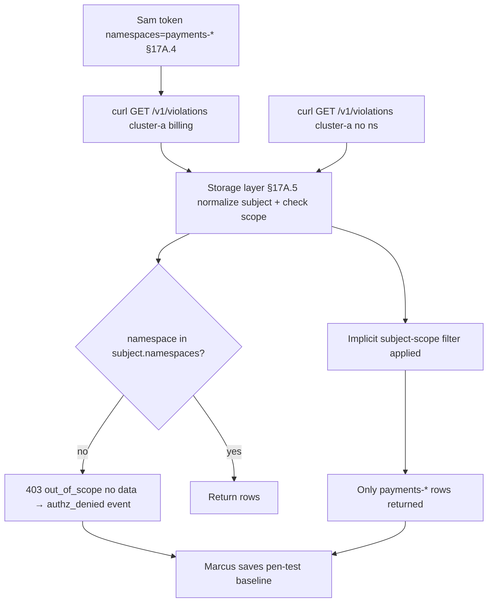

# DT-55 — Verify storage-layer scope enforcement against a Namespace Policy Author

**Personas:** Marcus (Platform Security Engineer), Sam (Application Developer, acting in penetration-test role)
**Spec sections:** §17A.5 (queries filtered by subject scope; no out-of-scope retrieval), §17A.1 ("GUI-only authorization is insufficient"), §17A.2, §17A.4
**Type:** Mid-level
**Pre-condition:** Sam holds `namespace-policy-author` on `payments-prod` and `payments-dev` only (`tenants=["payments"]`, `policy_domains=["runtime-security"]`). The storage layer stamps every object with §17A.5 metadata (`cluster`, `namespaces`, `policy_domains`, `control_ids`, `tenant`, `visibility`). A `billing` namespace exists in `cluster-a` under tenant `treasury` with violations Sam must not see.
**Trigger:** Marcus runs a scheduled storage-API pen-test using Sam's token to confirm authz holds when the GUI is bypassed.

## Steps
1. Marcus obtains a fresh OIDC token for Sam; it carries `roles=["namespace-policy-author"]`, `namespaces=["payments-prod","payments-dev"]`, `tenants=["payments"]` (§17A.4).
2. Marcus calls storage directly via `curl`, bypassing the Console: `GET /v1/violations?cluster=cluster-a&namespace=billing`.
3. Storage normalizes the subject (§17A.4), evaluates query vs scope (§17A.5), and returns `403` `{"error":"out_of_scope","requested":{"cluster":"cluster-a","namespace":"billing"},"subject_namespaces":["payments-prod","payments-dev"]}`. No rows returned.
4. Broader query without namespace filter: `GET /v1/violations?cluster=cluster-a`. Storage applies subject scope as an implicit filter (§17A.5) and returns only `payments-*` rows; counts and pagination cursors are computed from the filtered set.
5. Marcus probes `/v1/policies`, `/v1/simulations`, `/v1/audit-fixtures`, `/v1/policy-bundles`. Out-of-scope namespaces return 403; unfiltered queries return only in-scope rows. Bundles whose scope metadata names a non-`payments` domain are excluded (§17A.5).
6. Marcus opens the Console as Sam and confirms that even a modified Console issuing the same `billing` query is rejected at the storage layer — proving §17A.1 ("GUI-only authorization is insufficient").
7. Every denied request emits an `authz_denied` event with `subject_id`, requested scope, denying-rule ref, and `correlation_id`. Marcus saves the run as a pen-test baseline linked to the §14 drift detector.

## Success criteria (testable)
- Direct storage-API call for `cluster=cluster-a, namespace=billing` with Sam's token returns 403 with no row data.
- Unfiltered queries against `violations`, `policies`, `simulations`, `audit-fixtures`, and `policy-bundles` return only objects whose scope metadata intersects Sam's `namespaces`/`tenants`/`policy_domains` (§17A.5).
- No response body, error message, or pagination cursor leaks the existence of out-of-scope rows (count and cursor reflect the filtered set).
- Each denied request produces an `authz_denied` audit event with subject, requested scope, and correlation ID.
- The same denials occur whether the request comes from the Console, `curl`, a CI job, or a custom MCP client — confirming the §17A.1 storage-layer invariant.

## Flowchart

## Notes
Related: HL-13 (cross-tenant detection), DT-53 (granting the role), DT-54 (admin boundary crossing). The pen-test should be re-run on every storage-layer release; a regression here is a §17A.1 violation.
