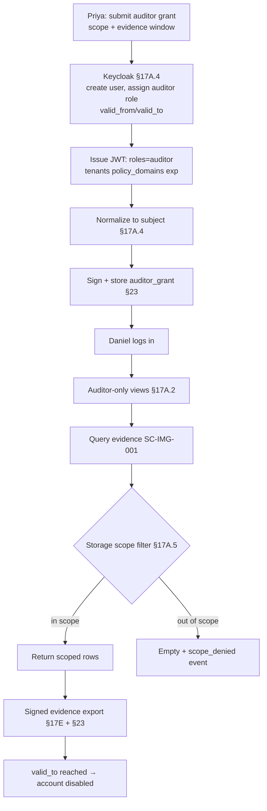

# DT-56 — Onboard an external Auditor with read-only scoped access

**Personas:** Priya (Compliance & GRC Lead), Daniel (External Auditor)
**Spec sections:** §17A.2 Role Model (Auditor), §17A.4 Keycloak Integration, §17A.5 Storage-Level Access Controls, §23.1 Evidence integrity
**Type:** Low-level
**Pre-condition:** SOC 2 Type II engagement is scoped to audit period `2026-01-01..2026-03-31` and to `tenant=payments`, `policy_domains=[supply-chain,runtime-security]`, `control_ids=[SC-IMG-001, DEPLOY-APPROVAL-001]`. The Keycloak realm has an `auditor` realm role mapped to platform role `Auditor` (§17A.2). Stored objects carry §17A.5 authorization metadata. Daniel has accepted the engagement and provided an email.
**Trigger:** Priya files a "provision auditor" request in the Governance Console with Daniel's identity and the engagement scope.

## Steps
1. Priya opens the Auditor Onboarding form (§16.3) and submits: `username=daniel.ext`, `email=daniel@auditfirm.example`, `roles=[auditor]`, `tenants=[payments]`, `policy_domains=[supply-chain,runtime-security]`, `valid_from=2026-04-01T00:00:00Z`, `valid_to=2026-05-15T23:59:59Z`, `evidence_window=2026-01-01..2026-03-31`.
2. The platform's Keycloak integration (§17A.4) creates the user, assigns the `auditor` realm role, and writes claims `realm_access.roles=[auditor]`, `tenants=[payments]`, `policy_domains=[supply-chain,runtime-security]`. Token lifetime and account `enabled` window track `valid_from`/`valid_to`.
3. The platform normalizes the Keycloak claims into the §17A.4 internal subject and stores an immutable `auditor_grant` record (engagement id, scope, evidence window, granted_by=Priya) signed for §23 evidence integrity.
4. Daniel logs in; the GUI presents only `Auditor` views (immutable reports, evidence sets, replay results). Authoring, simulation-write, and approval surfaces are hidden because `report:view`, `violation:view`, `audit:replay` are the only permissions issued (§17A.3).
5. Daniel queries evidence for `SC-IMG-001`. The storage layer (§17A.5) filters every result by his subject scope: `tenant=payments`, `policy_domains⊇{supply-chain}`, and timestamps in the evidence window. A probe against `tenant=hr` returns empty with an audited `scope_denied` event — not a 403 leak.
6. Daniel exports the §17E.3 Audit-Derived Violation Report and a signed evidence package. The export records `exported_by=daniel.ext`, `subject_scope`, content hash, and signer identity; the §23 chain remains verifiable to him as an independent party.
7. On `2026-05-15T23:59:59Z` Keycloak disables the account; subsequent token refresh fails; storage queries from any cached token are rejected because the `auditor_grant` is expired. The grant record remains in the audit log permanently.

## Success criteria (testable)
- Daniel's Keycloak token carries `roles=[auditor]`, `tenants=[payments]`, `policy_domains=[supply-chain,runtime-security]`, and `exp` not exceeding `valid_to`.
- Storage queries for objects outside Daniel's tenant or policy domain return zero rows and emit a `scope_denied` audit event (§17A.5).
- Evidence retrieval is filtered to `timestamp ∈ [2026-01-01, 2026-03-31]`; out-of-window objects are not returned.
- Exported evidence package is signed; its hash and signer are recorded in the §23 evidence chain and re-verifiable after the engagement ends.
- After `valid_to`, every API request authenticated as `daniel.ext` is denied; the historical `auditor_grant` record remains queryable by Priya.

## Flowchart

## Notes
Storage-side enforcement is mandatory; GUI hiding alone is insufficient (§17A.5). The `auditor_grant` survives account deletion so the engagement is reconstructable.
