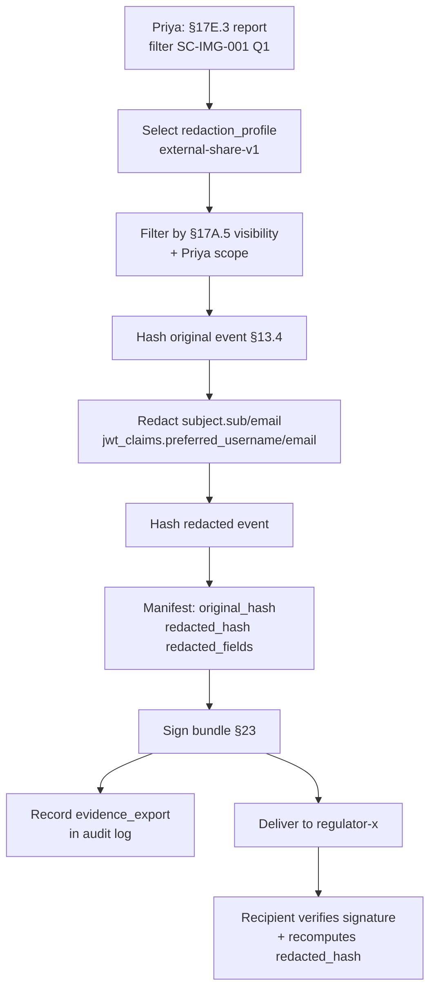

# DT-57 — Compliance Analyst exports an evidence set with redacted JWT subjects

**Personas:** Priya (Compliance & GRC Lead)
**Spec sections:** §17E.1–17E.3 Reporting, §13.3 Required Core Fields (subject, jwt_claims), §13.4 Example Replay-Capable Event, §17A.5 Visibility metadata, §23.1 Evidence integrity
**Type:** Mid-level
**Pre-condition:** Priya holds `Compliance Analyst` role (§17A.2) with `report:view` over `tenant=payments`. A redaction profile `external-share-v1` exists, declaring fields to redact: `subject.sub`, `subject.email`, `jwt_claims.preferred_username`, `jwt_claims.email`. The §14 engine stores §13.3-compliant events. An external regulator has requested Q1 2026 evidence for control `SC-IMG-001`.
**Trigger:** Priya initiates an export from the §17E.3 Audit-Derived Violation Report view, selecting `redaction_profile=external-share-v1` and recipient `regulator-x`.

## Steps
1. Priya filters the §17E.3 report to `control_id=SC-IMG-001`, `tenant=payments`, window `2026-01-01..2026-03-31` and clicks **Export for external party**.
2. The platform resolves the candidate evidence set against §17A.5 visibility metadata — only objects with `tenant=payments` and `visibility ∈ {tenant-scoped, global}` are eligible. Anything `namespace-scoped` outside her scope is omitted with a count surfaced to Priya.
3. For each event the exporter computes `original_hash = sha256(canonical_json(event))` and stores it in the export manifest before redaction (§23 tamper-evidence anchor).
4. The exporter applies `external-share-v1`: `subject.sub`, `subject.email`, `jwt_claims.preferred_username`, `jwt_claims.email` are replaced with `"<redacted>"`. Non-PII §13.3 fields (`event_id`, `timestamp`, `decision`, `policy_engine`, `policy_version`, `control_id`, `resource_id`, `correlation_id`, `outcome_reason`, `replay_completeness`) are preserved verbatim.
5. The exporter computes `redacted_hash = sha256(canonical_json(redacted_event))` and records both hashes per event: `{event_id, original_hash, redacted_hash, redacted_fields[]}`. A holder of the unredacted store can re-derive `redacted_hash` and confirm the redaction was field-scoped and lossless beyond the named fields.
6. The complete export bundle — redacted events + manifest + `redaction_profile=external-share-v1` reference + control mapping — is signed (§23) with the platform signing identity. `exported_by=priya`, `recipient=regulator-x`, and `export_id` are written to the immutable audit log.
7. Priya downloads the signed bundle and shares it with the regulator. The regulator independently verifies signature and, using the manifest, can verify that every redacted event's content (outside redacted fields) is unmodified.

## Success criteria (testable)
- Exported events contain no `sub`, `email`, or `preferred_username` values; those fields appear as `"<redacted>"`.
- For every exported event, both `original_hash` and `redacted_hash` appear in the manifest; recomputing `redacted_hash` from the redacted event reproduces the manifest value.
- The bundle is signed and its signature verifies with the platform's published key (§23).
- Objects outside Priya's §17A.5 scope are not included; the omitted count is shown in the export summary.
- An `evidence_export` event is recorded with `export_id`, `exported_by`, `recipient`, `redaction_profile`, and event count.
- A non-redacted §13.3 field (e.g., `policy_version`, `decision`, `correlation_id`) is byte-identical between source and exported event.

## Flowchart

## Notes
Redaction is field-scoped, not row-scoped: the §13.3 replay-relevant fields stay intact so the regulator can reason about decisions without identifying users. `correlation_id` is preserved because it is opaque.
