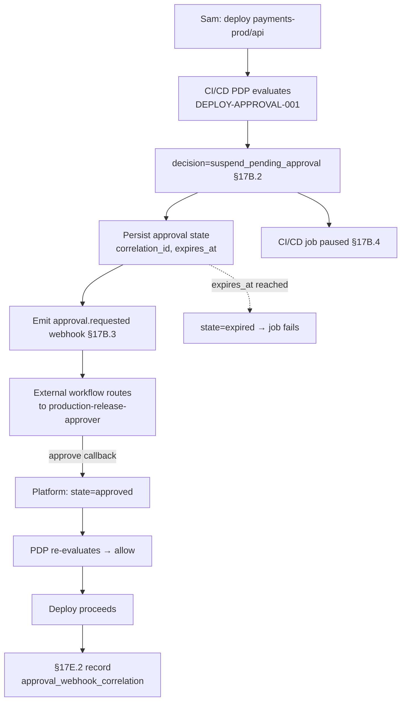

# DT-58 — `suspend_pending_approval` for a production deployment

**Personas:** Sam (Application Developer), Marcus (Platform Security Engineer)
**Spec sections:** §17B.1 Objective, §17B.2 Decision Outcomes, §17B.3 Workflow Webhook Integration, §17B.4 Suspend-Pending-Approval Behavior (CI/CD row), §17C.3 require_approval action
**Type:** Mid-level
**Pre-condition:** Control `DEPLOY-APPROVAL-001` is authored by Marcus and bound to a Rego rule that returns `decision=suspend_pending_approval` for production deploys lacking an approval annotation. The platform is configured (§17B.3) with a webhook endpoint at the org's external workflow system; required approver is `role=production-release-approver`. Approval-required deploys must complete within 24h or expire. Sam is `Developer` in `tenant=payments`, `namespace=payments-prod` (§17A.2).
**Trigger:** Sam's GitOps pipeline reaches a CI/CD policy gate that calls the platform PDP with an admission-shaped input for `Deployment payments-prod/api` lacking the approval annotation.

## Steps
1. The CI/CD PDP (§17C.4) evaluates Rego bound to `DEPLOY-APPROVAL-001`. The policy returns `{"decision":"suspend_pending_approval","approval_required_from":{"type":"role","value":"production-release-approver"},"outcome_reason":"Production deploy requires approver"}` per §17B.2.
2. The platform mints a `correlation_id`, computes `expires_at = now + 24h`, and persists an approval state record keyed by `correlation_id` with status `pending`.
3. The platform emits the §17B.3 webhook event `approval.requested` with `control_id=DEPLOY-APPROVAL-001`, `decision=suspend_pending_approval`, `requested_action="deploy workload"`, `resource={kind:Deployment, namespace:payments-prod, name:api}`, `subject={sub:sam, groups:[team-payments]}`, `approval_required_from={type:role, value:production-release-approver}`, `correlation_id`, `expires_at`. External workflow routing is out of scope (§17B.3).
4. The CI/CD pipeline receives `suspend_pending_approval` and pauses the deploy job per §17B.4 (CI/CD row: "Pause job or mark manual approval required"). Sam sees a Console card linking the `correlation_id`, the approver role, and the expiry.
5. An external approver with `production-release-approver` resolves the request in the external workflow system. The workflow posts an approval callback to the platform with `correlation_id`, decision, and approver identity; the platform updates the approval state to `approved` and records the approver subject for §17E.2 reporting.
6. The CI/CD job polls (or receives a resume signal); the PDP re-evaluates and now returns `allow` because the platform's approval state for `correlation_id` is `approved`. The deploy proceeds. A §17E.2 Real-Time Enforcement record is written with `approval_webhook_correlation=correlation_id`.
7. If no callback arrives before `expires_at`, the platform marks the request `expired`; the paused job fails closed; Sam must re-trigger and a new `correlation_id` is issued.

## Success criteria (testable)
- The webhook payload validates against the §17B.3 schema and includes all required fields: `event_type=approval.requested`, `control_id`, `decision=suspend_pending_approval`, `resource`, `subject`, `approval_required_from`, `correlation_id`, `expires_at`.
- The CI/CD job is paused (not failed, not allowed) while approval state is `pending`, matching §17B.4.
- An approval callback with matching `correlation_id` transitions state to `approved` and a subsequent PDP evaluation returns `allow`.
- The §17E.2 Real-Time Enforcement record links the deploy decision to the approval via `correlation_id`.
- A pending request not callback-resolved before `expires_at` transitions to `expired` and the job does not deploy.

## Flowchart

## Notes
External workflow execution is explicitly out of scope (§17B.3); the platform only emits the event and accepts a callback. `correlation_id` is the single key linking PDP decision, webhook, callback, and §17E.2 record.
