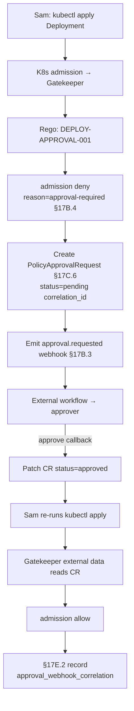

# DT-59 — Kubernetes admission deny-with-approval-required pattern

**Personas:** Sam (Application Developer), Marcus (Platform Security Engineer)
**Spec sections:** §17B.2 Decision Outcomes, §17B.4 Suspend-Pending-Approval (Kubernetes admission row), §17C.6 Custom CRD Extension Pattern (`PolicyApprovalRequest`), §17D.2 Kubernetes Library (Deploy image row)
**Type:** Mid-level
**Pre-condition:** Marcus has shipped a Gatekeeper constraint for `DEPLOY-APPROVAL-001` whose Rego maps `suspend_pending_approval` to admission `deny` with reason `approval-required` (§17B.4: "Generally cannot hold indefinitely; use deny-with-approval-required or create intermediate CRD"). The `PolicyApprovalRequest` CRD from §17C.6 is installed; a controller reconciles it. Sam runs `kubectl apply` for `Deployment payments-prod/api`. Sam holds `Developer` role in `namespace=payments-prod` (§17A.2).
**Trigger:** Sam's `kubectl apply` reaches the Kubernetes admission webhook; the constraint evaluates and no matching `PolicyApprovalRequest` is in status `approved`.

## Steps
1. Gatekeeper invokes Rego bound to `DEPLOY-APPROVAL-001`. The policy returns deny with `reason=approval-required`, `correlation_id`, `approval_required_from={type:role, value:production-release-approver}`, and `resourceRef`. Admission denies the request because §17B.4 forbids holding the admission webhook open.
2. Sam's `kubectl` exits non-zero with a structured message: "denied: approval-required for DEPLOY-APPROVAL-001 (correlation_id=...). Create or wait for PolicyApprovalRequest." Sam sees the same `correlation_id` in the Governance Console.
3. The platform's admission post-processor (or a Kyverno generate policy) creates a `PolicyApprovalRequest` per §17C.6 example: `spec.controlId=DEPLOY-APPROVAL-001`, `spec.requestedBy=sam`, `spec.resourceRef={apiVersion:apps/v1, kind:Deployment, name:api}`, `spec.requiredApproval={type:role, value:production-release-approver}`, `status=pending`. If a `pending` CR already exists for the same `(controlId, resourceRef, requestedBy)`, it is reused; not duplicated.
4. The controller emits the §17B.3 `approval.requested` webhook with the same `correlation_id` and `expires_at`. External workflow routing is out of scope (§17B.3).
5. An external approver with `production-release-approver` approves in the external workflow. The callback patches `PolicyApprovalRequest.status` to `approved` with `approvedBy` and `approvedAt`. Marcus monitors the CR to verify the binding.
6. Sam re-runs `kubectl apply`. Gatekeeper re-evaluates; the Rego consults a Gatekeeper external-data provider that reads `PolicyApprovalRequest` and finds `status=approved` matching `(controlId, resourceRef, requestedBy)`. Decision: `allow`. The admission succeeds.
7. A §17E.2 Real-Time Enforcement record is written for the admit, with `approval_webhook_correlation=correlation_id` linking back to the deny, the CR, and the approval callback. Per §17D.2 Kubernetes Library, the deploy-image decision point now reports `decision=allow` with approval evidence.

## Success criteria (testable)
- The initial `kubectl apply` returns admission deny with reason `approval-required` and a `correlation_id` — not a hang or timeout (§17B.4).
- A `PolicyApprovalRequest` is created with the §17C.6 fields populated; duplicate applies for the same resource do not create a second pending CR.
- The §17B.3 webhook `approval.requested` is emitted with the same `correlation_id` as the deny and the CR.
- After `status=approved`, a retried `kubectl apply` is admitted by Gatekeeper without policy change.
- The admit record's `approval_webhook_correlation` matches the deny record's `correlation_id`, completing the deny → CR → approval → admit trace.

## Flowchart

## Notes
The admission webhook never blocks waiting for human approval (§17B.4). The CR is the platform-side approval state; the webhook is fire-and-forget. External-data freshness matters — Marcus must ensure the provider's poll interval is short relative to user retry expectations.
