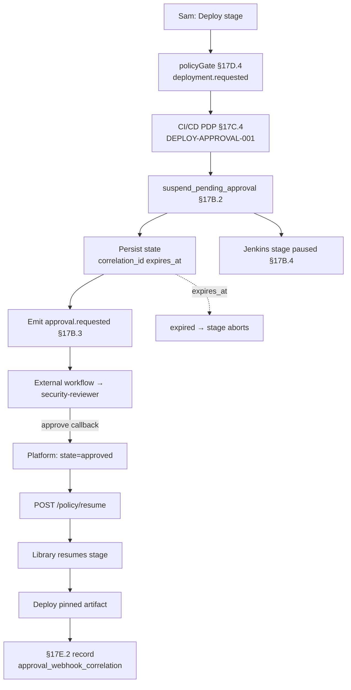

# DT-60 — Jenkins pipeline pauses for security approval at deploy stage

**Personas:** Sam (Application Developer), Marcus (Platform Security Engineer)
**Spec sections:** §17B.2 Decision Outcomes, §17B.3 Workflow Webhook Integration, §17B.4 Suspend-Pending-Approval (Jenkins pipeline row), §17D.4 Jenkins Library (Deployment requested), §17C.4 CI/CD PDP
**Type:** Mid-level
**Pre-condition:** Marcus has published a Jenkins shared library wrapping the §17D.4 `Deployment requested` decision point as `policyGate(controlId)`. `DEPLOY-APPROVAL-001` Rego returns `suspend_pending_approval` for prod deploys lacking approval. Platform webhook (§17B.3) is configured; approver is `role=security-reviewer`. Jenkins exposes a signed resume callback `/policy/resume`. Sam is `Developer` for `tenant=payments` (§17A.2).
**Trigger:** Sam's Jenkinsfile enters the `Deploy to payments-prod` stage and invokes `policyGate('DEPLOY-APPROVAL-001')`.

## Steps
1. The library step calls the CI/CD PDP (§17C.4) with `event=deployment.requested`, `job=payments-api`, `artifact_digest=sha256:...`, `target_namespace=payments-prod`, `subject={sub:sam, groups:[team-payments]}` — the §17D.4 "Deployment requested" decision point.
2. The PDP evaluates `DEPLOY-APPROVAL-001` and returns `{"decision":"suspend_pending_approval","approval_required_from":{"type":"role","value":"security-reviewer"},"outcome_reason":"Production deploy requires security approval"}` per §17B.2.
3. The platform mints `correlation_id`, sets `expires_at=now+8h`, persists state `pending`, and emits the §17B.3 webhook `approval.requested` with `control_id`, `resource={kind:JenkinsDeployment, namespace:payments-prod, name:payments-api}`, `subject`, `approval_required_from`, `correlation_id`, `expires_at`. External routing is out of scope (§17B.3).
4. The library pauses the stage per §17B.4 Jenkins row ("Pause stage pending input or external webhook result"), registered as a `correlation_id` waiter via Pipeline `input` — not by holding HTTP open. Jenkins UI and Console show `correlation_id`, approver role, `expires_at`.
5. An external approver with `security-reviewer` resolves the request in the workflow system. The callback posts to the platform with `correlation_id`, decision, approver subject; the platform updates state to `approved`.
6. The platform POSTs `/policy/resume` to Jenkins with `correlation_id` and a signed payload. The library matches the waiter and resumes the stage; the deploy executes against the artifact captured at pause-time (no swap).
7. A §17E.2 Real-Time Enforcement record is written with `control_id`, `decision=allow`, `approval_webhook_correlation=correlation_id`, approver identity. If `expires_at` elapses, state becomes `expired` and the waiter aborts the stage.

## Success criteria (testable)
- Stage shows paused/input-awaiting (not failed, not proceeded) while approval state is `pending`, matching §17B.4 Jenkins row.
- Emitted webhook validates against §17B.3 and includes `event_type=approval.requested`, `correlation_id`, `expires_at`, `approval_required_from.value=security-reviewer`.
- Approval callback with matching `correlation_id` triggers `/policy/resume`; the same stage instance resumes (no new build).
- Deploy runs against the artifact captured at pause-time; the §17E.2 record's `approval_webhook_correlation` matches the webhook `correlation_id`.
- Unresolved past `expires_at` transitions to `expired` and the stage aborts with the expiry reason.

## Flowchart

## Notes
The pause lives inside Jenkins (Pipeline waiter), not in the webhook, matching §17B.4. `correlation_id` is the single key joining PDP decision, webhook, callback, resume, and §17E.2 record.
