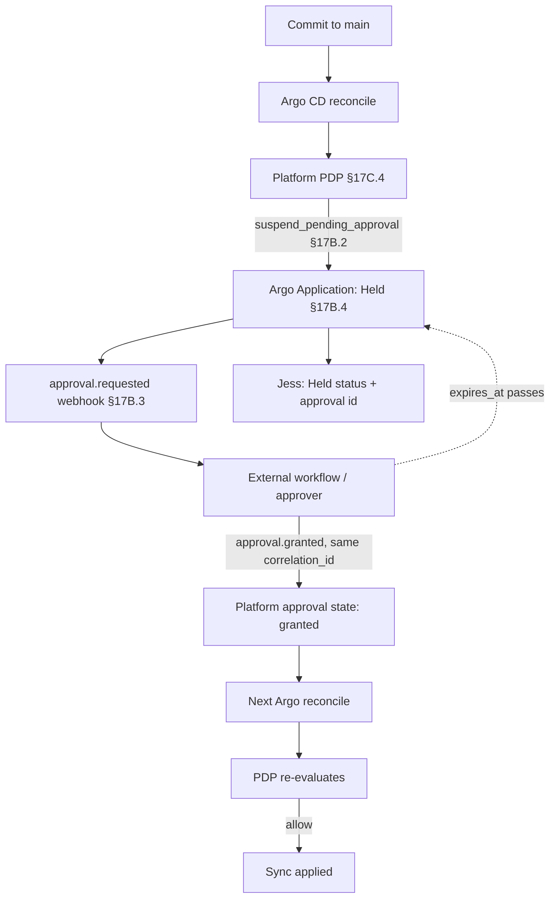

# DT-61 — GitOps controller suspends sync pending approval

**Personas:** Jess, Marcus
**Spec sections:** §17B.2 Decision Outcomes, §17B.3 Workflow Webhook Integration, §17B.4 Suspend-Pending-Approval Behavior by Enforcement Point, §17C.3 Action Taxonomy (suspend)
**Type:** Mid-level
**Pre-condition:** Argo CD manages the `payments-prod` Application; control `DEPLOY-APPROVAL-001` requires production-release-approver sign-off; the platform's GitOps integration is wired to the §17B.3 workflow webhook.
**Trigger:** A commit lands on `main` updating the `api` Deployment image tag; Argo CD attempts to sync the manifest.

## Steps
1. Argo CD reconciles `payments-prod`; before applying, it calls the platform PDP with the rendered manifest and the requesting subject.
2. The policy bound to `DEPLOY-APPROVAL-001` evaluates to `suspend_pending_approval` (§17B.2); the platform refuses to allow sync.
3. Per §17B.4 (GitOps controller row), the platform instructs Argo CD to **suspend sync or hold promotion**; the Application is marked `OutOfSync, Suspended` with reason `approval-required`.
4. The platform emits the §17B.3 `approval.requested` webhook with `control_id=DEPLOY-APPROVAL-001`, `decision=suspend_pending_approval`, `resource.kind=Deployment`, `approval_required_from.value=production-release-approver`, a `correlation_id`, and `expires_at`.
5. The webhook receiver routes the request to the approver group; an approval id is returned and persisted on the platform's approval state.
6. Jess, paged on a "sync suspended" alert, opens the GitOps view; the Application shows **Held — Pending Approval** with the linked approval id and `correlation_id`.
7. Marcus inspects the rendered manifest, control binding, and webhook payload in the Governance Console; he confirms the suspend is by design and comments on the approval record.
8. When the approver approves out-of-band, the workflow POSTs `approval.granted` (same `correlation_id`); the platform marks approval state `granted` and unblocks the GitOps controller.
9. Argo CD's next reconciliation calls the PDP again; the policy returns `allow` (approval present, not expired); sync proceeds and the Deployment rolls out.
10. The full chain — suspend, webhook, grant, allow, sync — is recorded as evidence under `DEPLOY-APPROVAL-001` with one `correlation_id`.

## Success criteria (testable)
- While approval is pending, the Argo CD Application status is `Suspended` (or equivalent "Held") and the platform exposes a linked approval id.
- A `approval.requested` webhook matching the §17B.3 schema was emitted with `decision=suspend_pending_approval` and a populated `expires_at`.
- No write to the cluster occurs for the suspended manifest until approval state transitions to `granted`.
- After `approval.granted` for the same `correlation_id`, the next reconcile yields `allow` and the Deployment is applied.
- All events (suspend, webhook, grant, allow, sync) share one `correlation_id` and are queryable as one evidence trail.
- If `expires_at` passes without grant, the Application remains suspended and a new approval cycle is required (no silent sync).

## Flowchart

## Notes
Related: DT-62 (approval expiry), DT-65 (PolicyApprovalRequest CRD lifecycle). The Kubernetes admission path cannot hold indefinitely (§17B.4); GitOps is the recommended hold point for long-running approvals.
