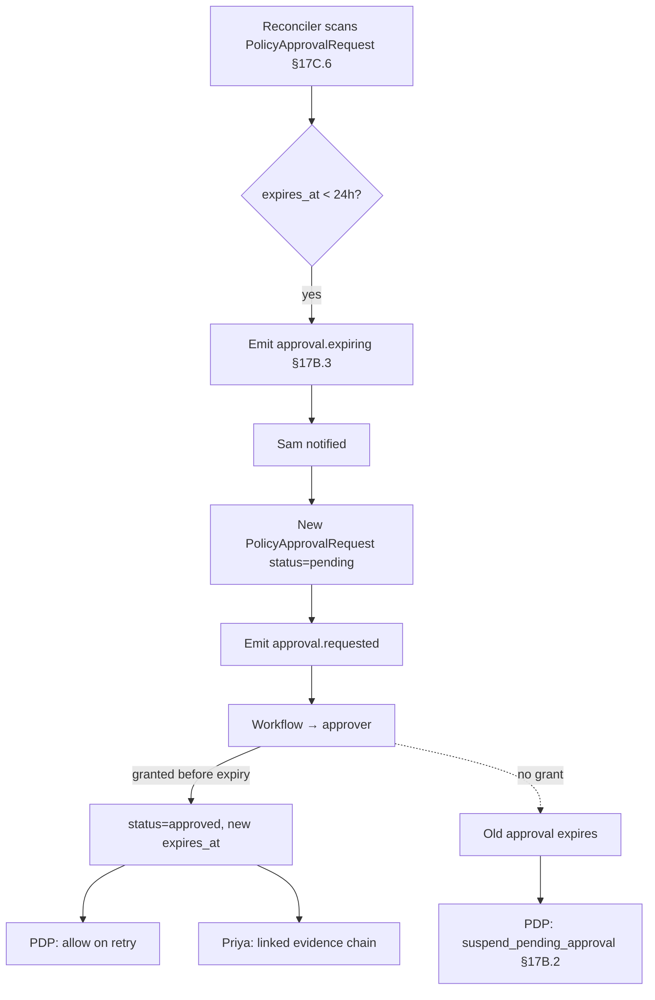

# DT-62 — Approval expires; re-authorization workflow

**Personas:** Sam, Priya
**Spec sections:** §17B.2 Decision Outcomes, §17B.3 Workflow Webhook Integration (`expires_at`), §17C.6 Custom CRD Extension Pattern (`PolicyApprovalRequest`)
**Type:** Mid-level
**Pre-condition:** A `PolicyApprovalRequest` for control `DEPLOY-APPROVAL-001` was granted 89 days ago for Sam's `api` Deployment in `payments-prod`; the original §17B.3 webhook recorded `expires_at` 90 days after grant. Platform emits `approval.expiring` notices at T-24h.
**Trigger:** The scheduled approval-state reconciler observes that `expires_at` is less than 24 hours away for the active approval.

## Steps
1. The platform reconciler scans active `PolicyApprovalRequest` resources (§17C.6); it finds the `deploy-api-payments-prod` request with `status: approved` and `expires_at` inside the warning window.
2. The platform emits a §17B.3 webhook event `approval.expiring` carrying the original `control_id`, `resource`, `subject`, original `correlation_id`, and the current `expires_at`.
3. Sam receives a notification in his usual workflow channel pointing at the soon-to-expire approval and a deep link to the `PolicyApprovalRequest` resource.
4. Sam files a re-authorization by creating (or patching) a new `PolicyApprovalRequest` (§17C.6) with `status: pending`, `requestedBy: sam`, the same `controlId`, `resourceRef`, and `requiredApproval.value: production-release-approver`; the platform links it to the prior approval via `correlation_id`.
5. The platform emits `approval.requested` (§17B.3) for the new CRD; the workflow system routes to the approver role.
6. While the new request is pending and the old approval is still valid, deploys continue to evaluate `allow`; once `expires_at` passes without grant, the policy evaluates `suspend_pending_approval` (§17B.2) and Sam's next deploy is held.
7. The approver grants the new request; the controller patches `status: approved` and writes a fresh `expires_at` (e.g., +90d); the platform emits `approval.granted` referencing both the new and prior `correlation_id`s.
8. Sam retries the deploy; the PDP returns `allow`; the action proceeds.
9. Priya opens the Governance Console filtered to `DEPLOY-APPROVAL-001` for the quarter; she sees the original approval, the `approval.expiring` event, the re-auth `PolicyApprovalRequest`, and the new grant — one unbroken evidence chain.
10. The expired CRD is retained immutably as audit history (§17C.6); only its `status` and `expires_at` transitions are recorded.

## Success criteria (testable)
- An `approval.expiring` webhook is emitted at least once before `expires_at`, matching the §17B.3 schema and carrying the original `correlation_id`.
- A new `PolicyApprovalRequest` (§17C.6) is created with `status: pending` and references the prior approval.
- After `expires_at` passes with no new grant, the PDP returns `suspend_pending_approval` for the same resource and deploys are held.
- After the re-auth grant, `expires_at` is refreshed and the PDP returns `allow` for the same `resourceRef`.
- The original (expired) `PolicyApprovalRequest` remains queryable as an immutable audit record.
- Priya can produce a single evidence view linking original grant → expiring notice → re-auth request → new grant for the control.

## Flowchart

## Notes
Related: DT-61 (suspend pending approval), DT-65 (CRD lifecycle). `expires_at` is required by §17B.3; the platform must never silently extend it — re-auth always creates a new request.
