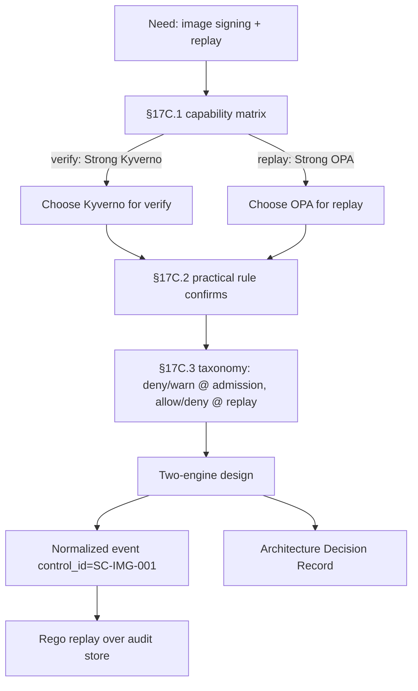

# DT-63 — Decide OPA vs Kyverno for a new image-verification policy

**Personas:** Marcus
**Spec sections:** §17C.1 Where Kyverno Is Needed Versus Where OPA Is Sufficient, §17C.2 Practical Rule, §17C.3 Action Taxonomy
**Type:** Low-level
**Pre-condition:** Control `SC-IMG-001` ("production images must be signed") is approved. The platform supports both OPA/Gatekeeper and Kyverno engines; cross-product replay is implemented over normalized audit events via OPA/Rego.
**Trigger:** Marcus is asked to implement image signature verification at admission and to keep the result available for retrospective replay across products.

## Steps
1. Marcus opens §17C.1 and reads the two relevant rows: **Image signature verification** is rated *Strong* in Kyverno and only *Possible with integrations* in Gatekeeper; **Retrospective replay over normalized audit logs** is *Strong* in OPA and *Limited to Kubernetes context* in Kyverno.
2. He cross-checks §17C.2: the "Verify image signatures" row recommends Kyverno; the "Cross-product replay simulation" row recommends OPA/Gatekeeper over normalized input.
3. Marcus drafts a two-engine design: a Kyverno `verifyImages` policy performs the cosign verification at the Kubernetes admission decision point (§17C.4 Admission PDP); the verified/failed outcome is emitted as a normalized event.
4. The normalized event (signer identity, digest, registry, verdict, `control_id=SC-IMG-001`, `correlation_id`) is written to the platform's audit store using the agreed replay schema (§17C.5 Replay schema).
5. An OPA/Rego module bound to `SC-IMG-001` consumes the normalized event for cross-product replay (§17C.1 last row) — so the same control can be re-evaluated historically and alongside non-Kubernetes signals (e.g., CI signing, Trivy results).
6. Marcus uses the action taxonomy in §17C.3 to label engine responsibilities: Kyverno handles `deny` and `warn` at admission; OPA handles `allow`/`deny` decisions during replay; neither engine is asked to do `require_approval` (out of scope for this control).
7. He writes an Architecture Decision Record citing §17C.1 (capability matrix), §17C.2 (practical rule), and §17C.3 (action taxonomy), stating: "Kyverno is the real-time PDP for signature verification; OPA is the replay PDP for `SC-IMG-001`."
8. The decision is reviewed and merged; the Kyverno policy and the OPA module both carry metadata mapping to `SC-IMG-001` so the Governance Console correlates them as one control.

## Success criteria (testable)
- The ADR cites §17C.1, §17C.2, and §17C.3 by name and references the exact matrix rows ("Image signature verification", "Retrospective replay over normalized audit logs").
- Image verification at admission is implemented in Kyverno (not Gatekeeper/OPA-alone) and produces a normalized event with `control_id=SC-IMG-001`.
- A Rego module exists for `SC-IMG-001` that can be invoked over the audit store for replay and yields the same decision Kyverno made.
- The Governance Console lists both the Kyverno policy and the Rego module under `SC-IMG-001` as one control binding.
- No long-running approval flow is introduced for this control (§17C.1 row 8 confirms admission-path approvals are not appropriate).

## Flowchart

## Notes
Related: DT-10 (sign Rego bundles), DT-46 (historical replay). This scenario is purely the *decision*; implementation/promotion is covered by DT-14 and the image-signing scenarios.
