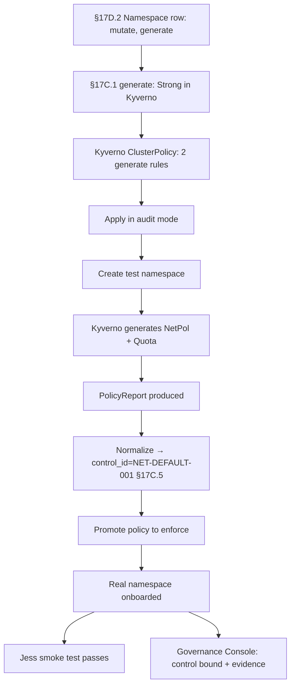

# DT-64 — Add Kyverno generate policy for default NetworkPolicy on namespace create

**Personas:** Marcus, Jess
**Spec sections:** §17C.1 (Generate related Kubernetes resources — Strong in Kyverno), §17C.3 Action Taxonomy (`generate`), §17D.2 Kubernetes Library (Namespace creation → mutate, generate)
**Type:** Low-level
**Pre-condition:** Control `NET-DEFAULT-001` ("every workload namespace must have a default-deny NetworkPolicy and a baseline ResourceQuota") is approved. Kyverno is installed; the platform normalizes Kyverno policy reports into evidence (§17C.1).
**Trigger:** Marcus is asked to enforce `NET-DEFAULT-001` at namespace creation; existing namespaces are out of scope (covered by a separate backfill).

## Steps
1. Marcus reviews §17D.2 row "Namespace creation": real-time hook is the admission webhook; supported actions include **mutate, generate, require approval**; example policy is "Generate default NetworkPolicy and ResourceQuota" — a direct match for `NET-DEFAULT-001`.
2. He confirms via §17C.1 that "Generate related Kubernetes resources" is *Strong* in Kyverno and *Not native / Not primary* elsewhere; per §17C.3 the `generate` action's engines are "Kyverno, custom controller". Kyverno is selected.
3. Marcus authors a Kyverno `ClusterPolicy` with two `generate` rules on `Namespace` create: (a) `NetworkPolicy/default-deny` with empty podSelector and no ingress/egress, and (b) `ResourceQuota/baseline-quota` with org-standard limits.
4. Both rules set `synchronize: true` so resources are reconciled if deleted; both carry annotations binding to `control_id=NET-DEFAULT-001` and the policy's `policy_version`.
5. Marcus applies the policy in `audit` mode; he creates a test namespace; Kyverno generates the two resources and produces a `PolicyReport` (§17C.1 "Kubernetes policy reports — Strong").
6. The evidence normalizer ingests the Kyverno `PolicyReport`, emits a normalized event with `control_id=NET-DEFAULT-001`, `decision=generate`, the namespace, and generated resource refs.
7. Marcus promotes the policy to `enforce`; he and Jess onboard a real namespace — it admits, both companion resources appear within seconds, `kubectl get netpol,resourcequota -n <ns>` shows them.
8. Jess updates the namespace runbook to expect `default-deny` and `baseline-quota` on day-0; she adds a cluster smoke test that fails if either is missing post-creation.
9. The Governance Console binding for `NET-DEFAULT-001` lists the `ClusterPolicy`, its `policy_version`, and an evidence stream of generate events keyed by namespace.

## Success criteria (testable)
- Creating a new namespace results in a `NetworkPolicy/default-deny` and a `ResourceQuota/baseline-quota` in that namespace, both owned/reconciled by the Kyverno `generate` rules with `synchronize: true`.
- A Kyverno `PolicyReport` for the namespace event exists and is normalized into a platform evidence event with `control_id=NET-DEFAULT-001` and `decision=generate`.
- Deleting either generated resource causes Kyverno to recreate it (synchronize behavior verified).
- The policy carries metadata mapping it to `NET-DEFAULT-001`, and the Governance Console correlates the policy and the evidence stream.
- Jess's cluster smoke test fails when either companion resource is absent in a freshly-created namespace.

## Flowchart

## Notes
Related: DT-63 (engine selection), DT-15/DT-17 (Gatekeeper audit/reconcile patterns). The `generate` action is the discriminator that forces Kyverno here per §17C.1 and §17C.3.
