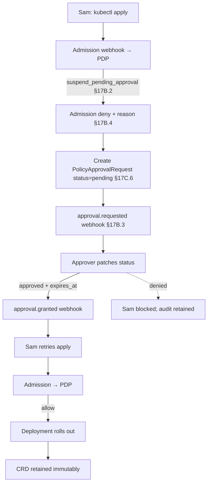

# DT-65 — PolicyApprovalRequest CRD lifecycle for a deploy gate

**Personas:** Marcus, Sam
**Spec sections:** §17B.2 Decision Outcomes, §17B.3 Workflow Webhook Integration, §17B.4 Suspend-Pending-Approval Behavior (Kubernetes admission row), §17C.6 Custom CRD Extension Pattern (`PolicyApprovalRequest`)
**Type:** Mid-level
**Pre-condition:** Control `DEPLOY-APPROVAL-001` requires `production-release-approver` sign-off; the `PolicyApprovalRequest` CRD (§17C.6) is installed; its controller is wired to the §17B.3 webhook. Sam owns the `api` Deployment in `payments-prod`.
**Trigger:** Sam pushes a new image tag and `kubectl apply`s the updated `Deployment/api`.

## Steps
1. Admission calls the PDP; the policy returns `suspend_pending_approval` (§17B.2). Per §17B.4 (Kubernetes admission row), admission cannot hold open, so the platform **denies with reason `approval-required`** and creates a `PolicyApprovalRequest` named `deploy-api-payments-prod` (§17C.6) with `spec.controlId`, `spec.resourceRef` (Deployment `api`), `spec.requestedBy: sam`, `spec.requiredApproval.value: production-release-approver`, and `status: pending`.
2. Marcus's controller observes the new CRD and emits `approval.requested` (§17B.3) carrying the CRD name as `correlation_id`, the `control_id`, `resource`, `subject`, `approval_required_from`, and `expires_at` (now + 90d).
3. Sam sees the kubectl error referencing the `PolicyApprovalRequest` name; he opens the CRD, watches `status: pending`, and notifies the approver via the workflow link.
4. The approver reviews the diff and patches the CRD: `status: approved`, `approvedBy`, `approvedAt`, `expires_at: <ts+90d>`. (Denial patches `status: denied` with `reason`.)
5. The controller reconciles the transition and emits `approval.granted` (§17B.3) with the same `correlation_id`; the platform records approval state keyed to `{controlId, resourceRef}`.
6. Sam retries `kubectl apply` on the same Deployment spec; admission re-evaluates; the PDP finds an active, non-expired approval matching the resource and returns `allow`; the Deployment rolls out.
7. Marcus verifies in the Governance Console that the deny, CRD create, `approval.requested`, status patch, `approval.granted`, second admission, and allow events all share one `correlation_id` under `DEPLOY-APPROVAL-001`.
8. The CRD is **retained as an immutable audit record** (§17C.6); future deletes or spec edits are rejected by the controller's validating webhook — only controller status transitions are writable.

## Success criteria (testable)
- On the first apply, admission is denied with reason `approval-required`, and a `PolicyApprovalRequest` matching the §17C.6 schema exists with `status: pending`.
- An `approval.requested` webhook matching §17B.3 was emitted with the CRD's name (or UID) as `correlation_id` and a populated `expires_at`.
- When `status: approved` is patched, an `approval.granted` event is emitted with the same `correlation_id`.
- A re-applied identical Deployment spec is admitted by the PDP after grant and denied again if `status: denied`.
- The CRD cannot be mutated by users (only by the controller) and is retained after the deploy succeeds.
- A single audit query by `correlation_id` returns the full chain: deny, CRD create, requested, granted, allow.

## Flowchart

## Notes
Related: DT-58 / DT-59 (suspend & admission deny paths), DT-61 (GitOps hold), DT-62 (expiry & re-auth). The CRD name doubles as the `correlation_id`, giving a single key for cross-system evidence.
