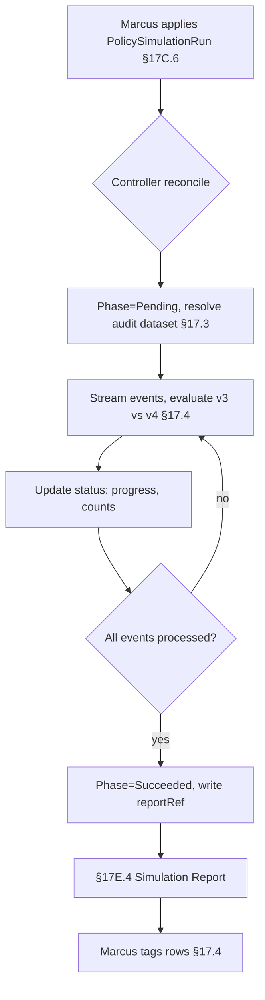

# DT-66 — `PolicySimulationRun` CRD for a long-running replay job

**Personas:** Marcus (Platform Security Engineer)
**Spec sections:** §17C.6 Custom CRD Extension Pattern, §17.2 Simulation Modes (Historical Replay), §17.4 Differential Simulation Semantics, §17E.4 Simulation Report
**Type:** Mid-level
**Pre-condition:** Marcus has a candidate Rego bundle `governance.kubernetes.imagesigning` (signed, with §8.3 metadata `__control_id__ = "SC-IMG-001"`). Privateer has 90 days of admission audit events that satisfy §17.3 replay-input completeness. A `PolicySimulationRun` CRD type is installed and its controller is reconciling. The current production policy_version is `v3`.
**Trigger:** Marcus needs a 90-day historical replay to compare `v3` against the candidate `v4` and produce a §17E.4 Simulation Report before promotion.

## Steps
1. **Author the CRD.** Marcus writes a `PolicySimulationRun` (§17C.6) with `spec.mode: HistoricalReplay` (§17.2), `spec.basePolicyVersion: v3`, `spec.candidatePolicyVersion: v4`, `spec.auditWindow: 90d`, `spec.scope.namespaces: ["*"]`, and `spec.differential: true` (§17.4). He `kubectl apply`s it; admission accepts because his Policy Author role permits `simulation:create` (§17A).
2. **Controller picks up the object.** The simulation controller (§17C.6) sets `status.phase=Pending`, allocates a job, and resolves the audit dataset reference. It records `status.eventsExpected` from the Privateer query plan and writes `status.startedAt`.
3. **Stream and evaluate.** The controller streams audit events that pass §17.3 completeness checks, evaluates both `v3` and `v4` against each normalized input, and emits per-event differential rows tagged `Newly blocked`, `Newly allowed`, `No enforcement change`, or `Continued block` (§17.4). Incomplete events are flagged rather than counted (§17.3).
4. **Persist progress in status.** Every reconcile tick (default 60s) the controller updates `status.eventsEvaluated`, `status.newlyBlocked`, `status.newlyAllowed`, `status.incompleteEvents`, and `status.progressPercent`. Marcus runs `kubectl get policysimulationrun -w` and watches counters climb.
5. **Recover from interruption.** A controller restart at hour 14 resumes from `status.lastCheckpointEventId`; no events are double-counted. Marcus confirms recovery via `kubectl describe`.
6. **Completion and report linkage.** When all events are processed, the controller writes `status.phase=Succeeded`, `status.completedAt`, `status.reportRef` pointing to the generated §17E.4 Simulation Report, and `status.conditions[type=ReportReady,status=True]`.
7. **Marcus consumes the report.** He opens the §17E.4 report via the link in `status.reportRef`; it contains policy version before/after, audit dataset, events evaluated, newly blocked/allowed/unchanged counts, untagged risky changes, and false-positive candidates. He tags the four "Requires review" rows per §17.4 directly from the report UI.

## Success criteria (testable)
- A `PolicySimulationRun` object exists with `spec.mode=HistoricalReplay` and `spec.auditWindow=90d`.
- `status.progressPercent` monotonically increases and reaches `100` at completion.
- Controller restart mid-run does not cause duplicate event evaluation (verified by `eventsEvaluated == eventsExpected - incompleteEvents`).
- On success, `status.reportRef` resolves to a §17E.4 report containing all required fields (policy version before/after, dataset, four outcome counts, tagged/untagged changes).
- Differential rows tagged per §17.4 categories are persisted and addressable from the report.
- Audit events missing any §17.3 required field are counted in `status.incompleteEvents`, not in the four outcome buckets.

## Flowchart

## Notes
The CRD pattern (§17C.6) is what makes long-running simulation tractable inside Kubernetes — admission webhooks cannot hold for 90-day replays. Pairs with DT-05 (promotion gates) and DT-25 (replay completeness).
