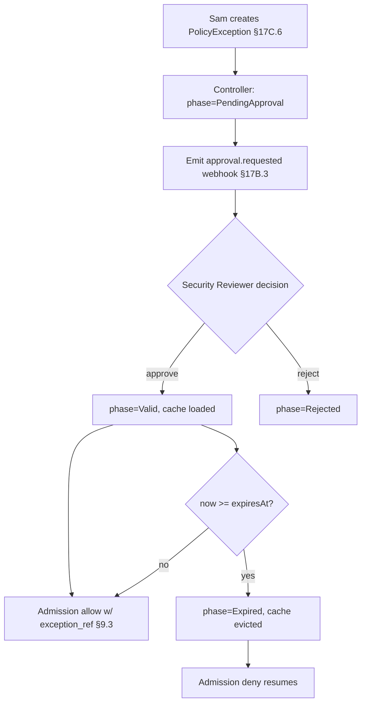

# DT-67 — `PolicyException` CRD lifecycle (request → approve → expire)

**Personas:** Sam (Application Developer), Priya (Compliance & GRC Lead — as Security Reviewer delegate)
**Spec sections:** §17C.6 Custom CRD Extension Pattern (`PolicyException`), §17B Approval-Gated Policy Decisions, §17B.3 Workflow Webhook Integration, §17A Scoped Roles
**Type:** Mid-level
**Pre-condition:** A `PolicyException` CRD type is installed and its controller is reconciling. A constraint enforcing control `K8S-PRIV-001` (no privileged pods) is at `enforcementAction: deny` (§9.2). Sam owns namespace `payments-legacy` and has the `Application Developer` role with `exception:create` scoped to that namespace (§17A.2). Priya's team includes a `Security Reviewer` role authorized to approve exceptions for `K8S-PRIV-*`.
**Trigger:** Sam needs a temporary exception so a legacy workload in `payments-legacy` can run with a privileged container until migration completes.

## Steps
1. **Sam requests the exception.** Sam creates a `PolicyException` (§17C.6) with `spec.controlId: K8S-PRIV-001`, `spec.scope.namespace: payments-legacy`, `spec.scope.workloadSelector.matchLabels.app: legacy-sdk`, `spec.rationale: "legacy SDK requires CAP_SYS_ADMIN; migration tracked in JIRA-4711"`, `spec.expiresAt: 2026-07-15T00:00:00Z`, `spec.requestedBy: sam`.
2. **Controller validates and emits approval request.** The exception controller sets `status.phase=PendingApproval`, derives required approver from policy metadata (`role: security-reviewer`), and emits a §17B.3 webhook event (`event_type=approval.requested`, `decision=suspend_pending_approval`, `correlation_id=<uuid>`, `expires_at` mirrored). Runtime engines treat `phase != Valid` as "exception not in effect" — denies continue.
3. **Priya reviews and approves.** Priya (Security Reviewer) opens the request in the Governance Console, verifies the rationale and scope are minimal, and approves. The controller records `status.approvedBy: priya`, `status.approvedAt`, `status.approvalCorrelationId`, and transitions `status.phase=Valid`. Approval is captured as a §17B decision event.
4. **Runtime engines honor the exception.** On the next admission for a `payments-legacy` pod matching the selector with `securityContext.privileged: true`, the constraint's Rego consults the platform's exception cache (keyed by `controlId + namespace + selector + now < expiresAt`) and short-circuits to `allow` with `decision_reason=policy_exception`, recording `exception_ref` in the §9.3 decision fields.
5. **Periodic reconciliation.** The controller re-validates each `Valid` exception: scope still matches at least one workload, `expiresAt` not reached, no revocation request. Status conditions updated each tick.
6. **Approaching expiry.** At `expiresAt - 7d` the controller emits a `approval.expiry_warning` webhook (§17B.3) and notifies Sam via the console.
7. **Expire and revoke.** At `expiresAt` the controller flips `status.phase=Expired` and removes the entry from the exception cache. The next admission for the same privileged pod is denied with `K8S-PRIV-001`; the §9.3 audit event no longer carries `exception_ref`. The exception object is retained for audit (§17E.3).

## Success criteria (testable)
- `PolicyException` lifecycle observable as: `PendingApproval` → `Valid` → `Expired`, each transition recorded with timestamp and actor.
- A §17B.3 `approval.requested` webhook is emitted on creation with `correlation_id` matching the eventual `status.approvalCorrelationId`.
- While `phase=Valid`, admission for the scoped privileged pod is allowed with `decision_reason=policy_exception` and `exception_ref` populated in the §9.3 decision record.
- After `expiresAt`, the same admission request is denied; no `exception_ref` is present.
- A user without `exception:approve` scope cannot transition the object to `Valid` (enforced at both API and storage layers per §17A).
- Expired exception objects remain queryable by Daniel (Auditor) for retrospective evidence.

## Flowchart

## Notes
Pairs with DT-03 (exception requirement on control) and DT-68 (Kubernetes example consuming this exception). Expired objects must be retained — they are evidence under §17E.3.
