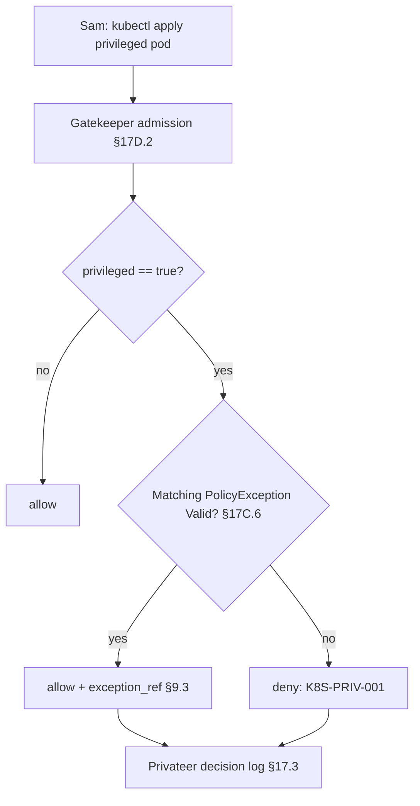

# DT-68 — Kubernetes library: block privileged pods with NS-scoped exception

**Personas:** Marcus (Platform Security Engineer), Sam (Application Developer)
**Spec sections:** §17D.2 Kubernetes Library (Create/update resource → Block privileged pods), §17C.6 `PolicyException` CRD, §9.2 Gatekeeper Enforcement Modes, §9.3 Decision Record Fields
**Type:** Low-level
**Pre-condition:** Marcus has installed the Kubernetes library's `block-privileged-pods` ConstraintTemplate (§17D.2 example) and a `K8sBlockPrivileged` constraint bound to control `K8S-PRIV-001` at `enforcementAction: deny` (§9.2). The constraint's Rego is exception-aware — it consults the `PolicyException` cache populated by the controller from DT-67. Sam owns namespace `payments-legacy` and has an approved `PolicyException` (`status.phase=Valid`) scoped to `controlId: K8S-PRIV-001`, `namespace: payments-legacy`, `selector: app=legacy-sdk`, expiring 2026-07-15.
**Trigger:** Sam applies a Deployment whose pod template sets `securityContext.privileged: true` to run a legacy SDK requiring `CAP_SYS_ADMIN`.

## Steps
1. **Submit the manifest.** Sam runs `kubectl apply -f legacy-sdk.yaml`. The Deployment's pod template has `metadata.labels.app: legacy-sdk` and `spec.template.spec.containers[0].securityContext.privileged: true`.
2. **Admission webhook fires.** Gatekeeper receives the AdmissionReview and evaluates the `K8sBlockPrivileged` constraint. The Rego (per §17D.2 example) first computes `violation` on `input.review.object.spec.containers[_].securityContext.privileged == true`.
3. **Exception check.** Before emitting deny, the Rego consults the exception cache: keys = `(controlId=K8S-PRIV-001, namespace=input.review.namespace, labels=input.review.object.metadata.labels, now < expiresAt)`. A match is found for Sam's `PolicyException` (DT-67).
4. **Allow with reason.** The constraint returns no violations; Gatekeeper admits the resource. The §9.3 decision record carries: `control_id=K8S-PRIV-001`, `constraint_name=block-privileged-pods`, `rego_package=governance.kubernetes.privileged`, `policy_version=<bundle digest>`, `admission_review_uid`, `decision=allow`, `decision_reason=policy_exception`, `exception_ref=PolicyException/payments-legacy/legacy-sdk-priv-2026Q2`.
5. **Negative case in another namespace.** Sam (or another user) applies the same manifest into `payments-prod`. The exception's `scope.namespace` does not match; Rego emits the violation. Gatekeeper denies with message `"K8S-PRIV-001: privileged containers prohibited; no valid exception for namespace payments-prod"`.
6. **Audit trail captured.** Both the allow-with-exception and the deny are written to the Privateer decision log with full §17.3 replay fields. Priya can query control `K8S-PRIV-001` and see one allow with `exception_ref` and one deny — supporting the §17E.2 real-time enforcement report.
7. **Post-expiry behavior.** After 2026-07-15, the exception is `Expired` (DT-67). The same `payments-legacy` apply now denies with the standard `K8S-PRIV-001` message; `exception_ref` is absent.

## Success criteria (testable)
- A privileged pod manifest in `payments-legacy` with label `app=legacy-sdk` is admitted while the `PolicyException` is `Valid`.
- The decision record for that admission includes `decision=allow`, `decision_reason=policy_exception`, and a resolvable `exception_ref`.
- The same manifest applied in `payments-prod` (no exception) is denied with a message naming `K8S-PRIV-001`.
- A privileged pod in `payments-legacy` that does *not* match the selector (`app != legacy-sdk`) is denied.
- All four outcomes are queryable from Privateer using `control_id=K8S-PRIV-001`.
- After exception expiry, the `payments-legacy` admission flips from allow to deny with no manifest change.

## Flowchart

## Notes
The exception-aware Rego pattern is the canonical §17D.2 + §17C.6 integration. Pairs with DT-67 (CRD lifecycle) and DT-03 (exception requirement modeling at control layer).
