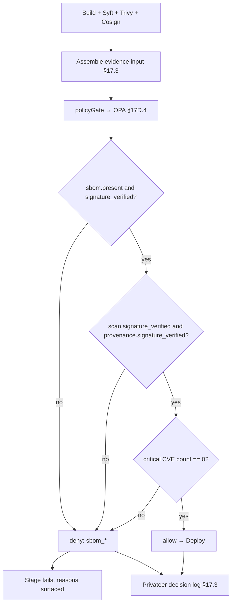

# DT-70 — Jenkins library: gate artifact deployment on SBOM + scan evidence

**Personas:** Sam (Application Developer), Marcus (Platform Security Engineer)
**Spec sections:** §17D.4 Jenkins Library (Artifact produced → must have SBOM and provenance), §17D.6 Trivy Library, §17C.3 Action Taxonomy, §17.3 Audit-Driven Simulation Requirements
**Type:** Mid-level
**Pre-condition:** Marcus has published the Jenkins library policy `governance.jenkins.artifact_gate` bound to control `BUILD-EVIDENCE-001` ("production artifact must have SBOM, signed scan, and zero critical CVEs"). A reusable Jenkins shared-library step `policyGate(controlId, evidence)` posts evidence to an OPA PDP and fails the stage on `decision=deny`. Sam's pipeline already runs Syft (SBOM) and Trivy (scan), and uses Cosign to sign both outputs. The PDP is reachable from the Jenkins controller.
**Trigger:** Sam pushes a commit; the `payments-api` Jenkins pipeline reaches its `Artifact Gate` stage (§17D.4 decision point `Artifact produced`).

## Steps
1. **Build and produce artifacts.** Earlier stages build `payments-api:${GIT_SHA}`, generate `sbom.spdx.json` (Syft), produce `trivy-report.json`, and Cosign-sign both: `sbom.spdx.json.sig`, `trivy-report.json.sig`. The image is also Cosign-signed.
2. **Assemble evidence bundle.** The `Artifact Gate` stage constructs the policy input: `{artifact: {name, digest, registry}, sbom: {present, format, digest, signature_verified}, scan: {tool: "trivy", report_digest, signature_verified, findings: [{cve, severity}, ...]}, provenance: {predicate_type, builder_id, signature_verified}, control_id: "BUILD-EVIDENCE-001", correlation_id: env.BUILD_TAG}`. Cosign verification is performed locally and the `*_verified` booleans are set from its exit codes.
3. **Call OPA via `policyGate`.** The shared-library step POSTs the input to `v1/data/governance/jenkins/artifact_gate/decision`. Timeout 10s, retry once. (Real-time hook in §17D.4 is "Pipeline policy step".)
4. **Rego evaluates evidence.** The policy enforces, in order: `sbom.present == true`, `sbom.signature_verified == true`, `scan.signature_verified == true`, `provenance.signature_verified == true`, and `count([f | f := input.scan.findings[_]; f.severity == "CRITICAL"]) == 0`. Each failed check appends a `reason` string. The decision is `allow` if all pass, else `deny` with full reason list (§17C.3 action: deny / require scan / attach evidence).
5. **Pass path.** All checks pass. PDP returns `{decision: "allow", control_id: "BUILD-EVIDENCE-001", evidence_refs: [sbom.digest, scan.report_digest], policy_version}`. The pipeline proceeds to `Deploy`. A §17.3-compliant decision record is written to Privateer.
6. **Fail path.** A new commit introduces a dependency with one CRITICAL CVE. `policyGate` receives `{decision: "deny", reasons: ["critical_cve: CVE-2026-1234"], control_id: "BUILD-EVIDENCE-001"}`. The shared-library step calls `error(...)` with a formatted message; Jenkins marks the stage failed and annotates the build with the reasons. The pipeline does not advance to deploy.
7. **Sam remediates.** Sam sees the structured deny reasons in the Blue Ocean view (and in the §17E.2 real-time enforcement report). He bumps the dependency, re-runs; the next build passes the gate. Marcus later queries Privateer for control `BUILD-EVIDENCE-001` and confirms every deny carries non-empty `reasons` and `evidence_refs`.

## Success criteria (testable)
- Missing or unsigned SBOM produces `decision=deny` with reason `sbom_missing` or `sbom_unsigned`.
- Unsigned Trivy report produces `decision=deny` with reason `scan_unsigned`.
- Presence of any CRITICAL CVE produces `decision=deny` with reason `critical_cve: <id>` for each finding.
- A fully evidenced artifact (signed SBOM, signed scan, signed provenance, zero criticals) produces `decision=allow` and the pipeline advances.
- Every gate decision is recorded with §17.3 fields including `control_id`, `policy_version`, `correlation_id=BUILD_TAG`, evidence digests, and decision reasons.
- Pipeline failure surfaces the deny reasons in the Jenkins UI (not just an opaque non-zero exit).

## Flowchart

## Notes
Cross-product: the same input is consumable by §17D.6 (Trivy) and §17D.11 cross-product pattern, so the same gate can be re-implemented in GitLab CI without re-authoring the Rego. Pairs with DT-23 (SBOM attestation → control) and DT-10 (signed OCI bundles for the policy itself).
