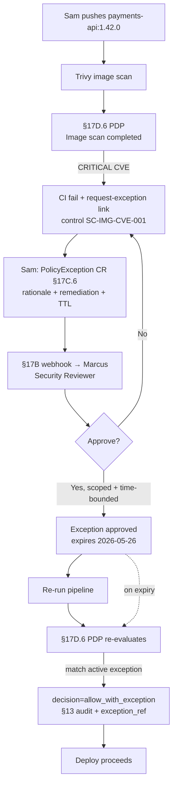

# DT-72 — Trivy library — block deployment for critical CVE; require exception

**Personas:** Sam (Application Developer), Marcus (Platform Security Engineer, acting as Security Reviewer)
**Spec sections:** §17D.6 Trivy Library (Image scan completed: Critical vulnerability blocks production), §17C.6 Custom CRD Extension Pattern (`PolicyException`), §17B Approval-Gated Decisions, §17D.1 Library elements, §13 Audit schema
**Type:** Mid-level
**Pre-condition:** Sam's `payments-api` service deploys to `payments-prod` via a CI pipeline that runs a Trivy image scan and uploads the report. The §17D.6 PDP is wired as a CI/CD gate: critical CVEs `fail build, block deployment, require exception`. A `PolicyException` controller (§17C.6) is installed; the Security Reviewer role is held by Marcus's team and routed via §17B webhook.
**Trigger:** Sam pushes `payments-api:1.42.0`. The Trivy scan finds `CVE-2025-3119` (CRITICAL, in `libxslt-1.1.34`, fixed in 1.1.39). The §17D.6 gate fires `Image scan completed` with `severity_max=CRITICAL`.

## Steps
1. The §17D.6 PDP evaluates the scan report against control `SC-IMG-CVE-001` ("Critical vulnerability blocks production"). Decision: `fail build, block deployment`. The CI job fails with a structured message naming the CVE, the affected layer, the fixed version, and a `request-exception` link.
2. Sam confirms upstream `libxslt 1.1.39` is not yet in the base image and a hotfix rebuild is 5 days out, while the customer-facing 1.42.0 release is needed in 48h. He clicks `request-exception`, which creates a `PolicyException` CR (§17C.6) referencing `controlId: SC-IMG-CVE-001`, `resourceRef: payments-api:1.42.0`, `cve: CVE-2025-3119`, with `rationale` (the call path is not reachable from `payments-api`), `remediationPlan` (rebase on base image v2026.05 by 2026-05-26), and `requestedTtl: 14d`.
3. The §17B approval webhook routes the request to Marcus as Security Reviewer with full context: scan report, exception rationale, remediation plan, and §17.4 differential simulation of the requested exception scope (only `payments-api`, only this CVE, time-bounded).
4. Marcus reviews, narrows the scope (`namespaces: [payments-prod]`, `cves: [CVE-2025-3119]`, `expiresAt: 2026-05-26T00:00:00Z`), and approves. The `PolicyException` status transitions `pending → approved` and the controller signs the resource.
5. The CI pipeline re-runs the §17D.6 gate. The Trivy PDP loads active `PolicyException` resources, finds a match (`resource=payments-api`, `cve=CVE-2025-3119`, `not_expired`), and emits `decision=allow_with_exception`, attaching `exception_ref=payments-api-cve-2025-3119` to the §13 audit event. The build passes and the deploy proceeds.
6. Marcus's team sees the exception on the §17E real-time exception dashboard. The §17C.6 controller schedules a re-evaluation at expiry: if `payments-api` is still pinned to a vulnerable image at `2026-05-26`, the gate flips back to `fail build` automatically (§17B re-authorization pattern, see DT-62).

## Success criteria (testable)
- A CRITICAL Trivy finding produces a CI failure with structured fields (`cve_id`, `severity`, `package`, `fixed_version`, `control_id=SC-IMG-CVE-001`) and a `request-exception` link — never a one-line opaque message.
- A `PolicyException` CR can be created from the failure context with `rationale` and `remediationPlan` required; missing fields reject the request.
- Approval is gated to the Security Reviewer role via §17B webhook; the requester (Sam) cannot self-approve.
- On approved exception, the §17D.6 gate emits `decision=allow_with_exception` with `exception_ref` in the §13 audit event; without an exception it emits `decision=deny`.
- The exception is time-bounded; expiry causes the gate to deny on the next run without manual intervention.

## Flowchart

## Notes
Related: DT-67 (`PolicyException` lifecycle), DT-62 (re-authorization), HL-10 (break-glass). Scope-narrowing at approval (specific CVE, namespace, TTL) is required — blanket "ignore Trivy" exceptions must be rejected.
