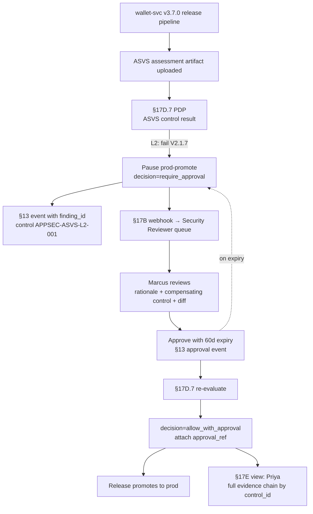

# DT-73 — OWASP library — ASVS L2 failure requires security approval

**Personas:** Marcus (Platform Security Engineer), Priya (Compliance & GRC Lead)
**Spec sections:** §17D.7 OWASP Library (ASVS control result: require approval, attach evidence), §17B Approval-Gated Decisions, §6 Governance hierarchy (control + evidence requirement), §17D.1 Library elements, §13 Audit schema, §17E Reporting
**Type:** Mid-level
**Pre-condition:** Priya has authored Gemara control `APPSEC-ASVS-L2-001` ("Production releases must pass ASVS L2"), with an evidence requirement linking to ASVS assessment results and an exception requirement allowing per-finding security approval. The §17D.7 OWASP library is installed: a CI/manual-evidence PDP consumes ASVS assessment JSON output and routes failures via the §17B approval webhook. The `wallet-svc` repo runs ASVS as part of its release pipeline.
**Trigger:** The `wallet-svc` release pipeline for tag `v3.7.0` uploads ASVS assessment results. Finding `V2.1.7` (password change requires current password) is graded `L2: fail` by the assessor; all other L1/L2 controls pass.

## Steps
1. The §17D.7 PDP ingests the assessment artifact, filters to the `L2` rows, and finds one failure (`V2.1.7`). Per §17D.7 it emits `decision=require_approval`, attaches the assessment as evidence, and pauses the release pipeline at the `prod-promote` stage.
2. The PDP records a §13 audit event with `source=owasp-asvs`, `decision_point=asvs.control_result`, `finding_id=V2.1.7`, `level=L2`, `result=fail`, `resource_id=wallet-svc@v3.7.0`, `control_id=APPSEC-ASVS-L2-001`, `policy_version=owasp-lib:v2`, `correlation_id=asvs-wallet-v370`.
3. The §17B webhook routes a notification to the Security Reviewer queue with: the failing ASVS row, the assessor's evidence (test transcript, screenshots), the release diff, and a link to prior approvals for the same finding (Marcus reuses the §17.4 differential view to confirm the failure is preexisting, not a regression).
4. Marcus, as Security Reviewer, opens the request in the Governance Console. He reviews the rationale ("legacy mobile flow still uses session-based reauth; full fix in v3.9"), confirms the compensating control (server-side rate-limit + alerting on password-change endpoint), and approves with a 60-day expiry. Approval is itself a §13 audit event with `actor`, `justification`, `expiresAt`.
5. The §17D.7 PDP re-evaluates with the approval present; it emits `decision=allow_with_approval`, attaches `approval_ref` to the audit event, and unblocks the `prod-promote` stage. The release proceeds.
6. Priya consumes the §17E Reporting view filtered by `control_id=APPSEC-ASVS-L2-001`: she sees the assessment, the failing finding, the linked approval, the approver identity, the expiry, and the compensating control note — a complete evidence chain for control `APPSEC-ASVS-L2-001` without any out-of-band Jira/Slack threads.
7. At expiry, the controller flips the gate back to `require_approval`; the next `wallet-svc` release blocks until the finding is remediated or re-approved (DT-62 pattern).

## Success criteria (testable)
- Any `L2: fail` row in the ASVS assessment causes the §17D.7 PDP to pause the release at `prod-promote` with `decision=require_approval`; `L1` failures follow §17D.7 row semantics (separate scenario) but never auto-pass an L2 failure.
- Approval requires the Security Reviewer role via §17B webhook; the release engineer cannot self-approve.
- The audit chain — assessment evidence, PDP decision, approval, allow_with_approval — shares one `correlation_id` and is recoverable from the §17E view for control `APPSEC-ASVS-L2-001`.
- The approval carries `justification`, `compensatingControl`, and `expiresAt`; expiry re-blocks releases automatically.
- Priya can pull a complete, audit-ready evidence package per control without engineering assistance (§6 evidence requirement satisfied continuously, not point-in-time).

## Flowchart

## Notes
Related: DT-72 (CVE exception), DT-67 (`PolicyException`), HL-07 (framework adoption). ASVS L1 failures are a sibling row in §17D.7 with different example policy text and are handled separately.
