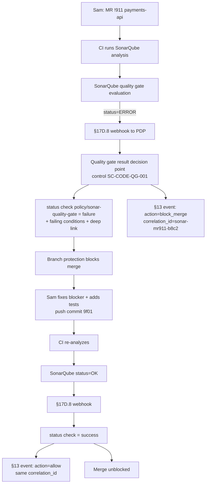

# DT-74 — SonarQube library — block merge on failed quality gate

**Personas:** Sam (Application Developer)
**Spec sections:** §17D.8 SonarQube Library (Quality gate result: block merge, fail build — "Production release requires passing quality gate"), §17D.1 Library elements, §17D.11 Cross-Product Decision Point Pattern, §13 Audit schema
**Type:** Low-level
**Pre-condition:** The `payments-api` repo is wired to SonarQube; the project uses the org's `Sonar way - strict` quality gate. The §17D.8 library is installed: a SonarQube webhook delivers the analysis result to the policy engine, which posts a GitHub/GitLab status check `policy/sonar-quality-gate`. Branch protection on `main` requires that check to pass. Sam owns `payments-api`.
**Trigger:** Sam opens MR `!911` on `payments-api`. The CI pipeline runs SonarQube analysis on commit `b8c2…`; the analysis completes and SonarQube fires the `webhook.qualitygate.status` event with `status=ERROR` (new code coverage 61% < 80% threshold; one new BLOCKER reliability issue).

## Steps
1. The §17D.8 PDP receives the SonarQube webhook payload. It evaluates the `Quality gate result` decision point: `status=ERROR` ⇒ `decision=block merge, fail build` per control `SC-CODE-QG-001` ("Production release requires passing quality gate").
2. The PDP posts status check `policy/sonar-quality-gate = failure` against commit `b8c2…` with a structured description: failed conditions (`new_coverage<80%`, `new_blocker_issues>0`), a deep link to the SonarQube project dashboard scoped to this MR's new code, and a one-line remediation hint per condition.
3. The git host's branch protection blocks the "Merge" button on `!911` because the required check is failing. Sam sees the failure inline on the MR page within seconds of the SonarQube webhook.
4. The §17D.8 PDP emits a §13 audit event: `source=sonarqube`, `decision_point=quality_gate.result`, `subject={user:sam}`, `resource_id=payments-api!911@b8c2…`, `action=block_merge`, `gate_conditions=[new_coverage:fail, new_blocker_issues:fail]`, `control_id=SC-CODE-QG-001`, `policy_version=sonar-lib:v1`, `correlation_id=sonar-mr911-b8c2`.
5. Sam clicks the deep link, lands on the SonarQube "new code" view filtered to commit `b8c2…`, fixes the BLOCKER issue, adds tests to lift new-code coverage to 84%, and pushes commit `9f01…`.
6. CI re-runs analysis; SonarQube fires a second `webhook.qualitygate.status` with `status=OK`. The §17D.8 PDP flips status check `policy/sonar-quality-gate = success`, emits a paired §13 audit event with `action=allow` sharing `correlation_id=sonar-mr911-…`, and the merge button unblocks.
7. The gate is enforced at status-check time only (low-level read of a tool result, no approval workflow). No human intervention is needed on the policy side — the `OK` → `success` transition is automatic.

## Success criteria (testable)
- Within one webhook delivery, a SonarQube `status=ERROR` produces status check `policy/sonar-quality-gate = failure` on the corresponding commit, blocking merge through branch protection.
- The failure description names each failing gate condition (not just "quality gate failed") and links directly to the SonarQube project view for the MR's new code.
- A passing re-analysis flips the status to `success` automatically and emits a paired §13 audit event sharing the original `correlation_id`.
- The §13 audit event captures `gate_conditions` so §14 analytics can answer "how often does new_coverage fail on first attempt?" without consulting SonarQube directly.
- Sam's path from "blocked" to "unblocked" requires no Slack ping, no Jira ticket, and no security approval — the failure message is self-serve.

## Flowchart

## Notes
Related: DT-71 (GitLab MR approval), DT-19 (Conftest CI). Other §17D.8 rows (vulnerability detected, security hotspot, profile change) are sibling controls handled separately.
