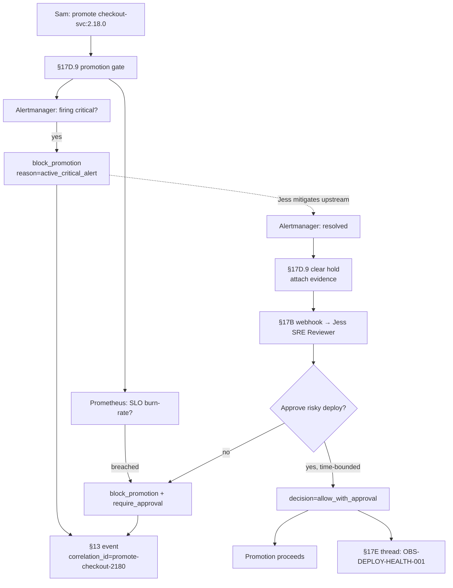

# DT-75 — Grafana/Prometheus library — block deploy when SLO breached or alert firing

**Personas:** Jess (SRE / Platform Operator), Sam (Application Developer)
**Spec sections:** §17D.9 Grafana/Prometheus Library (Alert fired: block promotion; Alert resolved: clear hold; SLO breach: require approval, block promotion), §17D.1 Library elements, §17D.11 Cross-Product Decision Point Pattern, §17B Approval-Gated Decisions, §13 Audit schema, §17E Reporting
**Type:** Mid-level
**Pre-condition:** The `checkout-svc` deploy pipeline includes a §17D.9 promotion gate as the last step before `prod`. Jess owns the gate configuration: it queries Alertmanager for `service=checkout-svc severity=critical state=firing`, and Prometheus for the 30-day burn-rate against SLO `checkout-svc-availability-99.9`. Sam owns the service and triggers the deploy. Control `OBS-DEPLOY-HEALTH-001` ("Active critical alert blocks deployment promotion; SLO breach blocks risky deploy") is mapped to this PDP.
**Trigger:** Sam promotes `checkout-svc:2.18.0` to `prod`. Concurrently Alertmanager is firing `HighCheckoutLatencyP99` (critical, started 7 minutes ago), and the 30-day burn rate has consumed 145% of the SLO error budget.

## Steps
1. The §17D.9 PDP receives the `promote` event from the CD pipeline. It runs two queries per Jess's library config: (a) Alertmanager `api/v2/alerts?filter=service=checkout-svc,severity=critical,state=firing`; (b) PromQL burn-rate over 30 days against `slo:checkout_svc_availability:ratio_30d < 0.999`.
2. Query (a) returns `HighCheckoutLatencyP99` active. The PDP emits `decision=block_promotion` per §17D.9 "Alert fired" row, with `reason=active_critical_alert`, `alert_fingerprint=…`, `started_at`. The pipeline pauses at `prod-promote` with a structured failure message and a deep link to the Alertmanager alert and Grafana SLO board.
3. Query (b) shows SLO breach. Per §17D.9 "SLO breach" row, the decision compounds: `block_promotion + require_approval` (risky deploy onto an unhealthy service). The §17B webhook is queued but held — approval routing only fires once the active-alert hold clears, so the on-call (Jess) is not paged for an approval that would be moot.
4. The PDP emits a §13 audit event: `source=grafana-prometheus`, `decision_point=promotion.gate`, `subject={user:sam, pipeline:checkout-svc#4421}`, `resource_id=checkout-svc:2.18.0`, `action=block_promotion`, `signals=[alert:HighCheckoutLatencyP99:firing, slo:availability:breached(145%)]`, `control_id=OBS-DEPLOY-HEALTH-001`, `policy_version=grafana-lib:v1`, `correlation_id=promote-checkout-2180`.
5. Jess investigates: the latency spike traces to an upstream `payments-api` degradation, not to Sam's change. She mitigates upstream; Alertmanager fires `HighCheckoutLatencyP99` `resolved` 12 minutes later. The §17D.9 "Alert resolved" hook re-evaluates the gate: alert clear → the alert-fired hold is released automatically (§17D.9 "clear hold, attach evidence"). The resolved alert is attached as evidence to the §13 audit chain.
6. The PDP re-runs query (b). The SLO is still in breach. Per §17D.9, the gate stays `block_promotion + require_approval`, and the §17B webhook now fires: Jess (SRE Reviewer) is notified with the SLO panel, burn-rate trend, the proposed change diff (Sam's release notes), and risk classification.
7. Jess assesses risk — the change is a UI-only bugfix with no checkout-path code touched — and approves a time-bounded promotion (expires in 4h, only `checkout-svc:2.18.0`). The PDP emits `decision=allow_with_approval`, attaches `approval_ref` and `slo_state=breached_but_approved`, and the pipeline promotes. If approval expires before the deploy completes, the gate blocks (DT-62 pattern).
8. Sam and Jess see the full sequence on the §17E real-time slice for `control_id=OBS-DEPLOY-HEALTH-001`: block → resolved-clear → SLO-approve → allow, threaded by `correlation_id`.

## Success criteria (testable)
- A firing critical alert on the target service produces `decision=block_promotion` within one gate evaluation; the pipeline pauses at `prod-promote` with the alert fingerprint and a Grafana/Alertmanager deep link.
- When the alert resolves, the alert-fired hold clears automatically without operator action; no manual "unstick" step is required.
- An independent SLO breach signal causes the gate to require §17B approval even when no alert is firing; the requester (Sam) cannot self-approve.
- All decisions in one promotion attempt share one `correlation_id` and surface as a single threaded row in the §17E view for `OBS-DEPLOY-HEALTH-001`.
- Approvals are time-bounded; expiry re-blocks promotion automatically.
- The §13 event captures both signals (`alert`, `slo`) so §14 analytics can answer "how often does SLO breach gate prod deploys?" without re-querying Prometheus.

## Flowchart

## Notes
Related: DT-72 (Trivy exception), DT-62 (re-authorization), DT-70 (Jenkins gate). Other §17D.9 rows (alert-rule change, dashboard change, data source change) are sibling controls handled separately.
