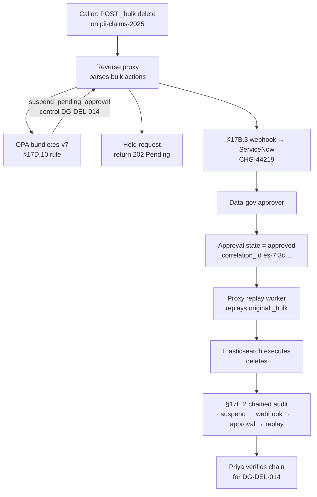

# DT-76 — Elasticsearch library: require approval for bulk delete on regulated index

**Personas:** Marcus (Platform Security Engineer), Priya (Compliance & GRC Lead)
**Spec sections:** §17D.10 Elasticsearch / Kibana Library (rows: "Elasticsearch API call — Bulk delete on production index requires approval"; "Document write/delete — Delete on regulated index requires approval"), §17B.2 Decision Outcomes (`suspend_pending_approval`), §17B.3 Workflow Webhook Integration, §17D.11 Cross-Product Decision Point Pattern
**Type:** Mid-level
**Pre-condition:** A reverse proxy fronts the production Elasticsearch cluster and forwards every API call to an OPA sidecar (§17D.10 real-time hook). Indices matching `pii-*` are tagged `regulated=true` in an external-data feed. The active bundle `bundle:es-v7` ties this rule to control `DG-DEL-014`. ServiceNow is the configured approval workflow endpoint (§17B.3).
**Trigger:** A data engineer issues `POST /pii-claims-2025/_bulk` containing 12,000 `{ "delete": ... }` actions through the proxy.

## Steps
1. The reverse proxy intercepts the `_bulk` request, parses the action lines, classifies the call as `action=document.bulk_delete` on `index=pii-claims-2025`, and POSTs the policy input (method, path, parsed actions, JWT subject `marcus.dev@…`, source IP, correlation_id) to OPA per §17D.10 and §17D.11.
2. OPA evaluates `bundle:es-v7`. The rule matches §17D.10 ("Bulk delete on production index requires approval") and §17D.10 ("Delete on regulated index requires approval"), returns `decision=suspend_pending_approval` with `control_id=DG-DEL-014`, `reason="bulk_delete on regulated index"`, `required_approvers=["data-governance"]` (§17B.2).
3. The proxy holds the request in a short-lived suspend buffer (request_id `es-7f3c…`), returns `HTTP 202 Pending` with the approval URL to the caller, and the platform fires the §17B.3 webhook payload (`decision=suspend_pending_approval`, control, actor, resource, correlation_id) to ServiceNow, which opens CHG-44219 routed to data-governance.
4. A data-governance approver reviews the request in ServiceNow — sees actor, target index, action count, matched control, policy version — and approves. ServiceNow calls the platform approval-state API; the approval object transitions to `approved` and references `correlation_id=es-7f3c…`.
5. The proxy's replay worker observes the approved state, replays the original `_bulk` body to Elasticsearch with header `X-Policy-Approval: es-7f3c…`, and returns the live ES response to the original caller (or via a polled status endpoint).
6. The audit pipeline emits a single chained event for the §17E.2 report: original suspend decision, webhook correlation, approval record, replayed request hash, ES response status — all sharing `correlation_id=es-7f3c…`. Priya later confirms the chain is intact for control `DG-DEL-014`.

## Success criteria (testable)
- The proxy never forwards the original `_bulk` request to Elasticsearch until an `approved` state exists for `correlation_id=es-7f3c…`.
- OPA returns `suspend_pending_approval` with `control_id=DG-DEL-014` and matched policy `bundle:es-v7` (§17B.2, §17D.10).
- A §17B.3 webhook payload is delivered to ServiceNow within the configured timeout and contains actor, resource, decision, control_id, correlation_id.
- The replayed request and live ES response share the same `correlation_id` as the original suspend decision and the approval record.
- The §17E.2 Real-Time Enforcement Report row for this event includes the approval-webhook correlation field populated.

## Flowchart

## Notes
Related: HL-10 (approval with break-glass), DT-77 (real-time enforcement report). The Kubernetes admission deny-and-retry pattern (§17B.5) does not apply here because the ES proxy is not bound by admission deadlines.
