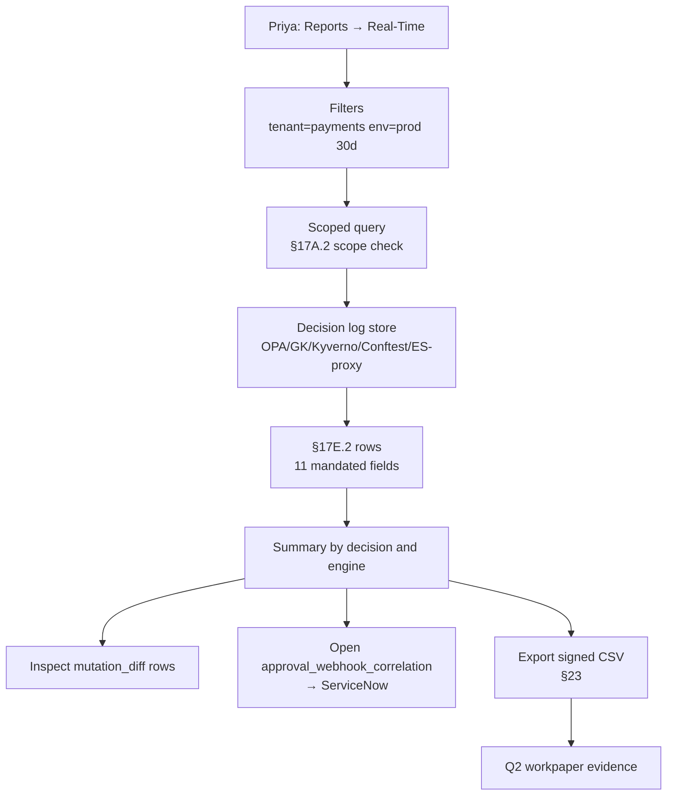

# DT-77 — Generate the real-time enforcement report for production tenants

**Personas:** Priya (Compliance & GRC Lead)
**Spec sections:** §17E.1 Report Categories (real-time enforcement actions, mutations, approvals, suspends), §17E.2 Real-Time Enforcement Report (required fields)
**Type:** Low-level
**Pre-condition:** Priya has the Compliance Analyst role (§17A.2) with read access scoped to `tenant=payments`. The platform ingests decisions from OPA, Gatekeeper, Kyverno, and Conftest (§17C) and the §17D product libraries. The Governance Console exposes the §17E.2 report view.
**Trigger:** Priya opens the Reports tab, selects "Real-Time Enforcement," and applies filters `tenant=payments`, `env=prod`, `window=last 30 days`.

## Steps
1. Priya selects the §17E.2 report and applies the three filters. The Console issues a scoped query into the decision-log store; results are bounded to namespaces tagged `tenant=payments` and `env=prod` (§17A.2 scope check).
2. The report renders one row per decision with the §17E.2 mandated columns: decision timestamp, actor (JWT subject), resource (e.g. `cluster-a/payments-prod/Deployment/api`), namespace, policy engine (`opa|gatekeeper|kyverno|conftest|es-proxy`), policy version (bundle digest), control_id, decision, action_performed, mutation_diff (populated only when `action_performed=mutate`), and approval_webhook_correlation (populated only when the decision was `suspend_pending_approval` or `require_approval`).
3. Priya sorts by `decision` and notes counts: 4,217 allow, 38 deny, 6 mutate, 4 suspend_pending_approval. The summary banner shows totals broken down by engine — confirming all four engines contributed events to the window (no silent engine gap).
4. For the 6 `mutate` rows, she expands the `mutation_diff` JSON-patch column inline (e.g., adding `securityContext.runAsNonRoot=true`); for the 4 `suspend_pending_approval` rows, she clicks `approval_webhook_correlation` and is linked to the corresponding ServiceNow change record and final approval state.
5. Priya filters further to `control_id=SC-IMG-001`, exports the filtered population as a signed CSV evidence package, and attaches it to her Q2 workpaper. The export embeds the query parameters, row count, and a signature over the result set (§23 tamper-evident evidence).
6. She saves the filter set as the named view "payments-prod-30d" so the next monthly cycle is one click.

## Success criteria (testable)
- Every rendered row contains all 11 §17E.2 fields; `mutation_diff` is non-empty iff `action_performed=mutate`; `approval_webhook_correlation` is non-empty iff decision is `suspend_pending_approval` or `require_approval`.
- The filter set `tenant=payments` ∧ `env=prod` ∧ `window=30d` is honored — zero rows from other tenants or environments appear (§17A.2 scope).
- The result set spans all engines the tenant uses (OPA, Gatekeeper, Kyverno, Conftest, product-library proxies) — none silently omitted.
- The exported CSV is signed and includes the query parameters and result count in its manifest (§23-aligned).
- Clicking `approval_webhook_correlation` resolves to the external workflow record for every suspend/approval row.

## Flowchart

## Notes
Related: DT-76 (populates approval-correlation rows), DT-78 (audit-derived complement), HL-01 (quarterly cycle).
