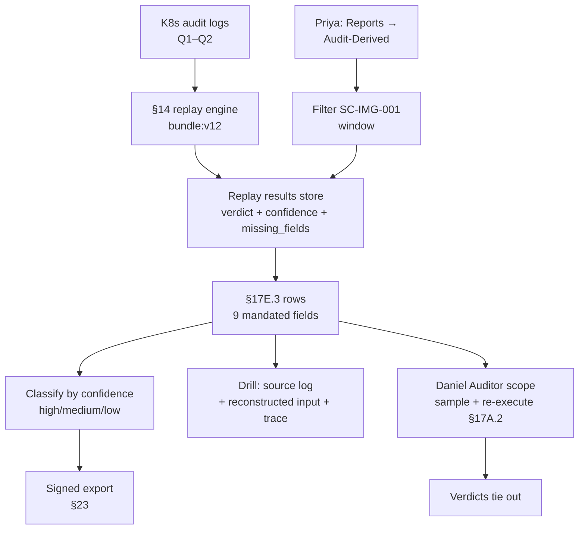

# DT-78 — Generate the audit-derived violation report for control SC-IMG-001

**Personas:** Priya (Compliance & GRC Lead), Daniel (Internal / External Auditor)
**Spec sections:** §17E.3 Audit-Derived Violation Report (required fields), §19 Retrospective Audit Detection, §14.1 Detect missing enforcement coverage, §17A.2 Auditor role
**Type:** Mid-level
**Pre-condition:** Control `SC-IMG-001` (no unsigned images) is enforced by Gatekeeper in production. The §14 analytics engine performs daily replay of Kubernetes audit logs against the deployed Rego (`bundle:v12` for the period 1 Mar – 31 May). Priya has the Compliance Analyst role; Daniel has the Auditor role with read-only scope over the audit period (§17A.2).
**Trigger:** Priya opens "Reports → Audit-Derived Violations," scopes to `control_id=SC-IMG-001`, and sets the window to the Q1-Q2 audit period.

## Steps
1. Priya selects §17E.3 and applies filters `control_id=SC-IMG-001`, `window=2026-03-01..2026-05-31`. The Console invokes the §14 replay results store; the engine has already replayed every K8s audit row whose `kind in {Pod,Deployment,…}` against `bundle:v12` per §19.
2. The report renders one row per detected violation with all §17E.3 fields: violation_timestamp (from source log), discovery_timestamp (when replay produced `decision=deny`), source_audit_log (e.g. `k8s-apiserver:cluster-a:7f3c…`), reconstructed_policy_input (the `requestObject` plus JWT claims joined at request time), policy_version (`bundle:v12`), confidence_level (`high|medium|low`), missing_fields (e.g. `["image.digest"]` when only a tag was logged), matched control_id (`SC-IMG-001`), recommended_remediation (string).
3. Priya inspects three classes of rows: (a) `confidence=high, missing_fields=[]` — fully reconstructable violations; (b) `confidence=medium, missing_fields=["image.digest"]` — replay defaulted unknown fields conservatively; (c) `confidence=low` — replay disclaimed a verdict and recommends operator review. She tags class (c) for follow-up.
4. For one row Priya drills in: the source K8s audit row has no paired Gatekeeper or OPA event (§14.1 missing coverage; §19 example), the reconstructed input is shown side-by-side with the Rego decision trace, and the remediation reads "Re-deploy with cosign-signed image and rotate base image."
5. Daniel, using his Auditor scope, independently runs the same report, samples 25 rows across confidence bands, and uses the "Re-execute" button to replay each reconstructed input against `bundle:v12` from his session. His results tie out row-for-row to the platform's stored verdicts — independent reproducibility (§17A.2, §17.4).
6. Priya exports the population as a signed evidence package for the SC-IMG-001 workpaper and links the row IDs into her GRC platform.

## Success criteria (testable)
- Every rendered row contains all 9 §17E.3 fields; `missing_fields` is a list (possibly empty) and `confidence_level` ∈ {high, medium, low}.
- Rows with `confidence=low` carry a non-empty `recommended_remediation` and are not auto-counted in violation totals without operator confirmation.
- Daniel's independent re-execution returns the same decision as the stored verdict for ≥95% of sampled rows; any divergence triggers a flag (consistent with §17.4 differential replay).
- Source-audit-log identifiers in the report dereference back to the original log row (round-trip).
- The exported package is signed (§23-aligned) and includes the replay `policy_version`, the row count, and the query window.

## Flowchart

## Notes
Related: DT-30 (single bypass detection), HL-05 (annual SOC 2), HL-18 (auditor re-execution). The "Re-execute" control is the auditor's independent-replay primitive (§17.4).
