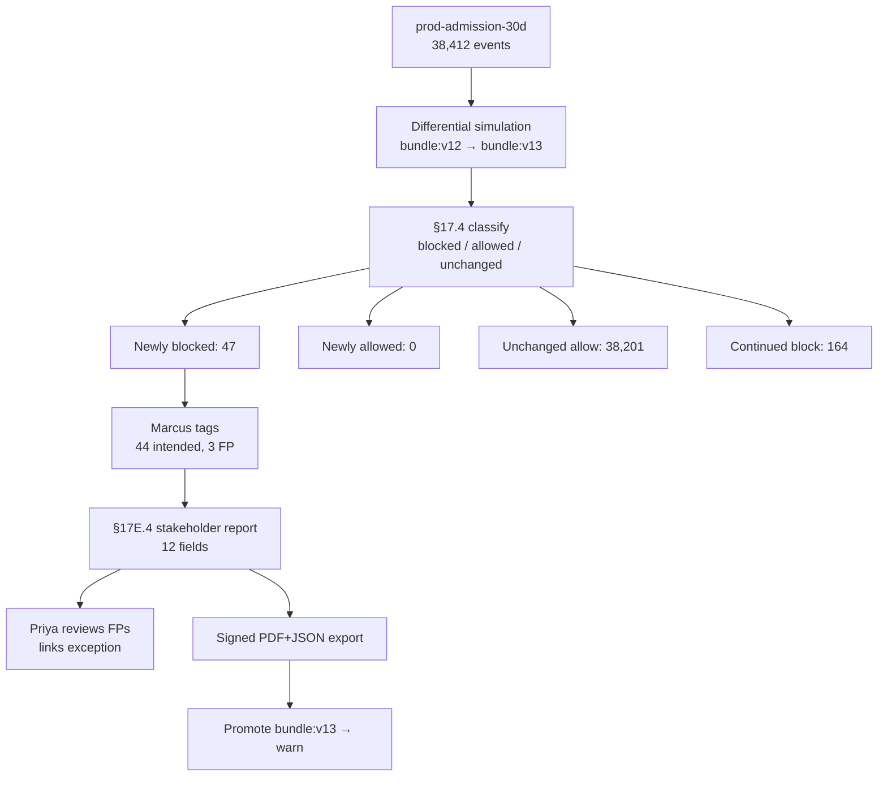

# DT-79 — Generate a simulation report for stakeholder review

**Personas:** Marcus (Platform Security Engineer), Priya (Compliance & GRC Lead)
**Spec sections:** §17E.4 Simulation Report (required fields), §17.4 Differential Simulation Semantics (4 classifications + tagging), §17.6 Example Simulation Workflow
**Type:** Low-level
**Pre-condition:** Marcus has authored `bundle:v13` — a tightening of the image-signing policy on control `SC-IMG-001` to require a specific signer identity. The platform's simulation framework can replay the last 30 days of production admission events (audit dataset `prod-admission-30d`, 38,412 events) against any candidate bundle (§17.6). `bundle:v12` is currently in production.
**Trigger:** Marcus runs differential simulation `bundle:v12 → bundle:v13` over `prod-admission-30d`, then clicks "Generate stakeholder report" to share with Priya before promoting to enforce.

## Steps
1. The simulation framework replays all 38,412 events against `bundle:v12` and `bundle:v13`, classifying each result per §17.4: Newly blocked (allow→deny), Newly allowed (deny→allow), Unchanged allowed (allow→allow), Continued block (deny→deny). Counts: 47 / 0 / 38,201 / 164.
2. For each Newly blocked row Marcus assigns a §17.4 tag — `intended_enforcement` (44), `potential_false_positive` (3 — canary signer from team-payments). For each Newly allowed row the report would list tags from {intended_relaxation, potential_regression, requires_review, approved_exception}; here the count is 0 so the section is empty.
3. Marcus clicks "Generate stakeholder report" (§17.6 step 8). The report renders the §17E.4 mandated fields: policy_version_before=`bundle:v12`, policy_version_after=`bundle:v13`, audit_dataset=`prod-admission-30d`, events_evaluated=38,412, newly_blocked_count=47, newly_allowed_count=0, unchanged_allowed_count=38,201, unchanged_denied_count=164, tagged_intentional_changes=44, untagged_risky_changes=0 (after Marcus tags the 3 FPs), false_positive_candidates=3, false_negative_candidates=0.
4. Each count cell links to the underlying event list. Priya opens the `false_positive_candidates=3` cell, sees the canary-signer rows, confirms team-payments has an open exception request, and signs off in-report.
5. The report is exported as a signed PDF + JSON pair for the change-advisory board; identifiers include both bundle digests, the dataset id, and the simulation run id.
6. Promotion proceeds: Marcus moves `bundle:v13` to warn mode (§17.6 step 9), the exception for the canary signer is linked to the report, and Priya attaches the artifact to control `SC-IMG-001` evidence.

## Success criteria (testable)
- The report contains all 12 §17E.4 fields with non-null values for counts and dataset/version identifiers.
- The four §17.4 classification counts sum to `events_evaluated` (47 + 0 + 38,201 + 164 = 38,412).
- `untagged_risky_changes` equals the number of Newly-blocked or Newly-allowed rows lacking a §17.4 tag; it is computed live and must reach 0 before "Promote" is enabled.
- `false_positive_candidates` is the count of Newly-blocked rows tagged `potential_false_positive`; `false_negative_candidates` is the count of Newly-allowed rows tagged `potential_regression`.
- The export is signed and identifies both bundle digests and the dataset id, enabling re-execution.

## Flowchart

## Notes
Related: HL-17 (sim prevents 2 a.m. rollback), DT-77 (post-promotion enforcement view). `untagged_risky_changes=0` is the spec-implied promotion gate from §17.4 + §17.6.
