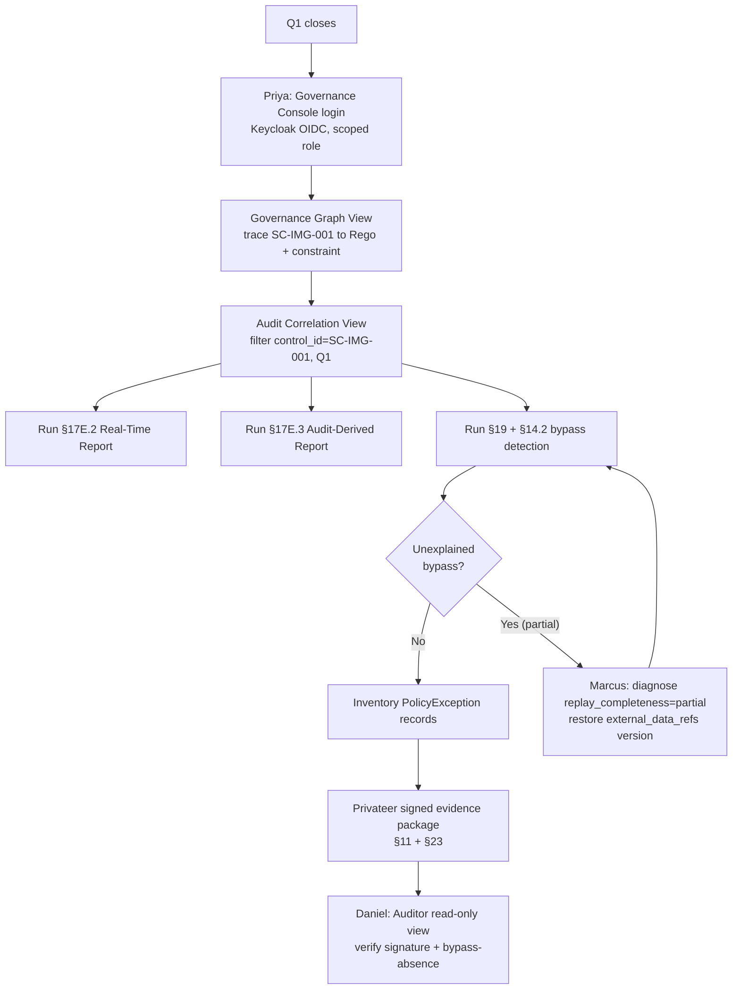

# HL-01 — Quarterly SOC 2 evidence collection cycle

**Personas:** Priya (lead, Compliance Analyst), Daniel (consumer, Auditor), Marcus (occasional support, Platform Governance Admin)
**Spec sections:** §6 governance hierarchy, §11 Privateer, §14 Compliance Analytics Engine, §16.3 Audit Correlation View, §17E Reporting, §19 Retrospective Audit Detection
**Type:** End-to-end
**Pre-condition:** Gemara controls SC-IMG-001 (image signing), AC-NS-002 (namespace ownership), and DEPLOY-APPROVAL-001 are deployed as signed OPA bundles; Privateer is collecting evaluation evidence; Audit Schema Service is normalizing events from Gatekeeper, OPA decision logs, Conftest, and Keycloak; quarter Q1 has closed.
**Trigger:** Priya begins her quarterly SOC 2 evidence cycle and needs population-level evidence for the operating effectiveness of in-scope controls without filing engineering tickets.

## Steps
1. Priya signs in to the Governance Console via Keycloak; her token carries `roles=["compliance-analyst"]` and `policy_domains=["supply-chain","runtime-security"]`. Storage scope per §17A.5 filters her view to in-scope tenants automatically.
2. In the Governance Graph View she selects control `SC-IMG-001`, confirms it traces to `governance.kubernetes.imagesigning` Rego package, Gatekeeper constraint `K8sRequireSignedImage`, and Privateer evaluation `EVAL-SC-IMG-001`.
3. She opens the Audit Correlation View, filters by `control_id=SC-IMG-001`, range = Q1, and inspects the enforcement decision population: total decisions, denies, warns, and `replay_completeness=complete` ratio.
4. She invokes §17E.2 Real-Time Enforcement Report and §17E.3 Audit-Derived Violation Report; both reports include `policy_version`, `correlation_id`, `outcome_reason`, and subject JWT context for every event.
5. She runs the §14.2 bypass-detection query (resources without matching Gatekeeper audit event + OPA decision log) and §19 retrospective detection across the quarter; result shows zero unexplained bypasses and links every reconciled discrepancy to a logged maintenance window.
6. She reviews the `PolicyException` records linked to SC-IMG-001 (12 exceptions, all with linked approvers and expiry); she annotates each as compensating control.
7. She asks Marcus for spot help on one `replay_completeness=partial` event; Marcus identifies the missing `external_data_refs` version and reclassifies the event after re-replay against the recorded bundle version.
8. Priya clicks Export Evidence Package; Privateer produces a signed bundle containing the Gemara control snapshot, Rego metadata, enforcement population CSV, bypass-absence report, exception list, and report digests per §23.
9. She hands the signed package to Daniel for read-only walkthrough in the Auditor scope of the Console.
10. Daniel verifies the package signature, reads the bypass-absence report, and confirms population completeness from the same Console view rather than from a spreadsheet.

## Success criteria (testable)
- Audit Correlation View returns the full enforcement population for `control_id=SC-IMG-001` over the quarter, not a sample; row count matches the §17E.2 report row count.
- Every row in the exported evidence carries `policy_version`, `control_id`, `correlation_id`, and `replay_completeness`.
- §19 retrospective detection returns zero unexplained bypass alerts; reconciled discrepancies are each linked to an approved maintenance change.
- The exported evidence package signature verifies against the platform key, and the manifest enumerates every included file with a digest (per §23).
- Daniel can open the same scoped view read-only via his Auditor role without Priya re-exporting anything; no engineering ticket was filed during the cycle.
- Total elapsed time from cycle start to handoff is bounded by Priya's working hours, not by engineering ticket latency.

## Flowchart

## Notes
Feeds directly into HL-05 (annual SOC 2 Type II engagement) — the signed packages from each quarter form Daniel's Type II evidence corpus. Bypass-detection mechanics also appear in HL-06.
