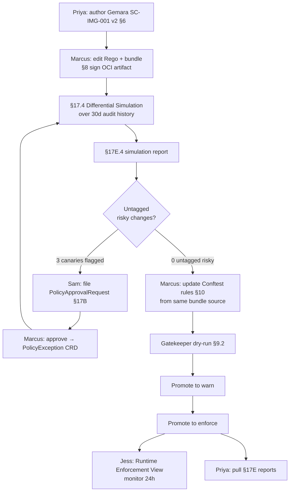

# HL-02 — Image-signing policy rollout end-to-end

**Personas:** Marcus (lead, Platform Governance Admin), Jess (SRE), Priya (Compliance Analyst), Sam (affected Developer on team-payments)
**Spec sections:** §6 governance hierarchy, §7 policy lifecycle, §8 OPA bundles, §9 Gatekeeper modes, §10 Conftest, §17.4 Differential Simulation, §17E Reporting
**Type:** End-to-end
**Pre-condition:** Existing weaker image-signing policy is enforced in production. Audit Schema Service has 30 days of replay-capable admission events (`replay_completeness=complete`). Keycloak emits `tenant`, `groups`, `environment` claims. Headlamp-based Governance Console is installed.
**Trigger:** Priya issues a strengthened governance requirement: production images must be signed by an approved corporate signer identity, not just any cosign signature.

## Steps
1. Priya authors the updated Gemara control under §6: keeps `control_id=SC-IMG-001`, raises severity to `critical`, adds an enforcement requirement ("approved signer identity"), an evaluation requirement, and an evidence requirement listing required audit fields.
2. Marcus opens the Rego Explorer (§16.3), forks `governance.kubernetes.imagesigning`, and edits the Rego to require `cosign.sigstore.dev/imageRef` plus a signer identity allowlist. He updates Rego metadata: `__control_id__ := "SC-IMG-001"`, `__required_claims__ := ["groups","tenant","environment"]`. Builds a candidate bundle as a signed OCI artifact per §8.2.
3. Marcus runs a §17.4 Differential Simulation against the last 30 days of production admission events using the new bundle vs. the deployed bundle. The §17E.4 simulation report classifies each event as newly blocked / newly allowed / unchanged.
4. Result: 47 newly-blocked deployments, of which 3 are legitimate canary builds from team-payments using a legacy signer. Marcus tags those 3 as Potential false positive → Requires review; the other 44 he tags Intended enforcement.
5. Sam (notified through the affected-team channel) reviews the 3 canaries, confirms they are legitimate, and files a `PolicyApprovalRequest` (§17B / §17C.6) requesting an exception for the legacy signer identity scoped to `namespace=payments-prod, expires_at=2026-06-30`.
6. Marcus approves the exception, which materializes as a `PolicyException` referenced by the new bundle; he re-runs differential simulation; newly-blocked count drops to 44 with zero untagged risky changes.
7. Marcus updates the Conftest ruleset (§10) from the same bundle source so CI gates use the same logic as admission, eliminating the seam (G2).
8. Marcus promotes the constraint to `dry-run` (§9.2). Audit Correlation View shows shadow decisions accumulating for 48 hours with no surprises.
9. Marcus promotes to `warn`; Gatekeeper emits warnings, Sam's team sees them in CI, and one additional team self-remediates after seeing the warning.
10. Marcus promotes to `deny`. Jess monitors the Runtime Enforcement View for deny rate, deny reasons, and any `replay_completeness != complete` events during the first 24 hours. No 2 a.m. page; no rollback.
11. Priya pulls the §17E reports the next morning and attaches them to the SC-IMG-001 control's evidence trail.

## Success criteria (testable)
- The §17E.4 simulation report exposes `newly_blocked_count`, `newly_allowed_count`, `unchanged_allowed_count`, `unchanged_denied_count`, and lists `tagged_intentional_changes` and `untagged_risky_changes`; untagged risky count is zero before promotion.
- Conftest output and Gatekeeper output for the same input manifest produce identical decisions and the same `control_id` and `policy_version` (no seam drift).
- The `PolicyException` for the legacy signer carries `controlId`, `requestedBy`, `expires_at`, approver subject, and is visible from the Approval Workflow view.
- During `dry-run` and `warn`, zero admissions are blocked; during `enforce`, denies match the simulation-predicted population within tolerance.
- No production rollback is filed in the 72 hours following enforce promotion; no incident page is opened against this control.
- Every emitted Gatekeeper decision event includes the §9.3 required fields (`policy_version`, `correlation_id`, JWT subject, JWT groups, constraint name, Rego package).

## Flowchart

## Notes
Mirrors the "before/after" Marcus narrative in the persona doc: replaces the 48-hour staged rollout that ended in a 2 a.m. rollback with a planned, simulated, tagged rollout. Related: HL-17 (differential simulation prevents rollback) is the focused single-persona variant.
