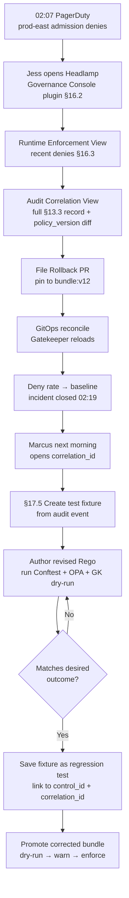

# HL-03 — 2 a.m. admission incident → regression fixture loop

**Personas:** Jess (lead, SRE / Cluster Operator), Marcus (Platform Governance Admin, follow-up)
**Spec sections:** §9 Gatekeeper enforcement, §13 Standardized Audit Event Schema (policy_version, correlation_id, JWT context), §16.2 Headlamp plugin, §16.3 Audit Correlation View, §17.5 audit-derived test cases
**Type:** End-to-end
**Pre-condition:** Headlamp Governance Console plugin is installed in Jess's cluster tooling. Audit Schema Service emits replay-capable events with all §13.3 fields. A constraint template under `governance.kubernetes.podsecurity` was updated four hours ago via GitOps and is now in `enforce` mode in `prod-east`.
**Trigger:** 02:07 — PagerDuty fires: "deploys failing in prod-east, payments and checkout teams blocked." Jess answers the page.

## Steps
1. Jess opens Headlamp on `prod-east`; the Governance Console plugin (§16.2) is already in her cluster nav. She does not context-switch.
2. She opens the Runtime Enforcement View (§16.3); recent denies are sorted top of list with constraint name, namespace, JWT subject, and `policy_version`.
3. She drills into a representative failing admission; the Audit Correlation View shows the full §13.3 record: `correlation_id`, `policy_version=bundle:v13`, `rego_package=governance.kubernetes.podsecurity`, JWT groups, `before_state`/`after_state`, `request_object`, `outcome_reason`, and `replay_completeness=complete`.
4. The view shows an inline diff between `bundle:v12` (in force four hours ago) and `bundle:v13` (current); a Rego rule was tightened to forbid a label pattern multiple payments and checkout workloads carry.
5. Jess clicks "File Rollback PR" — the plugin opens a pre-filled PR against the policy-bundle repo pinning the constraint back to `bundle:v12`, with the failing `correlation_id`s linked. She approves and merges with the on-call co-approver. Two clicks total.
6. GitOps reconciles; Gatekeeper switches back to `bundle:v12`; Runtime Enforcement View shows deny rate dropping to baseline within 90 seconds. Jess closes the page at 02:19.
7. Next morning Marcus picks up the incident. He opens the same `correlation_id` in the Audit Correlation View and clicks "Create test fixture from event" (§17.5).
8. The platform extracts the full policy input — `request_object`, JWT claims, external data refs — into a regression fixture, marked desired outcome = `allow`.
9. Marcus authors a revised Rego that catches the originally-intended bad pattern but allows the payments label pattern. He runs Conftest, OPA, and Gatekeeper dry-run against the fixture and against the broader §17.5 step-5 evaluation set.
10. The new policy matches the desired outcome on the fixture and across all related historical events; Marcus saves the fixture as a regression test and links it to control `RT-POD-014` and to the originating `correlation_id`.
11. He promotes the corrected policy through dry-run → warn → enforce (HL-02 pattern). The fixture now blocks any future regression of the same shape.

## Success criteria (testable)
- The deny event Jess opens displays the §13.3 required fields including `policy_version`, `correlation_id`, JWT subject, JWT groups, and `replay_completeness=complete`.
- The Audit Correlation View shows a side-by-side policy diff between the previous and current `policy_version` without leaving Headlamp.
- Rollback PR is filed and merged from inside the plugin with no manual editing; GitOps reconciles to the previous `policy_version` and the Runtime Enforcement View deny rate returns to baseline within minutes.
- The §17.5 "create test fixture" action produces a stored fixture containing the full normalized policy input plus the marked desired outcome.
- The fixture is linked to a Gemara `control_id` and to the originating `correlation_id`; running it against the deployed bundle reproduces the original deny, and running it against the corrected bundle yields the marked desired outcome.
- Incident wall-clock duration (page to deny-rate baseline) is bounded by the click-through, not by log archaeology — measured in single-digit minutes, not 90.

## Flowchart

## Notes
Demonstrates the cross-persona handoff Jess → Marcus: the incident becomes durable platform value (a regression test). Related: HL-12 (silent regression retrospective), DT-51 (the §17.5 fixture-creation feature in isolation).
