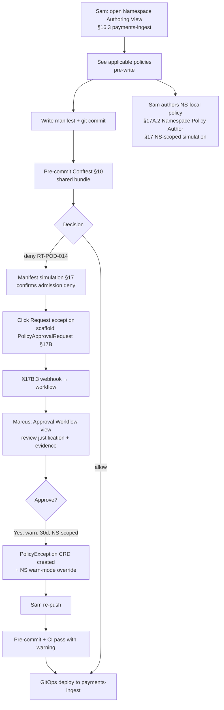

# HL-04 — Developer onboarding a new service through policy gates

**Personas:** Sam (lead, Developer on team-payments), Marcus (Platform Governance Admin, exception approver)
**Spec sections:** §7 unified policy lifecycle, §10 Conftest local, §16.3 Namespace Authoring View, §17A.2 Developer + Namespace Policy Author, §17A.5 storage scope, §17B approval workflow
**Type:** End-to-end
**Pre-condition:** Keycloak issues Sam a token with `groups=["team-payments"]`, `tenant="payments"`, `namespaces=["payments-dev","payments-prod"]`, `roles=["developer","namespace-policy-author"]`. Central policy bundle includes `K8sPSPPrivilegedContainer` enforcing no privileged containers. Conftest pre-commit hook references the same shared bundle as CI and admission (§7 / §10).
**Trigger:** Sam is onboarding a new `legacy-ingest` service that must run privileged because of a vendor SDK requirement. He creates `payments-ingest` namespace and starts writing manifests.

## Steps
1. Sam opens the Governance Console; storage-side scoping (§17A.5) shows him only `payments-*` namespaces and the controls applicable to them. He opens the Namespace Authoring View (§16.3) for `payments-ingest`.
2. The view lists all policies that will apply to manifests in this namespace pre-write: image signing (SC-IMG-001), pod security (`K8sPSPPrivilegedContainer`), required labels, NetworkPolicy generation by Kyverno on namespace create, and deploy approval gate. Sam sees the policy landscape before writing a line of YAML.
3. He writes the Deployment manifest and commits. The pre-commit hook runs Conftest (§10) against the shared bundle. Output: deny on `governance.kubernetes.podsecurity` with `control_id=RT-POD-014`, human-readable reason, and a "Request exception" link.
4. Sam runs the §17 manifest simulation from the Namespace Authoring View to confirm the same manifest would also be denied at admission — same `control_id`, same `policy_version`, no seam drift.
5. He clicks "Request exception"; the Console scaffolds a `PolicyApprovalRequest` (§17B / §17C.6) with `controlId=RT-POD-014`, `requestedBy=sam`, `resourceRef=deployments/legacy-ingest`, justification field, requested duration, and `requiredApproval.type=role, value=platform-governance-admin`.
6. He attaches the vendor SDK documentation, picks a 30-day duration, and submits. The platform emits the §17B.3 webhook to the workflow system.
7. Marcus is notified; he reviews the request in the Approval Workflow view, sees the linked manifest, the failing Conftest evidence, and Sam's justification. He approves with conditions: scope = `payments-ingest` only, mode = `warn` (not `deny`), expiry = 30 days, follow-up = vendor SDK upgrade ticket.
8. The approval materializes as a `PolicyException` linked to RT-POD-014; a temporary namespace-scoped `warn`-mode override for `K8sPSPPrivilegedContainer` is created for `payments-ingest`.
9. Sam re-pushes; pre-commit hook passes with a warning citing the active exception and expiry date; CI passes; GitOps deploys to `payments-ingest`.
10. Sam additionally authors a namespace-local policy ("internal pods must declare `app.team=payments`") as a Namespace Policy Author and tests it via §17 namespace-scoped simulation. Storage scope (§17A.5) prevents him from touching anything outside `payments-*`.

## Success criteria (testable)
- Namespace Authoring View lists every applicable policy for `payments-ingest` before Sam writes a manifest; the list is filtered by storage-side scope, not GUI-only.
- Conftest pre-commit and admission produce identical decisions (`control_id`, `policy_version`, decision, reason) for the same input.
- The `PolicyApprovalRequest` CRD contains the §17C.6 fields (`controlId`, `requestedBy`, `resourceRef`, `requiredApproval`, `status`); the §17B.3 webhook event fires once on submission.
- The approved `PolicyException` is scoped to `namespace=payments-ingest`, mode=`warn`, with non-null `expires_at`; the exception is visible from the Console's Approval/Exception view.
- After approval, Sam's deploy succeeds and the admission event records `decision=warn` with a reference to the active `PolicyException` and its `expires_at`.
- Sam cannot view or modify policies, simulations, violations, or exceptions for any namespace outside `payments-*` (storage-layer test per §17A.5).
- End-to-end elapsed time from first blocked push to successful deploy is bounded by approver response time, not by ticket triage — measured in minutes-to-hours, not days.

## Flowchart

## Notes
This is the developer-experience counterpart to HL-02 (the policy-author flow). Storage-scope enforcement (§17A.5) is verified in passing here and tested directly in DT-55. Exception expiry/re-auth is covered in HL-19.
