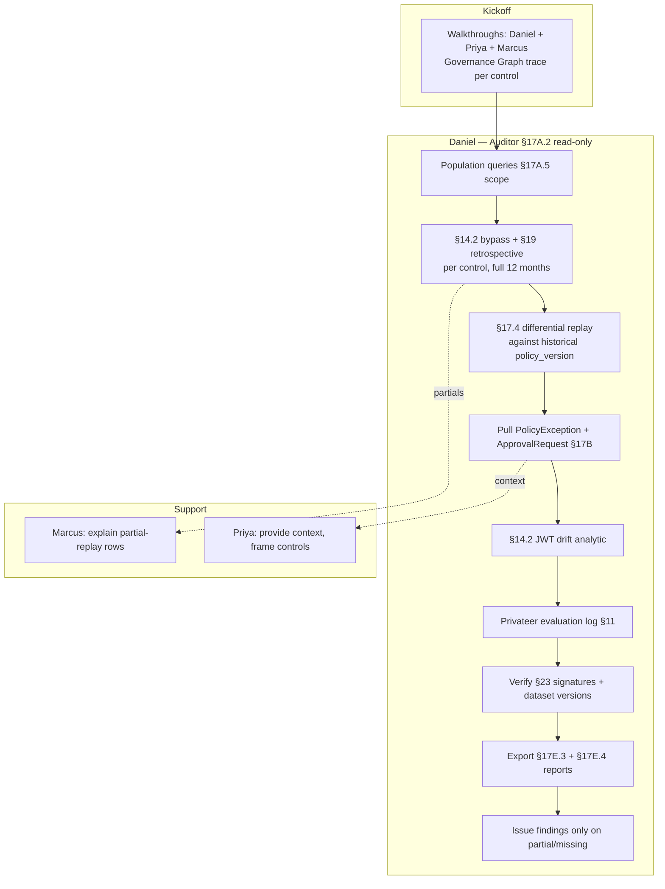

# HL-05 — Annual SOC 2 Type II external audit engagement

**Personas:** Daniel (lead, external Auditor — read-only scoped), Priya (Compliance Analyst), Marcus (Platform Governance Admin, walkthrough support)
**Spec sections:** §11 Privateer, §14.2 Bypass detection, §17.4 Differential Simulation (auditor-independent replay), §17A.2 Auditor role, §17A.5 storage-scope, §17E.3 Audit-derived violation report, §19 Retrospective Audit Detection, §23 Evidence integrity
**Type:** End-to-end
**Pre-condition:** 12-month audit period closed. All Gemara controls in scope (~40) have linked Rego, Privateer evaluations, and a continuous stream of replay-capable audit events for the full period. Daniel is provisioned via Keycloak with the §17A.2 **Auditor** role, scoped read-only to in-scope controls/namespaces. Bundle and evidence signing keys are published.
**Trigger:** Engagement kickoff: external firm begins SOC 2 Type II fieldwork.

## Steps
1. **Walkthroughs.** Daniel meets with Priya and Marcus and uses the **Governance Graph View** to trace each in-scope control (e.g., `SC-IMG-001`) from Gemara objective → Rego package → Gatekeeper constraint → Privateer evaluation → audit evidence (§3 G1). Marcus demonstrates one live admission decision; Daniel verifies the audit record carries `policy_version`, `control_id`, JWT subject, `correlation_id`, `replay_completeness`.
2. **Operating effectiveness — population, not sample.** Daniel queries each control's full enforcement population for the audit period via the Auditor scope (§17A.2). Storage-layer scope (§17A.5) confirms he cannot see out-of-scope namespaces or tenants. Population counts and bundle-version coverage are recorded.
3. **Bypass-absence proof.** Daniel runs the §14.2 **Gatekeeper bypass** analytic for each control over the full 12 months. Every Kubernetes Deployment-create/update event must reconcile to a Gatekeeper audit event and an OPA decision log; the §19 retrospective detector confirms no unreconciled mutating actions exist (or flags them with reasons).
4. **Independent replay.** Daniel selects a random and a risk-weighted sample of historical admission events and runs **Differential Simulation** (§17.4) against the deployed `policy_version` at the time of each event. Re-execution outcomes must match the original recorded decisions for `replay_completeness=complete` rows; any `partial`/`insufficient` rows are reported as evidence limitations rather than treated as authoritative.
5. **Exception/approval testing.** Daniel pulls every `PolicyException` and `PolicyApprovalRequest` (§17B, §17C.6) active during the period. Each must have a linked approver identity, control_id, scope, expiry, and approval webhook record. Exceptions whose expiry was missed must show subsequent denies, not silent continuation.
6. **Identity/JWT controls.** Daniel pulls the §14.2 **JWT policy drift** analytic to verify that required claims (`tenant`, `groups`, `environment`) were present on every relevant decision.
7. **Privateer evidence.** Daniel exports the Privateer **Gemara Evaluation Log** (§11) for each control — the governance-native artifact correlating control, Rego decision, Gatekeeper audit, Conftest output, SBOM, and signature evidence.
8. **Evidence integrity.** Daniel verifies §23 properties: the exported evidence package is signed; policy bundles are signed and versioned; the audit dataset is versioned/tamper-evident. He records the bundle digests and dataset version IDs in his workpapers.
9. **Reporting.** Daniel exports the §17E.3 Audit-Derived Violation Report per control, the §17E.4 differential-simulation reports from step 4, and a signed master evidence package per control.
10. **Findings.** Daniel issues findings only where evidence is partial/insufficient or where an exception was unaccounted for — never on bypass-absence (which is now provable).

## Success criteria (testable)
- Daniel's Auditor scope (§17A.2) is enforced at the storage layer (§17A.5): queries outside scope are rejected, not just hidden.
- Population counts for each in-scope control match between Priya's exports and Daniel's independent queries.
- For each control, §14.2 + §19 produce a 0-unreconciled-event result over the full audit period, or each unreconciled event has a documented justification.
- Differential simulation re-execution matches the original decision for ≥99% of `replay_completeness=complete` rows; mismatches are auto-flagged.
- Every `PolicyException` active in-period has a non-empty approver, expiry, control_id, and webhook correlation.
- Exported evidence package signatures verify against published platform keys; bundle digests in the workpaper match deployed bundles.
- Engagement evidence is population-level, not sampled, for the in-scope controls.

## Flowchart

## Notes
The annual peer of HL-01's quarterly cycle. Demonstrates G1 traceability + G3 retrospective compliance + §17.4 as auditor-grade evidence — a genuinely novel control test no prior tooling supports. Related: HL-01, HL-06, HL-18, DT-22, DT-46, DT-56, DT-78.
