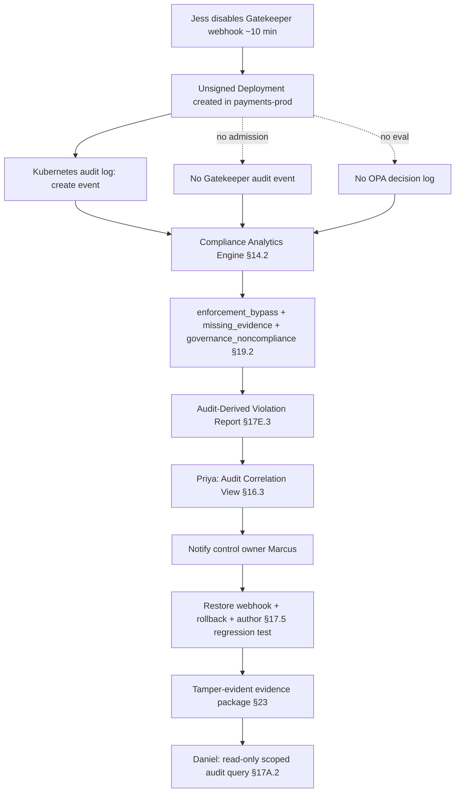

# HL-06 — Gatekeeper bypass retrospectively detected, post-incident review

**Personas:** Jess (SRE, initial), Priya (GRC Lead, review), Daniel (Auditor, eventual)
**Spec sections:** §14.2 Gatekeeper Bypass; §17E.3 Audit-Derived Violation Report; §19 Retrospective Audit Detection; §23 Evidence integrity
**Type:** End-to-end
**Pre-condition:** Control SC-IMG-001 (signed images) is enforced cluster-wide via Gatekeeper; Compliance Analytics Engine consumes Kubernetes audit logs, Gatekeeper audit events, and OPA decision logs; Privateer is producing evaluation evidence.
**Trigger:** During a P1 incident, Jess scales down the Gatekeeper validating webhook configuration "just for 10 minutes" to unblock a hotfix. An unsigned image deployment slips through admission unobserved.

## Steps
1. Jess removes the `gatekeeper-validating-webhook-configuration` for ~10 minutes; an unsigned `payments-api:hotfix-9` Deployment is created in `payments-prod`. Kubernetes audit log records the create; no Gatekeeper audit event and no OPA decision log are emitted (§19.2 conditions).
2. The Compliance Analytics Engine (§14.1) consumes the three audit streams and runs the §14.2 Gatekeeper Bypass detector: deployment exists with no corresponding admission evaluation, no Gatekeeper audit event, no OPA decision log against SC-IMG-001.
3. Engine emits the three §19.2 outputs: `enforcement_bypass` alert, `missing_policy_evaluation_evidence` event, and a `governance_noncompliance` event tagged with `control_id=SC-IMG-001`.
4. Platform generates an Audit-Derived Violation Report (§17E.3) with violation_timestamp (deploy time), discovery_timestamp (analytics run time), source audit log refs, reconstructed policy input from the Kubernetes audit entry, policy_version used for replay, confidence_level=`high` (one required input field — image signature annotation — was absent), matched control_id SC-IMG-001, and recommended remediation (cordon workload, restore webhook, file PolicyException or remove).
5. Priya, as Compliance Analyst (§17A.2), receives the report in the Governance Console Audit Correlation View (§16.3). She opens the bypass alert, confirms the control owner is Marcus's team via the Governance Graph View, and re-assigns remediation tracking to him.
6. Jess restores the webhook config and rolls back the unsigned Deployment; Marcus authors a §17.5 regression test fixture from the Kubernetes audit event so any future webhook-disabled bypass replays as a deny.
7. Months later, Daniel (Auditor, read-only scope per §17A.2) opens the audit period, queries SC-IMG-001 bypass events, and confirms the single detected bypass with its remediation trail. He verifies the §23 tamper-evident evidence package signature on the export.

## Success criteria (testable)
- Within one analytics window after the unsigned deployment lands, an `enforcement_bypass` alert references `SC-IMG-001`, the deployment UID, and the missing Gatekeeper/OPA event IDs.
- The §17E.3 report includes all required fields (violation_timestamp, discovery_timestamp, source audit log, reconstructed input, policy_version, confidence_level, missing_fields, matched control_id, recommended remediation).
- Priya can navigate from the alert to the control owner via the Governance Graph View in ≤3 clicks without engineering help.
- The control owner notification is logged with correlation_id linking back to the original Kubernetes audit event UID.
- A regression test fixture exists in the policy library linked to SC-IMG-001 and the original audit event, and runs in CI.
- Daniel's signed evidence export (§23) validates against the platform's signing key and shows the bypass and its remediation as a closed item.

## Flowchart

## Notes
The bypass is detectable only because Kubernetes audit logging is independent of Gatekeeper; if it shared fate, §19 would not work. Related: HL-12 (silent regression), DT-30.
