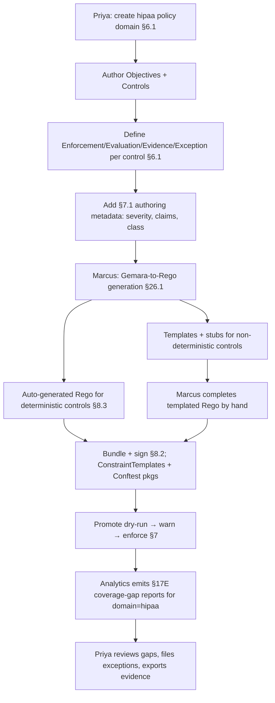

# HL-07 — New compliance framework (HIPAA) adoption

**Personas:** Priya (GRC Lead, lead), Marcus (Platform Security Engineer, implementation)
**Spec sections:** §6 Governance Hierarchy; §7 Policy Lifecycle; §17E Reporting; §26.1 Gemara-to-Rego generation guidance
**Type:** End-to-end
**Pre-condition:** The org already runs the platform for SOC 2 and ISO 27001. A new business segment subject to HIPAA Security Rule is being onboarded into clusters `hipaa-prod` and `hipaa-dev`. Priya holds the Platform Governance Admin role (§17A.2); Marcus holds Policy Library Maintainer.
**Trigger:** Audit committee approves the HIPAA program. Priya is asked to deliver coverage reporting against HIPAA controls within one quarter.

## Steps
1. Priya creates a new Policy Domain `hipaa` in the governance hierarchy (§6.1) and authors three Governance Objectives ("Protect ePHI confidentiality," "Authorize ePHI access," "Detect ePHI exposure"). Each is decomposed into Controls with unique control IDs (e.g., `HIPAA-AC-001`, `HIPAA-AU-002`, `HIPAA-SC-005`).
2. For each Control, Priya defines the four §6.1 sub-requirements: Enforcement Requirement (e.g., "Reject Pods scheduling ePHI workloads outside `hipaa-*` namespaces"), Evaluation Requirement, Evidence Requirement (audit fields needed), and Exception Requirement (who may approve, max duration).
3. Priya fills in the §7.1 authoring metadata per Control: severity, applicability (namespaces, clusters), enforcement class (Runtime, Build-Time, Detective, Manual, Advisory per §7.2), evidence schema reference, required JWT claims (including `data_classification=phi`), enforcement targets, exception workflow.
4. Marcus runs Gemara-to-Rego generation per §26.1. For deterministic controls (e.g., label requirement `data-classification=phi`) the platform emits complete Rego with `__control_id__`, `__severity__`, `__required_claims__` metadata (§8.3). For controls requiring human judgment (e.g., "minimum necessary access") it emits Rego templates with stubs, tests, and explanatory comments flagging what cannot be safely auto-generated.
5. Marcus completes the templated policies by hand, registers them as Gatekeeper ConstraintTemplates and Conftest packages for build-time, and tags each with the matching Gemara control ID. Bundles are signed and shipped per §8.2.
6. Marcus promotes the new policies through the §7 lifecycle: dry-run on `hipaa-dev`, warn for two weeks, enforce on `hipaa-prod`. Detective-class controls land directly as audit-only.
7. Compliance Analytics Engine begins emitting §17E coverage-gap reports filtered to the `hipaa` policy domain: per-control coverage by namespace and by cluster, missing-enforcement gaps, and detective-class evaluation evidence counts.
8. Priya opens the Governance Console and reviews the HIPAA coverage-gap report (§17E.1), notes three controls with `coverage = partial`, files exception requirements with expiry, and exports the first quarterly HIPAA evidence package.

## Success criteria (testable)
- The Governance Hierarchy contains the `hipaa` policy domain with ≥1 Objective and ≥N Controls, each populated with all §6.1 sub-requirements and §7.1 authoring metadata.
- Every HIPAA Rego package compiles, carries `__control_id__` metadata, and resolves to a HIPAA control ID in the Rego Explorer.
- Auto-generated Rego is distinguishable from templated Rego (e.g., via a `__generation_mode__` annotation or equivalent) per §26.1 guidance.
- §17E.1 coverage-gap report can be filtered by `policy_domain=hipaa` and lists every HIPAA control with a coverage state.
- Promotion of at least one HIPAA Runtime control has traversed dry-run → warn → enforce with audit trail (§7 lifecycle).
- Priya's quarterly export package contains evidence keyed by HIPAA control IDs only (no leakage of other domains).

## Flowchart

## Notes
HIPAA Security Rule mapping to Gemara controls is org-defined; the platform stores it but does not certify it. Related: HL-01, DT-01, DT-02, DT-09, DT-80.
