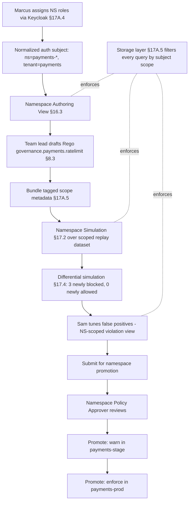

# HL-08 — Namespace-scoped policy authoring for an app team

**Personas:** Sam (App Developer, team-payments), Payments team lead (Namespace Policy Author + Approver), Marcus (Platform Security, consultative)
**Spec sections:** §16.3 Namespace Authoring View; §17 Simulation (Namespace Simulation mode); §17A.2 Namespace Policy Author + Namespace Policy Approver; §17A.5 Storage-Level Access Controls
**Type:** End-to-end
**Pre-condition:** The team-payments owns namespaces matching `payments-*` (`payments-dev`, `payments-stage`, `payments-prod`). The central policy library already enforces org-wide controls. The team has no namespace-scoped policies of its own. Keycloak has groups `team-payments` and roles `namespace-policy-author`, `namespace-policy-approver` per §17A.4.
**Trigger:** team-payments wants an internal rate-limit policy: any Deployment in `payments-*` declaring `annotations["payments.example.io/external-egress"]=true` must also carry a `payments.example.io/rate-limit-tier` label. They want to own this without going through the central policy library.

## Steps
1. Marcus, as Platform Governance Admin, assigns the `namespace-policy-author` role to the team lead and `namespace-policy-approver` to a second team lead via Keycloak (§17A.4). Their normalized authorization subject (§17A.4 example JSON) lists `namespaces: ["payments-dev","payments-stage","payments-prod"]`, `policy_domains: ["payments-internal"]`, `tenants: ["payments"]`.
2. Sam (Developer role) opens the Governance Console Namespace Authoring View (§16.3). The view shows only `payments-*` namespaces, only the `payments-internal` policy domain, and only objects scoped to those namespaces — enforced at the storage layer per §17A.5 (queries filtered by subject scope; cross-tenant policies, violations, simulations, and audit fixtures are not retrievable).
3. The team lead drafts a Rego package `governance.payments.ratelimit` with the §8.3 metadata extensions (`__control_id__="PAY-RL-001"`, `__governance_domain__="payments-internal"`). Bundles are tagged with §17A.5 scope metadata (`namespaces: ["payments-prod","payments-stage","payments-dev"]`, `tenant: "payments"`, `visibility: "namespace-scoped"`).
4. The team lead runs a Namespace Simulation (§17.2) against the last 30 days of admission audit events restricted to `payments-*`. The materialized replay dataset is built per §17A.5 ("Audit replay datasets must be materialized as scoped datasets before use"); attempting to widen scope returns zero results, not access denied.
5. Differential simulation (§17.4) classifies outcomes: 3 newly blocked Deployments, all in `payments-stage`, all tagged "intended enforcement"; 0 newly allowed; no cross-namespace events surface.
6. Sam (Developer scope) helps tune false positives. He can view violations in `payments-*` only; storage filters block him from seeing other tenants' fixtures (§17A.5).
7. The team lead submits the policy for namespace promotion. The Namespace Policy Approver (second team lead) reviews the simulation report and approves; the platform promotes the policy to warn mode in `payments-stage` then enforce in `payments-prod`. Marcus's central library is not modified.
8. Verification: a query from the central admin scope confirms PAY-RL-001 exists and is namespace-scoped; a query from a different team's Namespace Policy Author returns nothing (§17A.5 storage-side enforcement, not GUI-side).

## Success criteria (testable)
- Namespace Authoring View, opened by `team-payments` users, surfaces only `payments-*` namespaces, policies, violations, simulations, and approval state (§16.3, §17A.5).
- Storage-layer queries from a user in `team-payments` for objects outside `payments-*` return empty result sets independent of the GUI.
- Namespace Simulation results only include events from `payments-*` namespaces; the materialized replay dataset metadata shows `namespaces: ["payments-*"]` and `visibility: "namespace-scoped"`.
- PAY-RL-001 is promoted to enforce in `payments-prod` only by the Namespace Policy Approver, with the promotion event logged per §23 Auditability.
- A user from another team with `namespace-policy-author` on `orders-*` cannot read PAY-RL-001 nor its simulation dataset.
- Marcus's central policy library does not list PAY-RL-001 among global policies.

## Flowchart

## Notes
The §17A.5 boundary is tested by verifying access from outside the scope, not just by checking the GUI. Related: HL-04, DT-43, DT-50, DT-53, DT-55.
