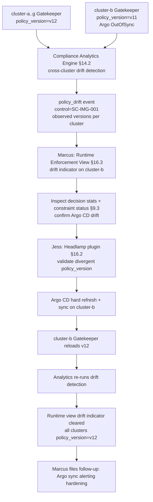

# HL-09 — Multi-cluster policy drift remediation

**Personas:** Marcus (Platform Security Engineer, lead), Jess (SRE / Cluster Operator)
**Spec sections:** §9 Gatekeeper; §14 Compliance Analytics Engine (especially §14.2 detections); §16.3 Runtime Enforcement View
**Type:** End-to-end
**Pre-condition:** Eight production clusters across two clouds run Gatekeeper with the shared central policy bundle deployed via Argo CD. Each Gatekeeper decision emits the §9.3 required audit fields including `policy_version` and `cluster`. The Compliance Analytics Engine (§14.1) consumes OPA decision logs, Gatekeeper audit, and Kubernetes audit logs from every cluster. Constraint `K8sRequireSignedImages` is at bundle version v12 in source-of-truth.
**Trigger:** During its periodic detection pass, the Compliance Analytics Engine flags inconsistent enforcement: `cluster-a` and six others emit decisions tagged `policy_version=v12`, while `cluster-b` emits `policy_version=v11` for the same constraint name.

## Steps
1. The Compliance Analytics Engine (§14.1) runs cross-cluster drift detection (a §14.2-class detection over normalized audit events), grouping decisions by `constraint_name + control_id` and comparing emitted `policy_version` per cluster. It raises a `policy_drift` event with `control_id=SC-IMG-001`, `expected_version=v12`, `observed_versions={cluster-b: v11}`.
2. Marcus opens the Runtime Enforcement View (§16.3) and filters by control SC-IMG-001. The view's "where is what enforced" panel lists active Gatekeeper constraints, OPA bundles, Kyverno policies, decision statistics, and drift indicators per cluster. `cluster-b` shows a red drift indicator on `K8sRequireSignedImages` with version v11.
3. Marcus drills into `cluster-b`. The decision-statistics panel shows v11 has been the active version for ~6 hours; recent denies match v11's stricter-signer-list-minus-one behavior. He cross-references Argo CD and confirms the cluster's Application is `OutOfSync` against the bundle Git ref (Argo CD drift).
4. Marcus pages Jess to take cluster-side action. Jess opens the same Runtime Enforcement View through the Headlamp plugin (§16.2) and confirms the divergent `policy_version` on the constraint object's status fields per §9.3.
5. Jess triggers an Argo CD `hard refresh + sync` on `cluster-b`'s Application; the central bundle is re-fetched and Gatekeeper reloads `K8sRequireSignedImages` to v12. The constraint status now reports `policy_version=v12`.
6. Marcus issues a bundle resync verification: he requests the Analytics Engine to re-run drift detection over the next analytics window. Recent decisions from `cluster-b` now emit `policy_version=v12`, matching all other clusters.
7. Runtime Enforcement View clears the drift indicator on `cluster-b`. Marcus tags the incident in the audit-correlation timeline and files a follow-up to harden Argo CD sync alerting so future drift surfaces from Argo first, not from analytics.

## Success criteria (testable)
- The §14.2-class `policy_drift` event identifies `control_id`, the divergent clusters, and per-cluster `policy_version` values, derived from normalized decision logs (not from a Git poll).
- Runtime Enforcement View (§16.3) lists every cluster, the active version per constraint, decision statistics, recent denies, and a drift indicator for the divergent cluster.
- After Argo CD sync, the next Gatekeeper decisions from `cluster-b` carry `policy_version=v12` and the constraint object's status reflects v12 (§9.3 audit fields).
- The drift indicator clears within one analytics window after parity is restored; no manual indicator reset is required.
- The full incident is reconstructable from audit data alone: pre-drift decisions, drift detection, sync action, post-drift decisions, all linked by `control_id` and `cluster`.

## Flowchart

## Notes
Detection happens at the audit-event layer, so it works even if Argo CD's own health signal is wrong. Related: DT-32 (single-pair drift detection), HL-03 (incident triage), HL-12.
