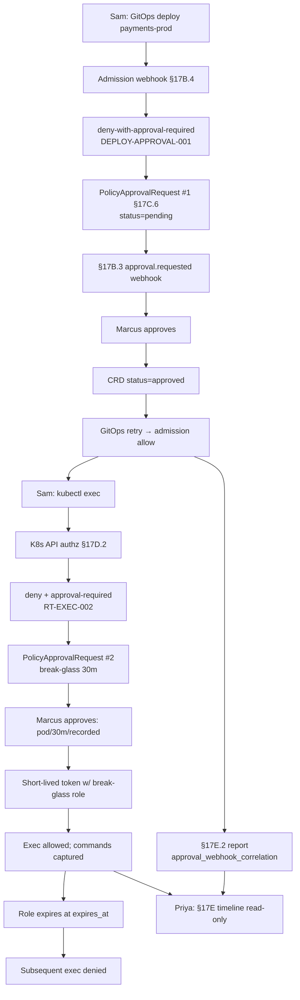

# HL-10 — Production deploy approval with break-glass exception

**Personas:** Sam (Developer, team-payments), Priya (Compliance Analyst, observer), Marcus (Platform Security, Security Reviewer / approver)
**Spec sections:** §17B Approval-Gated Decisions; §17B.4 Admission deny-with-approval-required; §17C.6 PolicyApprovalRequest CRD; §17D.2 Kubernetes library (Exec into pod / break-glass role); §17E Reporting
**Type:** End-to-end
**Pre-condition:** Control `DEPLOY-APPROVAL-001` requires Security Reviewer approval for any Deployment to `payments-prod`. Control `RT-EXEC-002` requires a break-glass role plus approval before `kubectl exec` into a production pod (§17D.2). Approvals run through `PolicyApprovalRequest` CRDs (§17C.6) and the §17B.3 webhook. Sam=`developer`, Marcus=`security-reviewer`, Priya=`compliance-analyst` (read).
**Trigger:** Sam pushes a `payments-api` release to `payments-prod`; admission returns `suspend_pending_approval` (§17B.2). Shortly after, a data anomaly forces Sam to `kubectl exec` into a running pod for diagnostics.

## Steps
1. The GitOps deploy hits the admission webhook. Per §17B.4 (admission cannot hold long), Gatekeeper returns deny-with-approval-required citing `DEPLOY-APPROVAL-001` and creates a `PolicyApprovalRequest` (§17C.6) with `requestedBy=sam`, `resourceRef={Deployment, payments-prod, api}`, `requiredApproval={type: role, value: security-reviewer}`, `status: pending`, bounded `expires_at`.
2. The platform emits the §17B.3 `approval.requested` webhook; Marcus is notified with a deep-link to the CRD and the failing decision evidence.
3. Marcus reviews the manifest diff, control text, and justification, then approves; the controller patches the CRD to `status: approved`, recording approver and timestamp.
4. The GitOps controller retries (§17B.4 "allow a later retry once approval state exists"). Admission now allows because a matching approved CRD exists. The §17E.2 Real-Time Enforcement Report records `decision=allow`, `action_performed=deploy`, `approval_webhook_correlation` pointing at the CRD.
5. Sam later attempts `kubectl exec` into a `payments-api` pod. The §17D.2 "Exec into pod" decision point intercepts via Kubernetes API authorization; Sam's token lacks `break-glass`, so the request is denied with `control_id=RT-EXEC-002` and an approval-required reason.
6. Sam files a second `PolicyApprovalRequest`: `controlId=RT-EXEC-002`, `resourceRef={Pod, payments-prod, payments-api-xyz}`, `requiredApproval={role: security-reviewer}`, justification, `duration=30m`, matching `expires_at`.
7. Marcus approves with conditions: single pod scope, recorded mode, 30-minute bound. The platform issues Sam a short-lived token carrying the `break-glass` role with the same expiry; Keycloak claims include the temporary role and `approval_correlation_id`.
8. Sam exec's; every command and exit-code lands in the Kubernetes audit log and platform pipeline tagged `RT-EXEC-002` plus the approval correlation. At `expires_at` the role auto-expires; later exec attempts return to deny.
9. Priya opens the §17E timeline read-only and sees both flows tied by requester, approver, control IDs, and correlation IDs.

## Success criteria (testable)
- Each request has a `PolicyApprovalRequest` CRD with the §17C.6 fields populated (`controlId`, `requestedBy`, `resourceRef`, `requiredApproval`, `status`) plus `expires_at`.
- The admission webhook never holds the deploy request open; the deploy succeeds only on retry after `status: approved` (§17B.4).
- The break-glass role expires at `expires_at`; a post-expiry exec attempt is denied again, observable from audit.
- Both flows emit §17E.2 entries with `control_id`, approver, requester, `approval_webhook_correlation`, and decision.
- Every exec command after approval appears in the audit pipeline with `RT-EXEC-002` and the approval correlation ID.
- Priya can reconstruct request → approval → action → expiry read-only from Compliance Analyst scope, no engineering help.

## Flowchart

## Notes
Both decisions share the §17C.6 CRD shape; only control and duration differ. The break-glass path follows §17B.4: short admission deadlines force deny-then-retry. Related: HL-04, HL-19, DT-65.
