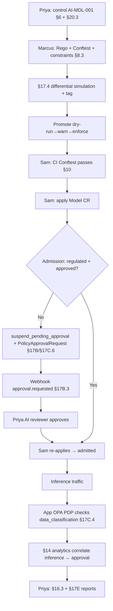

# HL-11 — AI model deployment governance lifecycle

**Personas:** Priya (Compliance Analyst), Marcus (Platform Governance Admin / Policy Library Maintainer), Sam (ML engineer in the Developer / Namespace Policy Author role)
**Spec sections:** §6 governance hierarchy, §17 simulation, §17B approval-gated decisions, §20.3 AI Governance use case
**Type:** End-to-end
**Pre-condition:** Keycloak issues tokens carrying `tenant`, `namespaces`, and `data_classification` claims (§15); Privateer, Audit Schema Service, and the §17B workflow webhook are running; the `ml-inference` namespace exists with no model-specific control.
**Trigger:** Priya's quarterly review adds a FINOS AIGF-aligned control "Models handling regulated data require approval"; Sam plans to deploy a fraud-scoring model whose metadata declares `data_classification=regulated`.

## Steps
1. Priya authors a §6 Objective "Govern AI models handling regulated data," decomposes it into control `AI-MDL-001` with enforcement, evaluation, evidence, and exception requirements; she maps it to the §20.3 AI Governance row.
2. Marcus authors the Rego package `governance.ai.modelapproval` with §8.3 metadata (`__control_id__="AI-MDL-001"`, `__required_claims__=["tenant","data_classification","deployment_approval"]`), plus a sibling Conftest policy reading the Model CR annotation `model.governance/data_classification`.
3. Sam adds the Conftest hook to CI per §10/§20.3 build-time layer; the pipeline validates classification and signed metadata against `AI-MDL-001` before merge.
4. Marcus runs §17.4 Differential Simulation across 30 days of historical model deployments (v0 absent vs v1 new); the §17E.4 report lists newly-blocked events. Marcus tags regulated-data ones "Intended enforcement"; flags two as "Potential false positive" pending Sam review.
5. Marcus promotes the Gatekeeper constraint `K8sRequireApprovedModel` dry-run → warn → enforce; Kyverno is selected for the inference-endpoint annotation mutation per §17C.1.
6. Sam submits the Model CR; admission sees `data_classification=regulated` with no `deployment_approval` state and returns §17B.2 `suspend_pending_approval` using the §17B.4 Kubernetes pattern (deny-with-approval-required plus a `PolicyApprovalRequest` CRD per §17C.6).
7. The §17B.3 webhook fires (`event_type=approval.requested`, `control_id=AI-MDL-001`); Priya's AI Risk reviewer approves; the controller flips the CRD to `approved`; Sam re-applies and the Model is admitted.
8. At inference time, the application PDP (OPA sidecar, §17C.4 Application PDP) checks each request's JWT `data_classification` claim against the model's approved scope; mismatches deny and emit decision logs.
9. Compliance Analytics (§14) correlates each inference decision with the approval state for that model version; Priya's §16.3 Audit Correlation View shows live counts of approved-vs-pending models and any traffic against pending models.

## Success criteria (testable)
- Control `AI-MDL-001` is queryable via `/controls/{id}` (§21) and traces in the Governance Graph View to both Rego packages, the Conftest policy, and the Gatekeeper/Kyverno constraints.
- A Model CR with `data_classification=regulated` and no approval state is admitted only after the `PolicyApprovalRequest` reaches `approved`; the admission audit event carries `policy_version`, `control_id=AI-MDL-001`, and a `correlation_id` matching the webhook.
- The §17E.4 simulation report lists newly-blocked and newly-allowed counts with tagged intentional changes before promotion to enforce.
- Inference requests against a non-approved model produce OPA deny decision logs correlated to the model's approval-state record in the analytics view.
- Sam, scoped to `ml-inference`, can view his own `PolicyApprovalRequest` but not other tenants' requests (§17A.5 storage scope).

## Flowchart

## Notes
Pairs with HL-07 (new framework adoption) and DT-65 (`PolicyApprovalRequest` lifecycle). FINOS AIGF / Gemara AI experimentation per §20.3.
