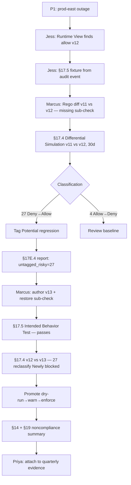

# HL-12 — Major outage retrospective uncovers silent policy regression

**Personas:** Marcus (Platform Governance Admin, lead), Jess (SRE / Security Reviewer), Priya (Compliance Analyst)
**Spec sections:** §14 Compliance Analytics, §17.4 Differential Simulation Semantics, §17E.4 Simulation Report, §19 Retrospective Audit Detection
**Type:** End-to-end
**Pre-condition:** Policy bundle `governance.kubernetes.quotas` was promoted v11 → v12 four weeks ago; Audit Schema Service retains ≥30 days of replay-capable events (§22.1); Privateer history exists; §17E.4 report generator is wired into the Governance Console.
**Trigger:** A P1 — a runaway Deployment exhausted node capacity and toppled `prod-east`. Triage shows the workload was admitted despite violating resource-quota control `RT-QUOTA-002`.

## Steps
1. Jess opens the §16.3 Runtime Enforcement View, filters by the offending namespace and time window, and finds the admission was `allow` from policy version `v12`. The same workload pattern was previously denied under `v11`.
2. Jess opens the §16.3 Audit Correlation View; the admission event carries full §13.3 fields (policy_version=v12, control_id=RT-QUOTA-002, correlation_id, JWT subject). She files a fixture from the event using the §17.5 audit-derived test workflow and assigns it to Marcus.
3. Marcus diffs v11 vs v12 in the Rego Explorer; the refactor inlined a helper but dropped one sub-check (`total_limits.memory ≤ namespace_quota.memory`). Rego still compiles and existing tests pass — but the missing sub-check silently allows previously-denied requests.
4. Marcus runs §17.4 Differential Simulation across the last 30 days for `RT-QUOTA-002`, with `policy_version_before=v11` and `policy_version_after=v12`.
5. The §17.4 classifier returns 4 `Allow→Deny` (Newly blocked) and 27 `Deny→Allow` (Newly allowed) including the incident workload. Marcus tags the 27 "Potential regression"; none are "Intended relaxation."
6. The §17E.4 Simulation Report is generated: versions before/after, 30-day dataset, all four outcome counts, tagged intentional=0, untagged risky=27. Marcus and Jess co-sign as the retrospective artifact.
7. Marcus authors v13 restoring the sub-check, runs the §17.5 Intended Behavior Test using Jess's fixture (expected: deny; passes), and runs differential simulation v12 → v13 — all 27 events reclassify to `Allow→Deny` ("Intended enforcement").
8. Marcus promotes v13 dry-run → warn → enforce per §7; the promotion record links to the §17E.4 report and v11→v12→v13 lineage.
9. The §14 analytics engine re-evaluates the 30-day window using §19 retrospective detection: it confirms none of the 27 admissions had a matching deny event and emits a noncompliance summary linked to the incident.
10. Priya receives the §14 alert and attaches the §17E.4 report and §19 summary to her quarterly evidence package as compensating evidence with bypass-absence rationale.

## Success criteria (testable)
- The §17.4 classifier returns exactly 27 `Deny→Allow` events for `RT-QUOTA-002` over the v11→v12 30-day window; the incident workload is among them.
- The §17E.4 report includes policy_version_before, policy_version_after, dataset, all four counts, tagged intentional (0 for v11→v12), and untagged risky (27 for v11→v12, 0 for v12→v13).
- v13 promotion is blocked by the §7 gate unless the §17.5 intended-behavior fixture for the incident asserts deny and passes.
- §14 + §19 produce a noncompliance record linking each of the 27 admissions to `RT-QUOTA-002` with `replay_completeness=complete`.
- Priya's re-exported quarterly evidence contains the v11/v12/v13 lineage, the simulation report, and the regression noncompliance record, all signature-verifying per §23.

## Flowchart

## Notes
Sibling to HL-03 (incident → fixture loop) and HL-17 (differential simulation prevents rollback). The step-2 fixture becomes a permanent §17.5 regression test linked to `RT-QUOTA-002`.
