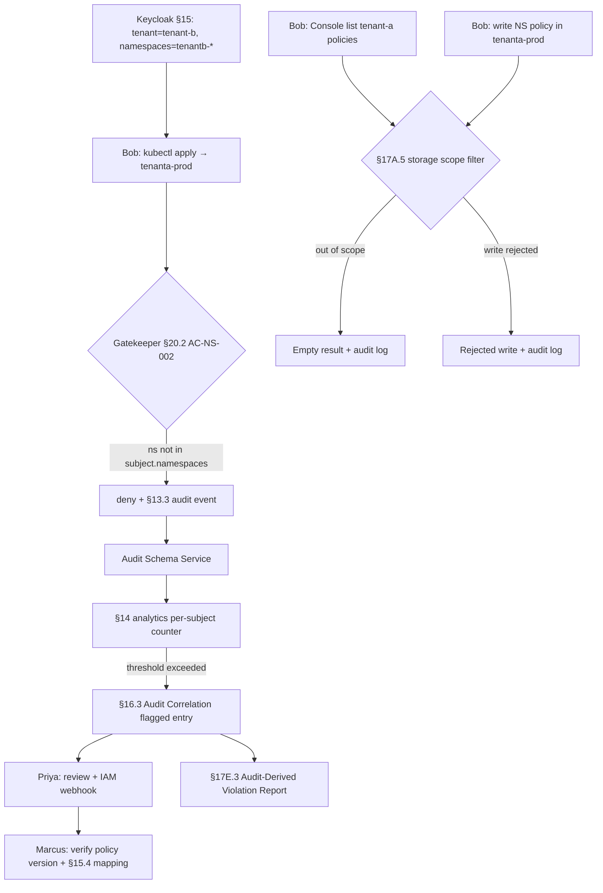

# HL-13 — Cross-tenant access attempt detected and audited

**Personas:** Marcus (Platform Governance Admin), Priya (Compliance Analyst), and a Namespace Policy Author user (`bob@tenant-b`) whose attempts drive the scenario
**Spec sections:** §14 Compliance Analytics, §15 Keycloak/JWT (`tenant` + `namespaces` claims), §17A Roles & Storage Authorization, §20.2 Multi-Tenant Kubernetes Governance
**Type:** End-to-end
**Pre-condition:** Keycloak issues §15.2 `tenant` and `namespaces` claims via §15.4 mapping; control `AC-NS-002` ("Tenants cannot deploy outside authorized namespaces") is deployed as Rego + Gatekeeper constraint `K8sRequireNamespaceOwnership`; §17A.5 storage scope is enforced; Bob's JWT has `tenant="tenant-b"` and `namespaces=["tenantb-dev","tenantb-prod"]`.
**Trigger:** Bob attempts (via kubectl and via Console) to deploy a workload into `tenanta-prod`, owned by `tenant-a`.

## Steps
1. Bob authenticates to Keycloak; the §15.4 mapping layer normalizes claims into the §17A.4 subject `{tenant:"tenant-b", namespaces:["tenantb-dev","tenantb-prod"], roles:["namespace-policy-author"]}`.
2. Bob runs `kubectl apply -f deploy.yaml` targeting `tenanta-prod`. The §20.2 runtime layer evaluates `AC-NS-002`, sees the target namespace not in `subject.namespaces`, and denies with reason `cross-tenant deploy attempt`.
3. The deny is recorded with §13.3 fields: `policy_version`, `control_id=AC-NS-002`, `correlation_id`, JWT subject (`sub`, `tenant`, `namespaces`), resource target, outcome, explanation.
4. The §14 analytics engine ingests the deny and increments a per-subject "cross-tenant attempt" counter; configured detection threshold is 3 attempts in 24h.
5. Bob opens the Governance Console and searches for policies named `tenant-a*`. The Console queries the §17A.5 storage layer; results are filtered server-side by `subject.tenant`, so Bob gets an empty set — he cannot enumerate tenant-a's policies even by ID guessing.
6. Bob tries the §16.3 Namespace Authoring View and attempts to create a NamespaceScopedPolicy in `tenanta-prod`; storage rejects the write because the object's required `tenant`/`namespaces` metadata is outside scope. The rejected write is audit-logged.
7. Bob retries kubectl 4 more times. §14 fires a "cross-tenant repeated attempt" detection (5 events <1h, same subject, target tenant `tenant-a`) and posts to Priya's §16.3 Audit Correlation dashboard with subject, target, count, time window, and correlation IDs.
8. Priya opens the dashboard entry; linked admission events show consistent deny outcomes and `replay_completeness=complete`. She marks it "Reviewed — credential check needed" and emits a webhook to her IAM team. No deploy was admitted.
9. Marcus verifies `AC-NS-002` is at the expected version on every cluster (§9 multi-cluster sanity) and that §15.4 produced the expected subject for Bob.
10. Priya exports the §17E.3 Audit-Derived Violation Report scoped to `AC-NS-002` for the past 24h; it enumerates Bob's 5 attempts with reconstructed input, replay version, and control mapping.

## Success criteria (testable)
- Every cross-tenant admission produces a deny event whose audit record contains the JWT `tenant` claim, the target namespace, `control_id=AC-NS-002`, and a `correlation_id`; no workload appears in the target tenant's cluster.
- Bob's Console query for tenant-a policies returns zero rows from the storage layer (not from a GUI filter) — verifiable by hitting the storage API directly with Bob's token.
- The repeated-attempt detection in §14 fires once the threshold is met and surfaces in Priya's §16.3 Audit Correlation View with subject, target tenant, count, and links to each underlying audit event.
- The §17E.3 report for `AC-NS-002` enumerates all 5 attempts with `replay_completeness=complete` and matched control ID.
- Global admins crossing tenant boundaries during investigation appear in the §17A.5 audit trail.

## Flowchart

## Notes
Related: DT-54, DT-55, HL-16. §17A.5 storage scope is what makes this resistant to ID guessing — GUI-only filtering would not.
