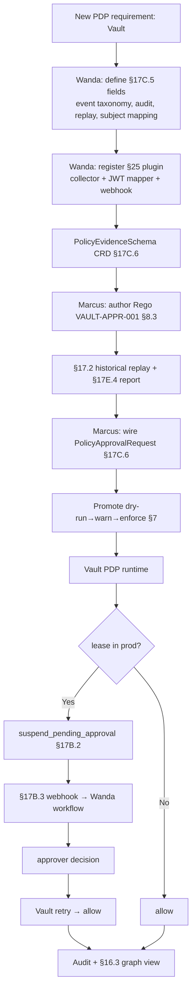

# HL-14 — New product / PDP integration onboarding

**Personas:** Marcus (Platform Governance Admin / Policy Library Maintainer), Wanda (Workflow Integrator per §17A.2)
**Spec sections:** §17C.4 PDP model, §17C.5 PDP requirements, §17D product libraries, §25 extensibility plugin system
**Type:** End-to-end
**Pre-condition:** Platform runs with §17D libraries for Kubernetes, Keycloak, Jenkins, GitLab, Trivy onboarded. HashiCorp Vault is in production but emits no platform evidence. Marcus has Policy Library Maintainer; Wanda has Workflow Integrator role and approval-webhook config access (§17A.2).
**Trigger:** Security asks for a control "Vault dynamic-secret leases for production databases require manual approval"; Vault is not yet a recognized PDP, so no Gemara control can be wired to it.

## Steps
1. Wanda opens the §17D library directory and authors a new entry `governance.vault` modelled on §17D.4 (Jenkins) and §17D.10 (Elasticsearch) — Application/Data PDPs per §17C.4.
2. Wanda fills each §17C.5 required definition for Vault: event taxonomy (`secret.lease.create`, `secret.lease.revoke`, `policy.update`, `auth.login`); enforcement location (Vault Sentinel + application PDP); audit source (Vault audit device); replay schema (`event_type`, `path`, `entity_id`, `mount_accessor`, `request_data`, `auth`); subject mapping (Vault `entity_id` → Keycloak `sub`); resource mapping (Vault path → governance resource); decision outcomes (allow/deny/`require_approval` per §17B.2); missing-capability notes (no native suspend on lease create — use deny-with-approval-required per §17B.4).
3. Wanda registers Vault as a §25.1 plugin: evidence collector (audit-device tail), custom JWT mapper (Vault auth metadata → §17A.4 subject), and webhook receiver for §17B.3 events.
4. Wanda submits a `PolicyEvidenceSchema` CRD (§17C.6) for the Vault replay schema; the platform validates that every required §13.3 field maps from a Vault event.
5. Marcus authors Rego control `VAULT-APPR-001` ("prod DB lease requires approval") in `governance.vault.dblease`, with §8.3 metadata referencing the Gemara control ID and required claims (`tenant`, `environment`).
6. Marcus runs §17.2 historical replay over 30 days of Vault audit events (now ingested via the new plugin). The §17E.4 simulation report classifies events; he tags expected approvals "Intended enforcement."
7. Marcus connects the §17C.6 `PolicyApprovalRequest` CRD: a flagged lease emits `suspend_pending_approval`, the §17B.3 webhook fires to Wanda's workflow, approval flips the CRD to `approved`, Vault retries and gets `allow`.
8. Marcus promotes the control dry-run → warn → enforce per §7; the §16.3 Governance Graph View now lists Vault as a PDP alongside Kubernetes admission, CI/CD, and Keycloak, traceable end-to-end to Gemara.
9. Wanda runs a smoke test: a real prod DB lease enters Vault, hits the PDP, suspends, fires the webhook, gets approved, and is granted; evidence is end-to-end correlated via `correlation_id`.

## Success criteria (testable)
- The Vault entry in §17D documents all eight §17C.5 required definitions; the platform rejects registration if any field is missing.
- A §25.1 plugin manifest registers an evidence collector, a JWT mapper, and a workflow webhook for Vault; uninstalling it removes all three.
- A `PolicyEvidenceSchema` CRD for Vault is queryable via the platform API and used by the simulation engine for replay (`replay_completeness=complete` on test events).
- `VAULT-APPR-001` Rego compiles, runs against historical Vault events via §17.2 replay, and emits a §17E.4 report referencing `policy_version` and `control_id`.
- A prod lease attempt yields `suspend_pending_approval`, a `PolicyApprovalRequest` CRD, a §17B.3 webhook event, and on approval a subsequent `allow` linked by `correlation_id`.
- The Governance Graph View shows Vault as a PDP with lineage Gemara objective → control → Rego → enforcement → audit.

## Flowchart

## Notes
Vault is illustrative; the same flow onboards any new PDP. The §25.1 plugin contract — collector + JWT mapper + webhook — is the integration seam.
