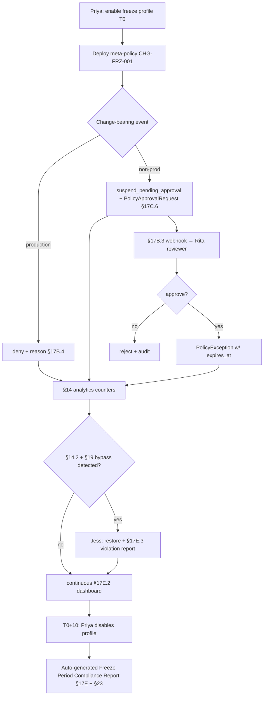

# HL-15 — Continuous compliance during change-freeze period

**Personas:** Priya (Compliance Analyst), Jess (SRE / Security Reviewer), Rita (Security Reviewer per §17A.2)
**Spec sections:** §14 Compliance Analytics, §17B Approval-Gated Decisions, §17E Reporting (continuous)
**Type:** End-to-end
**Pre-condition:** Platform in steady state with production controls enforced; Keycloak emits `environment` and `groups` claims (§15.2/§15.3); §17B webhooks and §17C.6 `PolicyApprovalRequest` CRD are wired; §17E.1 report categories refresh continuously.
**Trigger:** Org enters its end-of-quarter change-freeze window (T0 → T0+10 days). Priya activates the "freeze profile," which tightens enforcement to deny-by-default for production deploys and `suspend_pending_approval` (§17B.2) for everything else.

## Steps
1. Priya toggles the freeze profile in the Governance Console; the platform promotes a meta-policy `CHG-FRZ-001` that rewrites the outcome of any change-bearing action (`Deployment`, `StatefulSet`, GitOps sync, Jenkins deploy stage) during the window.
2. For `environment=production`, `CHG-FRZ-001` returns `deny` with reason "change-freeze: emergency approval required" per §17B.4 Kubernetes pattern. For non-prod, it returns `suspend_pending_approval`, creating a `PolicyApprovalRequest` (§17C.6) and firing the §17B.3 webhook to Rita's reviewer queue.
3. Jess monitors §16.3 Runtime Enforcement View; deny/suspend volume rises and she validates §13.3 fields populated on every event (`policy_version`, `control_id=CHG-FRZ-001`, `correlation_id`, JWT subject, `environment`).
4. Throughout the freeze, the §14 analytics engine maintains four live counters wired to §17E.2 Real-Time Enforcement Report: frozen-prod denies, suspended non-prod requests, exceptions granted, and attempted bypasses (e.g., admission attempts on disabled webhooks, per §14.2 + §19).
5. A team needs an emergency hotfix; their lead files a `PolicyApprovalRequest` with `requiredApproval.type=role`, `value=production-release-approver` (§17C.6). Rita approves; the platform records an exception linked to `CHG-FRZ-001` with `expires_at` ≤ freeze end; the deploy is admitted.
6. Mid-freeze, §14.2 fires a Gatekeeper-bypass alert (someone scaled the webhook to zero for 6 minutes). The §17E.3 violation report enumerates it; Jess restores the webhook and the bypass is closed with remediation evidence.
7. The §17E dashboard shows running totals: frozen prod denies, suspended/approved/rejected non-prod requests, granted exceptions with `expires_at`, and bypass attempts detected by §14 + §19.
8. Freeze ends at T0+10 days; Priya toggles the profile off; meta-policy reverts; pending `PolicyApprovalRequest`s either expire or roll over per policy.
9. The platform auto-generates a "Freeze Period Compliance Report" from §17E bundling the §17E.2 stream summary, §17E.3 violations, every exception (approver, control_id, expires_at), and bypass-detection record; Priya signs and exports it (§23).

## Success criteria (testable)
- Every change-bearing prod admission receives `deny` with reason mentioning `CHG-FRZ-001`; every non-prod change-bearing admission receives `suspend_pending_approval` and creates a `PolicyApprovalRequest` CRD.
- The §17E dashboard updates in near real time with four counters (frozen-prod denies, suspended non-prod, exceptions, bypass attempts) and links each to underlying audit events.
- Every granted exception carries `controlId=CHG-FRZ-001`, `requestedBy`, `requiredApproval`, approver subject, and `expires_at ≤ freeze_end`; expired exceptions stop authorizing admissions.
- Any §14.2 bypass during the freeze produces a §17E.3 Audit-Derived Violation Report with `replay_completeness=complete` and a remediation trail.
- The exported Freeze Compliance Report contains enforcement counts, exceptions list, bypass-detection results, and §23 tamper-evident signature.

## Flowchart

## Notes
Related: HL-10 (break-glass), HL-06 (bypass), DT-62 (exception expiry). The freeze profile composes existing primitives — meta-policy + `suspend_pending_approval` + continuous reporting — no new enforcement modes.
