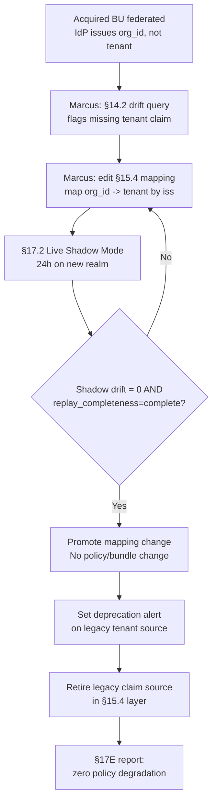

# HL-16 — Keycloak IdP change drives JWT claim evolution

**Personas:** Marcus (Platform Security Engineer)
**Spec sections:** §14.2 JWT Policy Drift, §15.2 Required JWT Claims, §15.4 JWT-to-Policy Mapping Layer, §17A.4 Keycloak Integration
**Type:** End-to-end
**Pre-condition:** Existing tenants federate through Keycloak realm `platform`; deployed Rego packages and Gatekeeper constraints require the normalized `tenant` claim per §15.2; the JWT-to-Policy Mapping Layer (§15.4) is the only place where source claims are mapped into the internal authorization subject (§17A.4).
**Trigger:** A second IdP (newly acquired business unit) is federated behind Keycloak and issues `org_id` instead of `tenant`; Marcus must onboard it without touching every policy.

## Steps
1. Marcus opens the Governance Console as Platform Governance Admin (Keycloak OIDC login) and inspects the §17A.4 normalized authorization subject for a test user from the new IdP. Result: `tenant` is empty; raw token carries `org_id`.
2. In §14.2 JWT Policy Drift analytics, Marcus filters by issuer = new IdP and sees the drift flag: "policies require claim `tenant`, but runtime JWTs omit the claim" across a synthetic eval batch.
3. Marcus edits the §15.4 mapping configuration — not the policies — adding a transform that maps `org_id` from the new IdP's `iss` into the normalized `tenant`, with identity aliasing for the legacy `tenant` claim from the original IdP:
   ```yaml
   claim_mappings:
     tenant:
       sources:
         - claim: tenant
           when: iss == "https://keycloak.example/realms/platform"
         - claim: org_id
           when: iss == "https://keycloak.example/realms/acquired-bu"
   ```
4. He runs Live Shadow Mode (§17.2) for 24 hours against admission and OPA decisions originating from the new realm. The Rego Explorer view confirms `required_claims` resolve for every shadow decision.
5. Marcus runs the §14.2 drift query again scoped to the shadow window; JWT drift count for the new realm drops to zero. The Audit Correlation View shows `replay_completeness=complete` on the shadow events (jwt_claims and `external_data_refs` both populated per §13.3).
6. He promotes the mapping change from shadow to active in the §15.4 layer. No Rego package version changes; no Gatekeeper constraint changes; bundle digest is unchanged.
7. Marcus opens a §17C.6 deprecation plan to retire the legacy `tenant` source claim once the acquired-BU realm reaches 100% of original-IdP traffic. He sets a §17E coverage report alert on any future event with raw `tenant` from the new IdP.
8. After the deprecation window, Marcus removes the legacy source from the mapping; analytics shows zero policies degraded, zero authorization-subject regressions across both realms.

## Success criteria (testable)
- Zero Rego packages, Gatekeeper constraints, or signed bundles are modified during the IdP onboarding (verifiable from bundle version history per §8).
- §14.2 JWT Policy Drift detection returns zero hits for both realms after the mapping change.
- Every post-change audit event from the new IdP has `replay_completeness=complete` and a populated normalized `tenant` in §17A.4 subject form.
- The §15.4 mapping change is itself versioned, logged, and reviewable in the Governance Console (per §23 auditability).
- Deprecation of the legacy `tenant` source produces no new drift alerts; no policy returns `unknown` due to missing claims.

## Flowchart



## Notes
Demonstrates that §15.4 is the only seam that absorbs identity-provider churn. Related: DT-35, DT-36, DT-37, DT-31.
