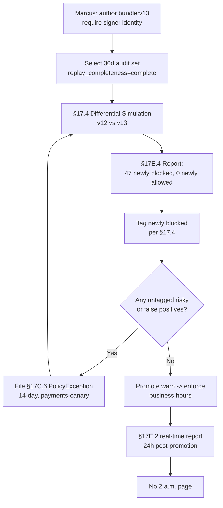

# HL-17 — Differential simulation prevents a 2 a.m. rollback

**Personas:** Marcus (Platform Security Engineer)
**Spec sections:** §17.2 Simulation Modes, §17.4 Differential Simulation Semantics, §17.5 Policy Authoring Test Cases from Audit Logs, §17C.6 PolicyException, §17E.4 Simulation Report
**Type:** End-to-end
**Pre-condition:** Control `SC-IMG-001` is deployed as a Gatekeeper constraint in warn-then-enforce mode requiring signed images; the Audit Schema Service holds 30 days of replay-capable admission events (§13); team-payments runs a canary pipeline that signs with a legacy signer identity for last-mile compatibility.
**Trigger:** Marcus tightens `SC-IMG-001` to additionally require a specific signer identity (`signer == "release-bot@platform"`) and must promote the new bundle without a 2 a.m. rollback.

## Steps
1. Marcus authors the policy change in the Governance Console Rego Explorer, validates Rego metadata extensions (§8.3), and produces a candidate bundle `bundle:v13` alongside the deployed `bundle:v12`.
2. From the Audit Correlation View he selects the last 30 days of `event_type=kubernetes.admission.request` events for control `SC-IMG-001` as the §17.4 evidence set. Every selected event has `replay_completeness=complete`.
3. Marcus launches a §17.2 Differential Policy Simulation comparing `bundle:v12` (previous) and `bundle:v13` (new) over the same evidence set. A `PolicySimulationRun` CRD (§17C.6) is created.
4. The §17E.4 Simulation Report returns: Newly blocked = 47; Newly allowed = 0; Unchanged allowed ~12,400; Unchanged denied = 8. He drills into the 47.
5. Forty-four of the 47 newly blocked are unsigned-by-old-key images from third-party mirrors that should have failed `v12` already — Marcus tags them "intended enforcement" per §17.4.
6. The remaining 3 are canary builds from `team-payments` signed with the legacy signer. Marcus uses §17.5 to convert two of them into regression fixtures: one tagged "intended enforcement" (canary→prod path now blocked) and one tagged "potential false positive" pending team confirmation.
7. Marcus contacts team-payments; they confirm the legacy signer is being retired in 10 days. He files a `PolicyException` CRD (§17C.6) scoped to `payments-canary` namespace with a 14-day expiry and `controlId: SC-IMG-001`.
8. Re-running the differential sim with the exception applied: Newly blocked = 44 (all intended), zero residual false-positive candidates per §17E.4.
9. Marcus promotes `bundle:v13` warn → enforce per §7.2, with the exception live. The deploy goes through during business hours; no admission denials hit production payments at 2 a.m.
10. Two weeks later the exception auto-expires; analytics confirms team-payments has migrated to `release-bot`, and the next differential run shows the exception is no longer needed.

## Success criteria (testable)
- The §17E.4 Simulation Report enumerates Newly blocked, Newly allowed, Unchanged allowed, Unchanged denied counts plus tagged-intentional vs untagged-risky changes, sourced from a 30-day audit dataset.
- Every newly blocked event is tagged with one of {intended enforcement, potential false positive, requires review, emergency block} per §17.4 before promotion.
- The `PolicyException` CRD has a non-null `expiresAt`, links to `SC-IMG-001`, and is visible in the §17E reporting view.
- After promotion, the real-time enforcement report (§17E.2) shows zero unexpected denies in `payments-prod` for `SC-IMG-001` for the first 24 hours.
- Two regression fixtures created via §17.5 are saved, linked to control + bundle version, and re-run automatically on the next bundle build.

## Flowchart

## Notes
Demonstrates that differential simulation + tagging + exception CRD eliminates blind promotion risk. Related: DT-49, DT-51, DT-67, HL-02.
