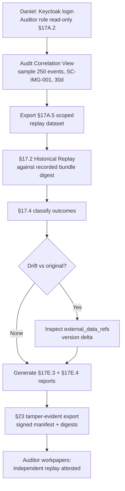

# HL-18 — Auditor independent re-execution of historical events

**Personas:** Daniel (Internal/External Auditor)
**Spec sections:** §13 Standardized Audit Event Schema, §17.2 Historical Replay, §17.4 Differential Simulation Semantics, §17A.2 Auditor role (read-only scoped), §23 Security / Evidence integrity
**Type:** End-to-end
**Pre-condition:** Daniel has an Auditor role in Keycloak with read-only scope across the in-scope tenants (§17A.2); the Audit Schema Service retains a 30-day replay-capable corpus where each event has the §13.3 required core fields and `replay_completeness` populated; signed policy bundles (`bundle:v11`, `bundle:v12`) are stored and addressable by digest per §8.2 and §23.
**Trigger:** Daniel is performing a Type II walkthrough and must independently re-execute a population sample of historical decisions for control `SC-IMG-001` rather than rely on client-produced report rows.

## Steps
1. Daniel signs in to the Governance Console via Keycloak OIDC; his normalized authorization subject (§17A.4) carries `roles=["auditor"]`, scoped to the in-scope tenants and read-only. He cannot edit policies, exceptions, or mappings.
2. He opens the Audit Correlation View and draws a statistically valid 30-day sample (e.g., 250 events) for `control_id=SC-IMG-001`, filtering on `replay_completeness=complete` only. The sample IDs and digests are recorded.
3. Daniel exports the sample as a §17A.5 scoped audit-replay dataset. The export manifest enumerates each `event_id`, `policy_version`, `external_data_refs` digest, and `correlation_id` per §13.3.
4. He launches a §17.2 Historical Replay against the *deployed* bundle version recorded on each event (`bundle:v11` or `bundle:v12`, addressed by digest). This is independent re-execution: Daniel runs the replay himself; no client engineer touches the run.
5. Replay completes; results are presented as §17.4 outcome classifications relative to the originally recorded decision: Continued block, No enforcement change, plus any drift (Allow→Deny / Deny→Allow). Daniel expects zero drift since he replayed against the same bundle digest.
6. The replay returns 248 matches and 2 mismatches. Daniel drills into the 2 mismatches and finds both are `external_data_refs` version drift — the image-signature-status feed evolved after the original decision. Both events were originally tagged complete because the digest is captured, so Daniel reclassifies these under §17.4 as expected variance, not as control failure.
7. Daniel generates a §17E.3 Audit-Derived Violation Report plus the §17E.4 Simulation Report for the replay run; both include `policy_version`, `confidence level`, `missing fields if any`, and the reconstructed policy input.
8. He triggers a tamper-evident evidence export (§23): the bundle includes the sample manifest, the replay outputs, the bundle digests used, and a signed checksum. Manifest signature verifies against the platform key.
9. Daniel documents in his workpapers that he, not the auditee, executed the replay; that the underlying schema (§13) made the replay reproducible; and that the §23 export is independently verifiable outside the platform.

## Success criteria (testable)
- Daniel completes the sample selection, replay, classification, and export without any write call to the platform (verified via platform audit log filtered by Daniel's `sub`).
- 100% of sampled events have §13.3 required core fields present; any partial/insufficient events are excluded with a documented reason.
- Replay against the recorded bundle digest produces zero unexplained drift; any §17.4 drift maps to an `external_data_refs` version delta that is itself logged.
- The §23 evidence export verifies: signature valid, manifest enumerates every artifact with a digest, and an independent third party can re-verify the signature offline.
- Daniel's run is itself logged (§23 auditability) and visible to Priya in the Compliance Analyst view.

## Flowchart

## Notes
Independent replay was previously impossible because client logs lacked the policy input and external-data digests. §13 + §23 make this auditor-executable. Related: HL-05, DT-22, DT-46.
