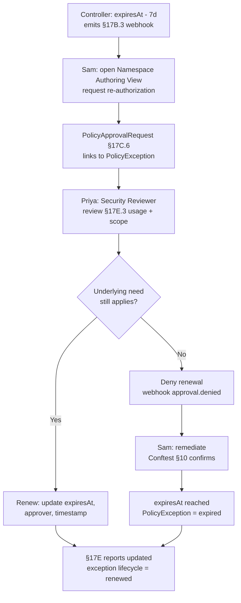

# HL-19 — Policy exception expiry and re-authorization

**Personas:** Sam (Developer / exception holder), Priya (Compliance Analyst / Security Reviewer for the control domain)
**Spec sections:** §17B Approval-Gated Policy Decisions, §17B.3 Workflow Webhook Integration, §17C.6 PolicyException CRD, §17E Reporting, §6 Exception requirements
**Type:** End-to-end
**Pre-condition:** A `PolicyException` CRD (§17C.6) covers Sam's `payments-legacy` namespace allowing privileged containers required by a legacy vendor SDK; the exception was approved 90 days ago, links to control `RT-POD-PRIV-001`, names Sam as `requestedBy`, and carries `expiresAt = now + 7d`. The Governance Console is wired to the org's workflow system via §17B.3 webhooks; Priya holds the `Security Reviewer` role per §17A.2.
**Trigger:** The exception controller observes `expiresAt - 7d` and emits an `approval.requested` webhook event (re-authorization).

## Steps
1. The exception controller reconciles the `PolicyException` and emits a §17B.3 webhook `event_type: approval.requested` with `control_id=RT-POD-PRIV-001`, original `correlation_id`, scope (`namespace: payments-legacy`), subject (`sub: sam`), and `approval_required_from: { type: role, value: security-reviewer }`. The §17E view lists the exception under "Suspended/pending actions" with state `expiring`.
2. Sam opens the Namespace Authoring View (§16.3) for `payments-legacy`, sees the exception and remaining lifetime, and clicks "Request re-authorization".
3. Sam files the re-authorization: updated justification (SDK version, vendor roadmap), the §17E.3 audit-derived violation report scoped to the namespace (showing actual exception usage), and proposed new `expiresAt`. The platform creates a `PolicyApprovalRequest` (§17C.6) linked back to the existing `PolicyException`.
4. Priya, as Security Reviewer, opens the request. She inspects: (a) the §17E.3 usage — within original scope? (b) the §17A.5 storage scope — still only `payments-legacy`? (c) whether `RT-POD-PRIV-001`'s underlying need still applies.
5. Branch A — Renew. Priya approves with a new 90-day `expiresAt`, optionally tightening scope (e.g., specific Deployment name). The controller updates the `PolicyException` in place: new expiry, approver `sub`, timestamp; prior approvals are preserved (§23 auditability).
6. Branch B — Deny renewal. Priya denies, citing remediation path (SDK upgrade GA'd). The controller marks the `PolicyException` `terminating`, webhook emits `approval.denied`, and the exception transitions to `expired` at `expiresAt`. Sam receives a remediation deadline.
7. In branch B Sam files a remediation PR upgrading the SDK; he validates with Conftest (§10) using the same bundle and confirms the pod no longer needs `privileged: true`. He merges before `expiresAt`.
8. At `expiresAt`: Branch A → next webhook at expiry-7d in 83 days. Branch B → exception removed; Gatekeeper enforces fully against `payments-legacy`; Sam's merged deploy is unaffected (manifest no longer needs the exception).
9. Priya's §17E coverage-gap report no longer lists `RT-POD-PRIV-001` as exception-covered (branch B), or lists it with new expiry and reduced scope (branch A).

## Success criteria (testable)
- A §17B.3 webhook with `event_type=approval.requested` and `expires_at` is emitted at `expiresAt - 7d`.
- The re-authorization is a §17C.6 `PolicyApprovalRequest` linked by reference to the original `PolicyException` (no orphan approvals).
- Only a subject holding Security Reviewer for the policy domain can `exception:approve`; §17A.5 storage filtering blocks unauthorized retrieval.
- Renewal updates `expiresAt`, `approvedBy`, and approval timestamp; prior approval records are preserved (§23).
- On denial, the `PolicyException` is `expired` at exactly `expiresAt`; subsequent admissions are evaluated against the unmodified control.
- §17E shows lifecycle states (`active`, `expiring`, `renewed` or `expired`); §17E.3 still attributes past decisions to the correct exception version.

## Flowchart

## Notes
Maps the "before/after" Sam narrative: structured CRD-backed lifecycle replaces multi-day Slack-thread exception renewals. Related: DT-62, DT-67, HL-10.
