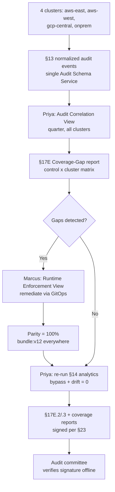

# HL-20 — Multi-cloud / federated compliance reporting

**Personas:** Priya (Compliance Analyst), Marcus (Platform Governance Admin)
**Spec sections:** §14 Compliance Analytics Engine, §16.3 Governance Console (Runtime Enforcement View, Audit Correlation View), §17E Reporting, §20.1 Supply Chain, §20.2 Multi-Tenant Kubernetes Governance, §23 Evidence integrity
**Type:** End-to-end
**Pre-condition:** Four clusters are onboarded: `aws-east-1`, `aws-west-2`, `gcp-us-central`, and `onprem-dc1`; each emits §13-compliant audit events into a single Audit Schema Service. Signed policy bundles are distributed by digest per §8.2 and the same Gemara controls (e.g., `SC-IMG-001`, `MT-NS-OWNER-001`) are referenced by each. Priya holds Compliance Analyst (global scope) and Marcus holds Platform Governance Admin per §17A.2.
**Trigger:** Priya's audit committee asks for a single quarterly coverage-gap report across all four clusters by control, by cluster, and by region.

## Steps
1. Priya opens the Audit Correlation View (§16.3), selects all four clusters and the quarterly window. The §14 analytics engine rolls up enforcement and audit-derived findings across regions, deduplicating on `correlation_id` per §13.3.
2. Priya runs a coverage-gap query (§17E: Coverage gaps by control). The result is a matrix: rows = controls (`SC-IMG-001`, `MT-NS-OWNER-001`, `RT-POD-PRIV-001`), columns = clusters; cells show enforcement mode, bundle version (digest), and decision counts.
3. The matrix surfaces three gaps: `gcp-us-central` has `SC-IMG-001` at `warn` not `enforce`; `onprem-dc1` is missing `MT-NS-OWNER-001` entirely; `aws-west-2` has bundle drift — `bundle:v11` while the rest run `bundle:v12`.
4. Priya tags the gaps; the console creates a `PolicyRemediationAction` CRD (§17C.6) per gap and hands them to Marcus.
5. Marcus opens the Runtime Enforcement View (§16.3) and confirms per-cluster parity: active Gatekeeper constraints, OPA bundle digests, Kyverno policies, drift indicators. He drives each cluster to `enforce` + `bundle:v12` via GitOps; the view refreshes to 100% parity.
6. Priya re-runs §14 cross-cluster correlation. The §14.2 example detections (Gatekeeper Bypass, JWT Policy Drift) run on the quarter: zero bypasses, zero drift events post-remediation.
7. Priya generates the consolidated §17E reports: §17E.2 Real-Time Enforcement (per cluster + aggregate), §17E.3 Audit-Derived Violation (per control), Coverage gaps by control and namespace. The report ties matched cases to §20.1 (supply chain) and §20.2 (multi-tenant).
8. Priya exports the bundle with a §23 tamper-evident signature. The manifest enumerates source audit events, per-cluster bundle digests, and a checksum signed by the platform key.
9. Priya delivers the signed bundle to the audit committee; they verify the signature offline against the published platform key. No screenshots, no spreadsheets, no per-cluster engineer queries.

## Success criteria (testable)
- A single Audit Correlation View query returns enforcement and audit-derived findings across all four clusters / two clouds in one rollup, deduplicated by `correlation_id`.
- The coverage-gap report enumerates every control × cluster cell with mode, bundle digest, and counts; partial coverage is flagged distinctly from absent coverage.
- The Runtime Enforcement View shows parity indicators (constraint set + bundle digest + Kyverno set) per cluster; drift flags clear after remediation.
- §14.2 Gatekeeper bypass and JWT drift detections are computed for the full quarterly window across all clusters, not per-cluster point-in-time samples.
- The §17E export carries a §23 signed manifest enumerating every source artifact with checksums; signature verifies offline against the platform key.
- Zero per-cluster engineer queries are required (auditable from the platform audit log: only Priya's read operations during the cycle).

## Flowchart

## Notes
Demonstrates that §13 normalization plus §14 cross-cluster analytics plus §23 signed export turns multi-cloud reporting into a single console query. Related: HL-01, HL-09, DT-32, DT-33, DT-80.
