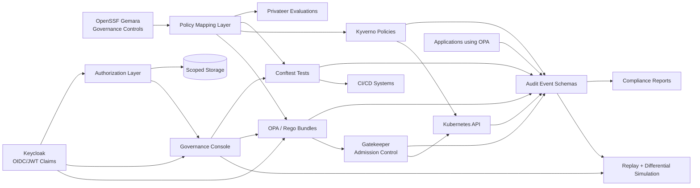
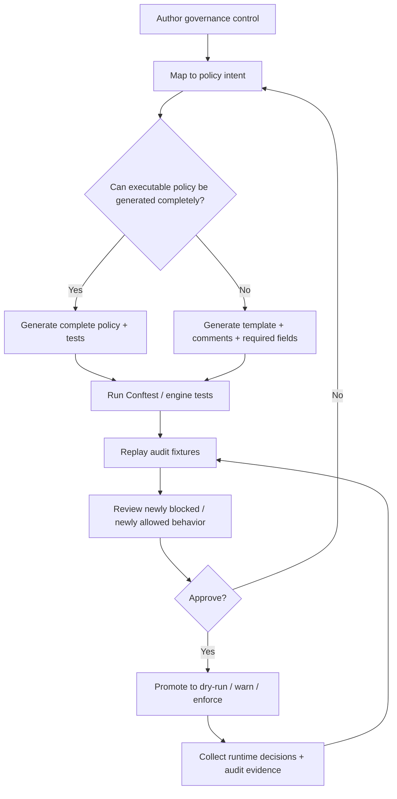
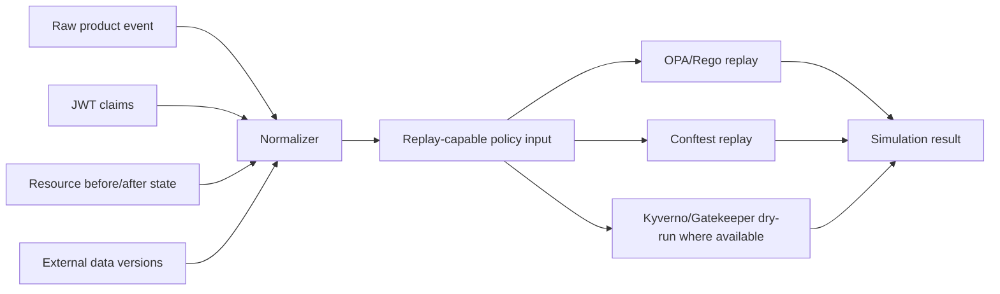
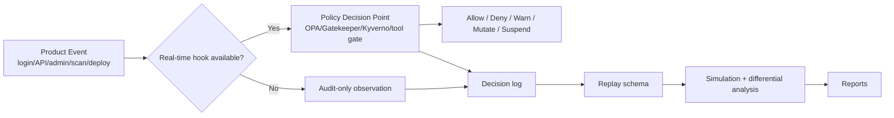

# Product Specification: Unified Governance and Policy Enforcement Platform

## 1. Executive Summary

This specification defines a unified governance, policy enforcement, audit, and policy visualization platform that combines:

- OpenSSF Gemara governance models and policy frameworks
- Open Policy Agent (OPA) and Rego for runtime policy evaluation
- Conftest for policy testing and CI/CD validation
- Kubernetes Gatekeeper for admission control enforcement
- Privateer for Gemara-native evaluations and evidence collection
- Keycloak for identity federation and JWT issuance
- Audit-log schema normalization and policy compliance analytics
- A lightweight graphical management and simulation environment

The platform objective is to provide:

1. Declarative governance definitions
2. Executable policy enforcement
3. Runtime and post-hoc compliance validation
4. End-to-end traceability from governance intent to enforcement outcome
5. Visualization and simulation of policy behavior
6. Continuous evidence collection and auditability
7. Federated identity-aware policy enforcement

The platform is intended for:

- Kubernetes platforms
- Supply chain security governance
- CI/CD governance
- Software assurance and compliance
- AI governance
- Zero Trust infrastructure
- Multi-cluster enterprise environments
- Regulated environments requiring auditable enforcement

---

# 2. Problem Statement

Modern policy ecosystems are fragmented:

- Governance frameworks describe intent but are not executable.
- Enforcement systems execute logic but lack governance traceability.
- Audit systems collect logs without normalized compliance semantics.
- CI/CD validation exists independently from runtime enforcement.
- Identity systems issue JWTs that are inconsistently mapped into policy contexts.
- Existing tools lack integrated visualization and simulation.

Organizations need:

- A unified governance model
- Shared policy semantics
- Traceable enforcement
- Audit-grade evidence
- Simulation capabilities
- Human-readable governance lineage

The platform addresses these gaps by combining governance-as-code and policy-as-code into a single architecture.

---

# 3. Product Goals

## 3.1 Primary Goals

### G1. Governance-to-Enforcement Traceability

Every runtime enforcement decision must trace back to:

- Governance objective
- Policy control
- Policy implementation
- Enforcement event
- Audit evidence
- Remediation workflow

### G2. Unified Policy Lifecycle

Provide a single lifecycle for:

- Policy authoring
- Policy testing
- Policy deployment
- Policy enforcement
- Policy auditing
- Policy simulation
- Policy reporting

### G3. Runtime and Retrospective Compliance

Support both:

- Real-time blocking/enforcement
- Retrospective detection of violations from audit streams

### G4. Identity-Aware Enforcement

Integrate JWT claims from Keycloak into:

- OPA policies
- Gatekeeper constraints
- Audit evidence
- Compliance reporting

### G5. Lightweight Operational Model

Provide:

- Minimal operational footprint
- Kubernetes-native deployment
- Pluggable GUI architecture
- Headlamp compatibility
- Modular extensibility

---

# 4. Non-Goals

The platform will not:

- Replace SIEM systems
- Replace IAM providers
- Replace vulnerability scanners
- Replace CI/CD systems
- Replace Kubernetes dashboards
- Replace enterprise GRC platforms

Instead, it integrates with those systems.

---

# 5. High-Level Architecture

## 5.1 Core Components

| Layer | Component | Purpose |
|---|---|---|
| Governance | OpenSSF Gemara | Declarative governance definitions |
| Policy Runtime | OPA | Runtime policy evaluation |
| Kubernetes Enforcement | Gatekeeper | Admission control enforcement |
| Kubernetes Actions | Kyverno | Validation, mutation, image verification, generation, cleanup |
| CI/CD Validation | Conftest | Pipeline policy validation |
| Evaluation/Evidence | Privateer | Evidence collection and evaluations |
| Identity | Keycloak | JWT issuance and federation |
| Audit | Audit Schema Service | Standardized compliance telemetry for replay |
| Visualization | Governance Console | Policy graphing, authoring, simulation, reporting |
| Analytics | Compliance Analytics Engine | Retrospective analysis and differential simulation |

## 5.2 Top-Level Architecture Diagram



## 5.3 Policy Lifecycle Diagram



---

# 6. Governance Model

## 6.1 Governance Hierarchy

The governance hierarchy shall include:

1. Governance Objectives
2. Policy Domains
3. Controls
4. Enforcement Requirements
5. Evaluation Requirements
6. Evidence Requirements
7. Exception Requirements

Example:

| Layer | Example |
|---|---|
| Objective | Prevent unsigned workloads |
| Control | All container images must be signed |
| Enforcement Requirement | Reject unsigned image admission |
| Evaluation Requirement | Detect workloads bypassing admission |
| Evidence Requirement | Record admission and signature verification metadata |

---

# 7. Policy Lifecycle

## 7.1 Policy Authoring

Policies originate in Gemara governance definitions.

Each control shall include:

- Unique control ID
- Severity
- Applicability
- Enforcement class
- Evidence schema
- Related Rego package
- Required JWT claims
- Enforcement targets
- Exception workflow

## 7.2 Enforcement Classes

| Class | Description |
|---|---|
| Runtime | Real-time blocking/enforcement |
| Build-Time | CI/CD validation |
| Detective | Audit-based detection |
| Manual | Human validation |
| Advisory | Informational only |

---

# 8. OPA Integration

## 8.1 OPA Responsibilities

OPA shall:

- Evaluate Rego policies
- Serve REST APIs
- Support Wasm compilation
- Produce decision logs
- Evaluate JWT-derived identity context
- Evaluate Kubernetes admission requests
- Evaluate CI/CD artifacts
- Evaluate retrospective audit events

## 8.2 Policy Packaging

Policies shall be packaged as:

- OPA bundles
- Versioned OCI artifacts
- Signed artifacts
- Traceable to Gemara control IDs

## 8.3 Rego Metadata Extensions

Each Rego package shall include metadata:

```rego
package governance.kubernetes.imagesigning

__control_id__ := "SC-IMG-001"
__severity__ := "critical"
__governance_domain__ := "supply-chain"
__required_claims__ := ["groups", "tenant", "environment"]
```

---

# 9. Gatekeeper Integration

## 9.1 Responsibilities

Gatekeeper shall:

- Enforce Kubernetes admission policies
- Execute Rego constraints
- Emit enforcement audit events
- Support dry-run simulation mode
- Integrate with governance metadata

## 9.2 Enforcement Modes

| Mode | Description |
|---|---|
| Deny | Block violating requests |
| Warn | Allow with warning |
| Dry Run | Evaluate without blocking |
| Audit | Periodic compliance scans |

## 9.3 Required Audit Fields

Every Gatekeeper decision event shall include:

- Timestamp
- Cluster ID
- Namespace
- Resource Kind
- Resource Name
- User Identity
- JWT Subject
- JWT Groups
- Control ID
- Constraint Template
- Constraint Name
- Rego Package
- Decision Outcome
- Violation Reason
- Request UID
- Admission Review UID
- Correlation ID

---

# 10. Conftest Integration

## 10.1 Responsibilities

Conftest shall:

- Validate IaC artifacts
- Validate Kubernetes manifests
- Validate Terraform
- Validate CI/CD configurations
- Execute locally and in CI/CD
- Produce normalized evidence

## 10.2 Supported Inputs

- Kubernetes YAML
- Helm charts
- Terraform plans
- JSON
- OCI metadata
- SBOMs
- Tekton pipelines
- GitHub Actions

## 10.3 Evidence Output

Conftest output shall normalize into:

```json
{
  "control_id": "SC-IMG-001",
  "policy_package": "governance.kubernetes.imagesigning",
  "resource": "deployment/api-server",
  "decision": "deny",
  "evidence_type": "build-time",
  "pipeline": "github-actions",
  "timestamp": "2026-05-12T00:00:00Z"
}
```

---

# 11. Privateer Integration

## 11.1 Responsibilities

Privateer shall:

- Execute Gemara-native evaluations
- Generate evaluation evidence
- Correlate governance artifacts to runtime evidence
- Produce Gemara Evaluation Logs
- Integrate with supply chain evidence

## 11.2 Evidence Correlation

Privateer shall correlate:

- Governance controls
- OPA decisions
- Gatekeeper audit events
- Conftest evaluations
- Runtime observations
- SBOM attestations
- Signature verification

---

# 12. Audit Schema Framework

## 12.1 Objective

The platform does not replace logging systems.

Instead, it defines normalized schemas required for:

- Compliance analytics
- Governance traceability
- Retrospective violation detection
- Runtime enforcement verification

## 12.2 Audit Sources

Supported audit sources:

| Source | Purpose |
|---|---|
| Kubernetes Audit Logs | Admission and API activity |
| Gatekeeper Audit Events | Policy enforcement |
| OPA Decision Logs | Policy evaluation decisions |
| CI/CD Logs | Build-time enforcement |
| Application Logs | Embedded OPA evaluations |
| Keycloak Events | Authentication and token issuance |
| Service Mesh Logs | Network policy context |

---

# 13. Standardized Audit Event Schema

## 13.1 Design Principle

Audit records used for replay must preserve the policy decision input, not merely the final outcome. A replay record that lacks information used by the original enforcement engine cannot produce an authoritative simulation result.

## 13.2 Replay-Capable Audit Event Diagram



## 13.3 Required Core Fields

| Field | Purpose |
|---|---|
| event_id | Unique event identifier |
| timestamp | Time of original action or enforcement decision |
| event_type | Policy decision, resource change, scan result, approval request, etc. |
| decision | allow, deny, warn, mutate, suspend_pending_approval, unknown |
| policy_engine | OPA, Gatekeeper, Conftest, Kyverno, application, scanner |
| policy_version | Policy or bundle version used |
| rego_package / policy_ref | Executed policy reference |
| control_id | Governance control mapping |
| resource_type | Type of object evaluated |
| resource_id | Stable resource identity |
| cluster / namespace / tenant | Scope attributes |
| subject | Normalized actor/workload identity |
| jwt_claims | Claims used for policy input, where available |
| operation | Create, update, delete, deploy, scan, approve, login, etc. |
| before_state | Previous object state if relevant |
| after_state | New object state if relevant |
| request_object | Original requested object if available |
| external_data_refs | External data used by policy and its version/digest |
| correlation_id | Link across product logs and decisions |
| outcome_reason | Human-readable explanation |
| replay_completeness | complete, partial, insufficient |

## 13.4 Example Replay-Capable Event

```json
{
  "event_id": "uuid",
  "timestamp": "2026-05-12T00:00:00Z",
  "event_type": "kubernetes.admission.request",
  "decision": "deny",
  "policy_engine": "gatekeeper",
  "policy_version": "bundle:v12",
  "control_id": "SC-IMG-001",
  "resource_type": "Deployment",
  "resource_id": "cluster-a/payments-prod/deployment/api",
  "cluster": "cluster-a",
  "namespace": "payments-prod",
  "operation": "create",
  "subject": {
    "sub": "user-123",
    "groups": ["team-payments"],
    "roles": ["developer"],
    "tenant": "payments"
  },
  "jwt_claims": {
    "iss": "https://keycloak.example/realms/platform",
    "aud": "kubernetes",
    "groups": ["team-payments"],
    "namespaces": ["payments-dev", "payments-prod"]
  },
  "request_object": {
    "apiVersion": "apps/v1",
    "kind": "Deployment",
    "metadata": {"name": "api", "namespace": "payments-prod"}
  },
  "external_data_refs": [
    {"name": "image-signature-status", "version": "2026-05-12T00:00:00Z"}
  ],
  "correlation_id": "uuid",
  "outcome_reason": "Unsigned image prohibited",
  "replay_completeness": "complete"
}
```

## 13.5 Optional Compatibility with OCSF

OCSF may be used as a compatibility target or mapping layer for security-event normalization. It is not required for the POC. The platform-specific replay schema is authoritative because it is tailored to policy simulation needs.

---

# 14. Compliance Analytics Engine

## 14.1 Responsibilities

The analytics engine shall:

- Detect policy bypasses
- Detect inconsistent enforcement
- Correlate runtime and build-time policy outcomes
- Identify drift between governance and runtime
- Detect missing enforcement coverage
- Generate compliance evidence reports

## 14.2 Example Detections

### Example: Gatekeeper Bypass

If a deployment exists without:

- Corresponding admission evaluation
- Matching Gatekeeper audit event
- Matching OPA decision log

The engine flags a potential bypass.

### Example: JWT Policy Drift

If policies require claim `tenant`, but runtime JWTs omit the claim, flag policy enforcement degradation.

---

# 15. Keycloak and JWT Integration

## 15.1 Objectives

The platform shall:

- Normalize JWT claims for policy evaluation
- Provide governance-aware identity mappings
- Ensure claims required by policy are exposed consistently

## 15.2 Required JWT Claims

The following claims are REQUIRED:

| Claim | Purpose |
|---|---|
| sub | Subject identity |
| iss | Issuer validation |
| aud | Audience validation |
| exp | Token expiration |
| iat | Issued-at validation |
| groups | Authorization grouping |
| roles | Role-based policy evaluation |
| tenant | Multi-tenant policy isolation |
| environment | Environment scoping |
| email | Human attribution |
| preferred_username | Human-readable identity |

## 15.3 Recommended Custom Claims

| Claim | Purpose |
|---|---|
| risk_level | Risk-aware policies |
| compliance_scope | Regulatory applicability |
| workload_identity | Workload-to-service mapping |
| deployment_approval | Deployment authorization state |
| data_classification | Data governance policies |

## 15.4 JWT-to-Policy Mapping Layer

The platform shall provide:

- Claim transformation
- Claim normalization
- Identity aliasing
- Tenant inheritance
- Group expansion
- Role hierarchy resolution

Example:

```yaml
claim_mappings:
  team:
    source: groups
    transform: first_prefix("team-")

  environment:
    source: realm_access.roles
    transform: extract_environment
```

---

# 16. Graphical Governance Console

## 16.1 Objectives

Provide a lightweight web-based interface for:

- Governance visualization
- Rego visualization
- Policy lineage visualization
- Conftest execution
- Simulation
- Enforcement debugging
- Audit inspection
- Drift analysis
- Namespace-scoped policy authoring
- Approval workflow visibility
- Reporting on real-time actions and retrospective audit findings

## 16.2 Framework Requirements

The GUI should preferably integrate with:

- Headlamp
- Backstage
- OpenLens-compatible APIs
- Existing Kubernetes dashboards

Preferred implementation:

- React frontend
- Headlamp plugin model
- OPA REST integrations
- WebAssembly Rego execution
- Kubernetes-native RBAC discovery
- Keycloak/OIDC authentication
- Pluggable policy action libraries

The Headlamp-based implementation should be the default option for Kubernetes-first deployments because it can inherit Kubernetes context, cluster visibility, and namespace-scoped user access patterns.

## 16.3 Required Views

### Governance Graph View

Visualize:

- Governance objectives
- Controls
- Rego packages
- Enforcement points
- Audit evidence
- Approval gates
- Policy action libraries

### Rego Explorer

Display:

- Rego packages
- Rule dependencies
- Control mappings
- Policy test coverage
- Required JWT claims
- Required audit fields

### Runtime Enforcement View

Display:

- Active Gatekeeper constraints
- OPA policy bundles
- Kyverno policies
- Decision statistics
- Recent denies
- Suspend-pending-approval events
- Drift indicators

### Audit Correlation View

Display:

- Enforcement decisions
- Missing evaluations
- Compliance gaps
- Violation timelines
- False-positive and false-negative analysis
- Policies that would newly allow previously blocked behavior
- Policies that would newly block previously allowed behavior

### Namespace Authoring View

Display and enforce:

- Namespace-scoped policy authoring permissions
- Namespace-scoped simulation permissions
- Namespace-scoped violation visibility
- Namespace-scoped approval state
- Underlying storage authorization boundaries

---

# 17. Policy Simulation and Dry-Run Framework

## 17.1 Objectives

The platform shall support:

- Offline simulation
- Live dry-run evaluation
- Historical replay
- Prospective impact analysis
- Regression testing against audit logs
- False-positive and false-negative analysis
- Comparison of old-policy and new-policy behavior
- Namespace-scoped testing

The simulation framework is a first-class product capability. Its primary authoring workflow is:

> This event happened and should not happen again. I wrote or modified a policy. I want to verify that the policy catches the intended behavior, does not block supported behavior, and does not unintentionally allow behavior that was previously blocked.

## 17.2 Simulation Modes

| Mode | Description |
|---|---|
| Manifest Simulation | Evaluate proposed manifests |
| Historical Replay | Replay historical audit events |
| Live Shadow Mode | Evaluate production traffic without enforcement |
| Cluster Snapshot Simulation | Evaluate current cluster state |
| Differential Policy Simulation | Compare old and new policy outcomes over the same evidence set |
| Namespace Simulation | Restrict simulation inputs and effects to objects in authorized namespaces |
| Previously Blocked Replay | Re-evaluate historical deny events against a new policy to identify newly allowed actions |
| Intended Behavior Test | Confirm that new policy catches a target behavior observed in logs |
| False Positive Test | Confirm that supported historical behaviors remain allowed |

## 17.3 Audit-Driven Simulation Requirements

Audit logs must contain enough information to reconstruct the same policy input used by runtime enforcement.

For each enforcement point, the audit schema must preserve:

- Full normalized policy input
- Original raw event where legally and operationally permissible
- Subject identity and JWT-derived attributes
- Resource before-state and after-state where applicable
- Request operation
- Request source
- Enforcement mode
- Policy bundle version
- Control ID
- Decision ID
- External data references used during the decision
- External data version or digest
- Admission Review UID or equivalent request correlation ID
- Runtime engine identity
- Decision outcome
- Explanation or violation message

If a runtime policy depends on a field that is not present in the audit schema, the simulation result must be marked as incomplete rather than treated as authoritative.

## 17.4 Differential Simulation Semantics

The platform shall compare policy behavior across four outcomes:

| Previous Outcome | New Outcome | Classification |
|---|---|---|
| Allow | Deny | Newly blocked |
| Deny | Allow | Newly allowed |
| Allow | Allow | No enforcement change |
| Deny | Deny | Continued block |

Each newly allowed result shall be taggable as:

- Intended relaxation
- Potential regression
- Requires review
- Approved exception

Each newly blocked result shall be taggable as:

- Intended enforcement
- Potential false positive
- Requires review
- Emergency block

## 17.5 Policy Authoring Test Cases from Audit Logs

The GUI shall allow a user to create test cases directly from audit events.

Required workflow:

1. User selects an audit event or violation.
2. User marks it as desired outcome: allow, deny, warn, mutate, or suspend-pending-approval.
3. Platform extracts policy input fixture from the event.
4. User modifies or authors a policy.
5. Platform runs Conftest, OPA, Gatekeeper dry-run, Kyverno test, or engine-specific evaluation.
6. Platform reports whether the new policy matches the desired outcome.
7. Fixture is saved as a regression test.
8. Test is linked to governance control and Rego/Kyverno policy version.

## 17.6 Example Simulation Workflow

1. Administrator identifies a historical production event that should have been blocked.
2. Administrator converts the event into a policy test fixture.
3. Administrator authors a new policy.
4. GUI replays historical events from the same namespace, product, or control domain.
5. Platform classifies results as newly blocked, newly allowed, unchanged allowed, or unchanged denied.
6. Administrator reviews false positives and newly allowed behavior.
7. Administrator tags expected changes.
8. Platform generates a simulation report.
9. Administrator promotes policy to warn, dry-run, or enforce mode.

---

# 17A. Scoped Roles, Permissions, and Storage Authorization

## 17A.1 Objectives

The platform shall support fine-grained authorization for:

- Policy authoring
- Policy approval
- Policy simulation
- Policy deployment
- Violation viewing
- Audit replay
- Exception management
- Reporting
- Namespace-scoped delegation

Authorization shall be enforced in both:

1. GUI/API layer
2. Underlying storage and retrieval layer

GUI-only authorization is insufficient.

## 17A.2 Role Model

Required roles:

| Role | Scope | Capabilities |
|---|---|---|
| Platform Governance Admin | Global | Manage controls, global policy mappings, and system configuration |
| Policy Library Maintainer | Global/domain | Manage reusable policy libraries and action libraries |
| Namespace Policy Author | Namespace | Author and test policies affecting owned namespaces |
| Namespace Policy Approver | Namespace | Approve namespace-scoped policy promotion |
| Compliance Analyst | Domain/global | View evidence, audit findings, and compliance reports |
| Security Reviewer | Domain/global | Review violations, exceptions, and risky simulations |
| Developer | Namespace/project | Run local tests and view relevant policy feedback |
| Auditor | Read-only scoped/global | View immutable reports and evidence |
| Workflow Integrator | Global/domain | Configure approval webhooks and workflow endpoints |

## 17A.3 Permission Primitives

Permissions shall be defined over:

- Resource type
- Namespace
- Cluster
- Policy domain
- Control ID
- Policy package
- Evidence set
- Simulation dataset
- Approval workflow
- Report

Example permissions:

- `policy:view`
- `policy:edit`
- `policy:test`
- `policy:simulate`
- `policy:promote-dry-run`
- `policy:promote-enforce`
- `violation:view`
- `audit:replay`
- `approval:request`
- `approval:approve`
- `exception:create`
- `exception:approve`
- `report:view`

## 17A.4 Keycloak Integration

Keycloak shall provide:

- Authentication
- Group membership
- Role assignment
- Optional fine-grained authorization policies
- Token claims used by the platform authorization engine

Required Keycloak claim mapping:

```yaml
required_claims:
  sub: user identity
  preferred_username: display identity
  email: human attribution
  groups: team and namespace membership
  realm_access.roles: global platform roles
  resource_access.platform.roles: platform-specific roles
  namespaces: authorized Kubernetes namespaces
  policy_domains: authorized governance domains
  tenants: authorized tenants
```

The platform shall normalize Keycloak claims into an internal authorization subject:

```json
{
  "subject_id": "user-123",
  "username": "alice",
  "roles": ["namespace-policy-author"],
  "groups": ["team-payments"],
  "namespaces": ["payments-prod", "payments-dev"],
  "policy_domains": ["supply-chain", "runtime-security"],
  "tenants": ["payments"]
}
```

## 17A.5 Storage-Level Access Controls

Storage must enforce access boundaries independent of the GUI.

Minimum requirements:

- Every stored object must include authorization metadata.
- Queries must be filtered by subject scope.
- Namespace-scoped users must not retrieve policies, violations, simulations, or audit fixtures outside their scope.
- Global admins must be auditable when crossing tenant or namespace boundaries.
- Policy bundles must encode scope metadata.
- Audit replay datasets must be materialized as scoped datasets before use.

Required metadata:

```json
{
  "object_type": "simulation_dataset",
  "cluster": "cluster-a",
  "namespaces": ["payments-prod"],
  "policy_domains": ["supply-chain"],
  "control_ids": ["SC-IMG-001"],
  "tenant": "payments",
  "created_by": "alice",
  "visibility": "namespace-scoped"
}
```

---

# 17B. Approval-Gated Policy Decisions

## 17B.1 Objective

Some policies cannot be expressed as immediate allow or deny. The platform shall support policies that require approval by:

- Person
- Role
- Group
- Organization
- Automated check
- External workflow system

## 17B.2 Decision Outcomes

Policy decisions shall support:

| Decision | Meaning |
|---|---|
| allow | Permit action |
| deny | Block action |
| warn | Permit but record warning |
| mutate | Modify request/resource |
| suspend_pending_approval | Pause or defer execution pending approval |
| require_async_check | Trigger an external check before final disposition |

## 17B.3 Workflow Webhook Integration

The platform shall emit configurable webhook events to external workflow systems.

External workflow execution is out of scope.

Webhook event schema:

```json
{
  "event_type": "approval.requested",
  "control_id": "DEPLOY-APPROVAL-001",
  "decision": "suspend_pending_approval",
  "requested_action": "deploy workload",
  "resource": {
    "kind": "Deployment",
    "namespace": "payments-prod",
    "name": "api"
  },
  "subject": {
    "sub": "user-123",
    "groups": ["team-payments"]
  },
  "approval_required_from": {
    "type": "role",
    "value": "production-release-approver"
  },
  "correlation_id": "uuid",
  "expires_at": "2026-05-13T00:00:00Z"
}
```

## 17B.4 Suspend-Pending-Approval Behavior by Enforcement Point

| Enforcement Point | Feasible Behavior |
|---|---|
| CI/CD pipeline | Pause job or mark manual approval required |
| GitLab merge request | Block merge pending approval |
| Jenkins pipeline | Pause stage pending input or external webhook result |
| Kubernetes admission | Generally cannot hold indefinitely; use deny-with-approval-required or create intermediate CRD |
| Application OPA integration | Application-specific pending state possible |
| GitOps controller | Suspend sync or hold promotion pending approval |

Kubernetes admission webhooks have short request deadlines. Therefore, long-running approval must not depend on holding the admission request open. The recommended Kubernetes pattern is to deny with an approval-required reason, create or update an approval request object, and allow a later retry once approval state exists.

---

# 17C. Policy Actions, Engine Gaps, and Kyverno/OPA Extensions

## 17C.1 Where Kyverno Is Needed Versus Where OPA Is Sufficient

Kyverno is not needed merely because a policy involves Kubernetes. OPA/Gatekeeper can evaluate complex Kubernetes admission logic, and Gatekeeper also supports mutation, audit, external data, constraints, and constraint templates. Kyverno fills important gaps when the desired outcome is a Kubernetes-native action rather than a pure decision.

| Capability | OPA Alone | Gatekeeper | Kyverno | Recommendation |
|---|---|---|---|---|
| Complex policy decision logic | Strong | Strong | Moderate | Use OPA/Rego where logic complexity, reuse, or cross-product consistency matters. |
| Kubernetes admission deny/warn | Needs integration | Strong | Strong | Use Gatekeeper for Rego-centered policies; Kyverno for YAML-native Kubernetes policies. |
| Kubernetes mutation | Not native alone | Supported through mutator CRDs | Strong | Use Kyverno for common/defaulting mutations; Gatekeeper for Rego-linked mutation needs. |
| Generate related Kubernetes resources | Not native | Not primary | Strong | Use Kyverno. |
| Cleanup/delete resources based on policy | Not native | Not primary | Strong | Use Kyverno cleanup policies or custom controller. |
| Image signature verification | Needs external data/service | Possible with integrations | Strong | Prefer Kyverno or a verifier feeding OPA external data. |
| Kubernetes policy reports | Requires custom reporting | Audit available | Strong | Normalize both Kyverno and Gatekeeper outputs. |
| Long-running approval workflows | Not appropriate | Not appropriate in admission path | Not appropriate alone | Use platform approval state plus workflow webhook. |
| Cross-product policy consistency | Strong | Kubernetes only | Kubernetes only | Use OPA/Gemara as the common governance and decision model. |
| Retrospective replay over normalized audit logs | Strong | Limited to Kubernetes context | Limited to Kubernetes context | Use OPA/Rego over replay schemas. |

## 17C.2 Practical Rule

Use Kyverno when the platform needs Kubernetes-native operational effects:

| Need | Why Kyverno Helps |
|---|---|
| Create companion resources | Kyverno generate policies are purpose-built for this. |
| Mutate resources declaratively | Kyverno is YAML-native and easier for Kubernetes teams. |
| Clean up resources | Kyverno has cleanup-oriented policy support. |
| Verify image signatures | Image verification is a strong native Kyverno use case. |
| Produce policy reports | Kyverno emits Kubernetes policy reports that can be normalized into platform evidence. |

Use OPA/Gatekeeper when the platform needs:

| Need | Why OPA/Gatekeeper Helps |
|---|---|
| Shared semantics across many products | Rego can evaluate normalized input from Kubernetes, CI/CD, identity, scanners, and apps. |
| Complex decision logic | OPA is optimized for policy decisions over structured data. |
| Identity-aware decisions | JWT claims and external data can be evaluated consistently. |
| Cross-product replay simulation | Historical audit events can be normalized and replayed through the same policy logic. |
| Governance traceability | Rego metadata can map directly to Gemara controls. |

## 17C.3 Action Taxonomy

| Action | Description | Typical Engines |
|---|---|---|
| allow | Permit requested action | OPA, Gatekeeper, Kyverno, application PDP |
| deny | Block requested action | OPA, Gatekeeper, Kyverno, CI/CD integrations |
| warn | Permit and log warning | Gatekeeper, Kyverno, application PDP |
| mutate | Modify resource/request | Kyverno, Gatekeeper, custom controller |
| generate | Create related resource | Kyverno, custom controller |
| cleanup/delete | Remove resource | Kyverno, custom controller |
| quarantine | Isolate workload/resource | Custom controller, Kubernetes automation |
| suspend | Pause workflow or reconciliation | CI/CD, GitOps, workflow integration |
| require_approval | Trigger approval flow | Platform workflow webhook plus approval state |
| require_scan | Trigger scanner | CI/CD, custom controller, scanner integration |
| notify | Send event | Webhook/SIEM/chatops integration |
| annotate/label | Add metadata | Kyverno, Gatekeeper mutation, custom controller |
| exception | Attach approved exception | Platform exception store |

## 17C.4 Policy Decision Point Model

A policy decision point is any place where the platform can evaluate or reconstruct a policy-relevant decision.

| PDP Type | Real-Time Enforcement? | Retrospective Replay? | Examples |
|---|---|---|---|
| Admission PDP | Yes | Yes | Kubernetes API admission via Gatekeeper/Kyverno |
| Application PDP | Yes | Yes if decision input is logged | Application calls OPA before serving API action |
| CI/CD PDP | Yes | Yes | Jenkins/GitLab pipeline gates, Conftest checks |
| Identity PDP | Sometimes | Yes | Keycloak login, token issuance, admin changes |
| Scanner PDP | Usually build-time | Yes | Trivy, SonarQube, OWASP/ZAP results |
| Observability PDP | Usually no direct block | Yes | Prometheus alert, Grafana dashboard/config change |
| Data/API PDP | Product-dependent | Yes | Elasticsearch/Kibana login, API call, ACL change |
| Approval PDP | Yes, via workflow | Yes | Change needs approval before deployment or role grant |

## 17C.5 Policy Decision Point Requirements

For every supported product, the platform shall define:

| Required Definition | Purpose |
|---|---|
| Event taxonomy | Which actions are policy-relevant |
| Enforcement location | Where the decision can be made in real time |
| Audit source | Where the same event can be observed later |
| Replay schema | Minimum fields needed to simulate the decision |
| Subject mapping | How identity/JWT/user/service account is normalized |
| Resource mapping | How product objects map to governance resources |
| Decision outcomes | allow, deny, warn, mutate, suspend, require approval |
| Missing capability notes | What cannot be enforced directly |

## 17C.6 Custom CRD Extension Pattern

Where existing engines cannot directly perform required actions, the platform shall use custom CRDs:

- `PolicyApprovalRequest`
- `PolicySimulationRun`
- `PolicyActionLibrary`
- `PolicyEvidenceSchema`
- `PolicyException`
- `PolicyRemediationAction`

Controllers reconcile these CRDs and interact with external systems through webhooks.

Example:

```yaml
apiVersion: governance.example.io/v1alpha1
kind: PolicyApprovalRequest
metadata:
  name: deploy-api-payments-prod
  namespace: payments-prod
spec:
  controlId: DEPLOY-APPROVAL-001
  requestedBy: alice
  resourceRef:
    apiVersion: apps/v1
    kind: Deployment
    name: api
  requiredApproval:
    type: role
    value: production-release-approver
  status: pending
```

---

# 17D. Product Decision Point and Action Libraries

## 17D.1 Objective

The platform shall provide product libraries so users can build enforcement and audit-replay policies from reusable decision points, action types, evidence schemas, and example controls.

Each product library shall define:

| Library Element | Description |
|---|---|
| Decision points | Product events where policy may apply |
| Real-time hook | Whether and where blocking or modification is possible |
| Audit source | Logs/events needed for retrospective analysis |
| Replay input schema | Fields required to reconstruct policy input |
| Supported actions | allow, deny, warn, require approval, mutate, etc. |
| Example controls | Ready-to-adapt governance/policy examples |
| Limitations | What cannot be enforced directly |

## 17D.2 Kubernetes Library

| Decision Point | Real-Time Hook | Audit/Replay Source | Supported Actions | Example Policies |
|---|---|---|---|---|
| Create/update/delete resource | Admission webhook | Kubernetes audit log, Gatekeeper/Kyverno reports | allow, deny, warn, mutate, require approval | Block privileged pods; require labels; restrict hostPath |
| Deploy image | Admission webhook | Admission request, image metadata, scan/signature evidence | deny, warn, require approval | Require signed image; block critical CVEs |
| Exec into pod | Kubernetes API authorization/audit | Kubernetes audit log | detect, alert, require review | Exec into production pods requires break-glass role |
| Port-forward | Kubernetes API authorization/audit | Kubernetes audit log | detect, alert, require review | Port-forward to regulated namespace requires approval |
| Role/RoleBinding change | Admission webhook | Kubernetes audit log | deny, require approval | Prevent cross-tenant role grants |
| Secret create/read/update | Admission/audit, product-dependent | Kubernetes audit log | deny, warn, detect | Prevent plaintext secret creation; alert on secret reads |
| Namespace creation | Admission webhook | Kubernetes audit log | mutate, generate, require approval | Generate default NetworkPolicy and ResourceQuota |
| Ingress change | Admission webhook | Kubernetes audit log | deny, mutate, require approval | External ingress requires approved domain |

## 17D.3 Keycloak Library

| Decision Point | Real-Time Hook | Audit/Replay Source | Supported Actions | Example Policies |
|---|---|---|---|---|
| User login | Authentication flow / event listener | Login events | allow, deny, require MFA, detect | Admin login from unusual network requires MFA |
| Token issuance | Protocol mapper / client policy / custom extension | Token/event logs | deny, require claim, detect | Deployment tokens must include namespace claims |
| Token exchange | Policy/custom extension | Admin/user events | deny, require approval, detect | Cross-tenant token exchange prohibited |
| Role assignment | Admin event listener / Admin API wrapper | Admin events | deny, require approval, detect | Privileged role grant requires approval |
| Group membership change | Admin event listener / Admin API wrapper | Admin events | deny, require approval, detect | Adding user to production deployer group requires approval |
| Client creation/update | Admin event listener | Admin events | deny, require approval, detect | Public clients cannot request privileged scopes |
| Identity provider change | Admin event listener | Admin events | require approval, detect | IdP trust changes require platform approval |
| Service account credential rotation | Admin event listener | Admin events | require approval, detect | Production service account changes require review |

## 17D.4 Jenkins Library

| Decision Point | Real-Time Hook | Audit/Replay Source | Supported Actions | Example Policies |
|---|---|---|---|---|
| Job started | Shared library/plugin/webhook | Build logs, job metadata | allow, deny, warn | Untrusted branch cannot use deploy job |
| Stage started | Pipeline step wrapper | Pipeline logs | pause, deny, require approval | Production stage requires approver role |
| Artifact produced | Pipeline policy step | Artifact metadata, SBOM, scan result | deny, require scan, attach evidence | Artifact must have SBOM and provenance |
| Credentials accessed | Plugin/audit logs | Jenkins audit/security logs | deny if hookable, detect | Production credential use restricted to release jobs |
| Deployment requested | Pipeline gate | Build/deploy logs | pause, require approval, deny | Deployment requires ticket and passing checks |
| Job configuration changed | Audit log / configuration-as-code review | Jenkins config history | require approval, detect | Disabling security checks requires approval |

## 17D.5 GitLab Library

| Decision Point | Real-Time Hook | Audit/Replay Source | Supported Actions | Example Policies |
|---|---|---|---|---|
| Merge request opened/updated | MR approval rules, CI policy job | GitLab audit/events | block merge, require approval | Policy file change requires security review |
| Merge request approved | Approval rules | MR events | allow, deny, require extra approval | Production code requires code-owner approval |
| Pipeline started | CI job | Pipeline logs | deny, require scan | Untrusted source cannot run privileged runner |
| Pipeline completed | CI job/status check | Pipeline logs | block merge/deploy | Failed security scan blocks merge |
| Protected branch push | Branch protection | Audit events | deny, detect | Direct push to protected branch prohibited |
| Environment promotion | Deployment approvals | Deployment events | require approval, deny | Prod promotion requires release approver |
| Runner registration/change | Admin/audit events | Audit events | require approval, detect | Shared runner registration requires admin approval |
| Secret/variable change | GitLab audit events | Audit events | require approval, detect | Protected variable changes require two-person review |

## 17D.6 Trivy Library

| Decision Point | Real-Time Hook | Audit/Replay Source | Supported Actions | Example Policies |
|---|---|---|---|---|
| Image scan completed | CI/CD gate | Scan report | fail build, block deployment, require exception | Critical vulnerability blocks production |
| Filesystem scan completed | CI/CD gate | Scan report | fail build, warn | Secrets in repository fail pipeline |
| SBOM generated | CI/CD gate | SBOM artifact | require evidence | Production artifact must have SBOM |
| Misconfiguration detected | CI/CD gate | Scan report | fail build, warn | Kubernetes manifest with privileged pod fails |
| License finding detected | CI/CD gate | Scan report | require review | Prohibited license requires legal approval |

## 17D.7 OWASP Library

| Decision Point | Real-Time Hook | Audit/Replay Source | Supported Actions | Example Policies |
|---|---|---|---|---|
| ZAP scan completed | CI/CD gate | ZAP report | fail build, require remediation | High-risk auth finding blocks release |
| ASVS control result | CI/CD/manual evidence | Assessment result | require approval, attach evidence | ASVS L2 failure requires security approval |
| Dependency risk finding | CI/CD scanner | Dependency report | fail build, require exception | Known exploited dependency blocks release |
| Threat model update | Workflow gate | Threat model metadata | require approval | High-risk feature requires threat model approval |

## 17D.8 SonarQube Library

| Decision Point | Real-Time Hook | Audit/Replay Source | Supported Actions | Example Policies |
|---|---|---|---|---|
| Quality gate result | CI/CD status check | SonarQube analysis result | block merge, fail build | Production release requires passing quality gate |
| Vulnerability detected | CI/CD status check | Finding report | block merge, require review | New critical vulnerability blocks merge |
| Security hotspot created | Review workflow | Hotspot status | require review | Security hotspots must be reviewed before release |
| Coverage threshold failed | CI/CD gate | Analysis result | warn, fail build | New code coverage must exceed threshold |
| Quality profile changed | Admin/audit event | Audit logs/config history | require approval, detect | Security rules cannot be weakened without approval |

## 17D.9 Grafana/Prometheus Library

| Decision Point | Real-Time Hook | Audit/Replay Source | Supported Actions | Example Policies |
|---|---|---|---|---|
| Alert fired | Alertmanager webhook | Alert history | notify, block promotion through CI/CD | Active critical alert blocks deployment promotion |
| Alert resolved | Alertmanager webhook | Alert history | clear hold, attach evidence | Deployment hold removed after alert resolves |
| SLO breach | Metrics query/gate | Metrics history | require approval, block promotion | Service below SLO cannot receive risky deploy |
| Recording/alert rule changed | GitOps/config review or Grafana API wrapper | Config history/audit | require approval, detect | Critical alert rule change requires approval |
| Dashboard changed | Grafana audit/plugin | Audit logs | detect, require review | Compliance dashboard changes require review |
| Data source changed | Grafana admin/audit | Audit logs | require approval, detect | Production data source change requires approval |

## 17D.10 Elasticsearch / Kibana Library

Elasticsearch and Kibana must be treated as both data systems and administrative surfaces. Security-relevant web UI actions, API calls, authentication events, authorization decisions, and access-control changes are policy-relevant.

| Decision Point | Real-Time Hook | Audit/Replay Source | Supported Actions | Example Policies |
|---|---|---|---|---|
| Kibana web UI login | Kibana/IdP integration, reverse proxy, custom plugin | Kibana audit logs, IdP logs | allow, deny, require MFA, detect | Privileged Kibana login requires approved group and MFA |
| Elasticsearch API call | Reverse proxy/API gateway, application PDP, Elasticsearch security model | Elasticsearch audit logs | allow, deny if proxied, detect | Bulk delete on production index requires approval |
| Index read/search | Elasticsearch security model/proxy | Elasticsearch audit logs | allow, deny if proxied, detect | Sensitive index search restricted to approved role |
| Document write/delete | Proxy/application PDP | Elasticsearch audit logs | allow, deny if proxied, detect | Delete on regulated index requires approval |
| Role or role mapping changed | Admin API wrapper, proxy, workflow gate | Elasticsearch audit logs | require approval, detect | Granting access to sensitive index requires approval |
| User/API key created | Admin API wrapper/proxy | Elasticsearch audit logs | require approval, detect | API key with write privilege requires expiration and approval |
| Index template/lifecycle policy changed | Admin API wrapper/proxy | Elasticsearch audit logs | require approval, detect | Retention policy reduction requires compliance approval |
| Kibana saved object changed | Kibana audit logs/plugin | Kibana audit logs | require review, detect | Dashboard used for compliance reporting requires approval |
| Security configuration changed | Admin API wrapper/proxy | Elasticsearch audit logs | require approval, detect | Disabling audit logging is prohibited |

## 17D.11 Cross-Product Decision Point Pattern

Every supported product shall use the same policy modeling pattern:



---

# 17E. Reporting Requirements

## 17E.1 Report Categories

The platform shall provide reports for:

- Real-time enforcement actions
- Mutations performed by policy
- Approval requests issued
- Suspended/pending actions
- Violations detected from audit logs
- Simulation results
- Newly allowed behavior
- Newly blocked behavior
- False-positive analysis
- Missing audit fields
- Coverage gaps by control
- Coverage gaps by namespace
- Policy drift

## 17E.2 Real-Time Enforcement Report

Must include:

- Decision timestamp
- Actor
- Resource
- Namespace
- Policy engine
- Policy version
- Control ID
- Decision
- Action performed
- Mutation diff if applicable
- Approval webhook correlation if applicable

## 17E.3 Audit-Derived Violation Report

Must include:

- Violation timestamp
- Discovery timestamp
- Source audit log
- Reconstructed policy input
- Policy version used for replay
- Confidence level
- Missing fields if any
- Matched control ID
- Recommended remediation

## 17E.4 Simulation Report

Must include:

- Policy version before
- Policy version after
- Audit dataset used
- Events evaluated
- Newly blocked count
- Newly allowed count
- Unchanged allowed count
- Unchanged denied count
- Tagged intentional changes
- Untagged risky changes
- False-positive candidates
- False-negative candidates

---

# 18. Real-Time Enforcement Flow

## 18.1 Kubernetes Admission Example

### Scenario

An engineer deploys an unsigned container image.

### Governance Layer

Gemara control:

```yaml
control_id: SC-IMG-001
objective: Prevent unsigned workloads
```

### Enforcement Layer

Gatekeeper constraint invokes Rego:

```rego
deny[msg] {
  not input.review.object.metadata.annotations["cosign.sigstore.dev/imageRef"]
  msg := "Unsigned image prohibited"
}
```

### Runtime Flow

1. User authenticates via Keycloak
2. JWT propagated through API gateway
3. Kubernetes admission request generated
4. Gatekeeper invokes OPA/Rego
5. Policy evaluates JWT claims and image metadata
6. Admission denied
7. Audit events emitted
8. OPA decision logs generated
9. Privateer records evaluation evidence
10. Compliance analytics engine correlates events

### Audit Evidence

Generated evidence includes:

- User identity
- JWT claims
- Image digest
- Policy version
- Control ID
- Enforcement outcome
- Timestamp

---

# 19. Retrospective Audit Detection Scenario

## 19.1 Objective

Detect workloads that bypassed enforcement.

## 19.2 Example

An administrator temporarily disables Gatekeeper.

A deployment with privileged escalation is created.

No deny event exists.

### Analytics Flow

1. Kubernetes audit logs show deployment creation
2. No Gatekeeper audit event exists
3. No OPA decision log exists
4. Runtime scan identifies violating workload
5. Compliance engine correlates discrepancy
6. Platform emits:

- Enforcement bypass alert
- Missing policy evaluation evidence
- Governance noncompliance event

---

# 20. Publicly Derived Use Cases

## 20.1 Supply Chain Security

Derived from:

- OpenSSF Secure Supply Chain initiatives
- Sigstore adoption patterns
- SLSA governance practices

### Policies

| Layer | Example |
|---|---|
| Governance | All production images must be signed |
| Build-Time | Conftest validates image metadata |
| Runtime | Gatekeeper blocks unsigned images |
| Detective | Audit analysis identifies bypasses |

---

## 20.2 Multi-Tenant Kubernetes Governance

Derived from:

- Gatekeeper production patterns
- Kubernetes policy management practices

### Policies

| Layer | Example |
|---|---|
| Governance | Tenants cannot deploy outside authorized namespaces |
| Runtime | Gatekeeper validates namespace ownership |
| Identity | JWT tenant claim enforced |
| Audit | Cross-tenant attempts logged |

---

## 20.3 AI Governance

Derived from:

- FINOS AIGF governance patterns
- Gemara AI governance experimentation

### Policies

| Layer | Example |
|---|---|
| Governance | Models handling regulated data require approval |
| Build-Time | CI validates model metadata |
| Runtime | OPA checks inference endpoint permissions |
| Audit | Inference requests correlated to approval state |

---

# 21. API Requirements

## 21.1 Governance APIs

Required APIs:

- GET /controls
- GET /controls/{id}
- GET /rego-packages
- GET /evidence/{controlId}
- POST /simulate
- POST /conftest/run
- GET /audit/events
- GET /violations

---

# 22. Proof-of-Concept Scale Requirements

## 22.1 Target Scale

The POC shall be sized for functional validation, not production telemetry processing.

| Metric | POC Target |
|---|---:|
| Clusters | 1-5 |
| Namespaces | 10-100 |
| Policy evaluations/sec | 100-1,000 |
| Audit events/day | 10,000-500,000 |
| Stored replay window | 7-30 days |
| Concurrent GUI users | 5-50 |
| Policy controls modeled | 25-100 |
| Product integrations | 3-6 initially |

## 22.2 POC Performance Expectations

| Capability | Target |
|---|---|
| Single policy simulation over 10k audit events | Complete interactively or as a short background job |
| Namespace-scoped replay | Preferred default simulation mode |
| Full-cluster replay | Supported only for small POC datasets |
| Report generation | Human-readable report generated from bounded datasets |
| Storage | Ordinary relational/document/object storage is acceptable |

---

# 23. Security Requirements

## 23.1 Requirements

| Area | Requirement |
|---|---|
| Policy integrity | Policy bundles should be signed and versioned. The signing implementation is not specified in the POC. |
| Access control | GUI and storage APIs must enforce scope-aware authorization. |
| Evidence integrity | Audit fixtures and replay datasets must be tamper-evident or versioned. |
| Identity | Authentication shall use OIDC/JWT, with Keycloak as the initial identity provider. |
| Authorization | Namespace, tenant, and policy-domain access must be enforced server-side. |
| Auditability | Policy edits, simulations, approvals, and promotions must be logged. |
| Transport | Service-to-service communication should use TLS in deployed environments. |

---

# 24. Deployment Model

## 24.1 Kubernetes-Native Deployment

Primary deployment targets:

- Kubernetes
- OpenShift
- Managed Kubernetes services

## 24.2 Components

| Component | Deployment |
|---|---|
| OPA | Sidecar/centralized |
| Gatekeeper | Cluster admission controller |
| Conftest | CI/CD execution |
| Privateer | Evaluation services |
| GUI | Headlamp plugin or standalone service |
| Analytics | Streaming processing cluster |

---

# 25. Extensibility Model

## 25.1 Plugin System

The platform shall support plugins for:

- New evidence collectors
- Additional policy engines
- Custom JWT mappers
- Visualization extensions
- SIEM integrations
- Alternative governance schemas

---

# 26. Resolved Design Guidance and Remaining Open Questions

## 26.1 Resolved Design Guidance

| Topic | Decision |
|---|---|
| Gemara-to-Rego generation | Generate automatically only when the result can be complete, deterministic, and safe. Otherwise generate templates, stubs, tests, and comments explaining what cannot be generated. |
| OCSF | OCSF means Open Cybersecurity Schema Framework. It may be used as an optional reference model for audit normalization, but the product shall define its own minimum policy-replay audit schema. |
| Wasm policies | WebAssembly execution is not a user-facing requirement. It may be considered later as an implementation optimization for browser/local simulation, but is not required in the specification. |
| Policy lineage | The product must preserve graph-shaped lineage records. It must not require a graph database at the specification phase. Storage implementation is out of scope for the POC. |
| Telemetry scale | The POC shall not target terabyte or petabyte telemetry. Scale targets must remain suitable for a small proof of concept. |
| Signed bundles | Policy bundles should be signed. The signing implementation is intentionally unspecified at this stage. |

## 26.2 OCSF Explanation

OCSF stands for Open Cybersecurity Schema Framework. It is an open-source schema framework for normalizing security events across tools and vendors. OCSF provides a common event taxonomy, data types, reusable objects, and an attribute dictionary. For this product, OCSF is relevant only as a possible inspiration or compatibility target for audit-event normalization. The product's core requirement is narrower: audit records must contain enough information to replay policy decisions accurately.

## 26.3 Remaining Open Questions

| Question | Why It Matters | POC Position |
|---|---|---|
| Which audit fields are mandatory per product? | Simulation accuracy depends on complete reconstructed inputs. | Define per-product replay schemas. |
| Which policies can be generated safely? | Bad generated enforcement policies create risk. | Generate complete policies only for simple, deterministic cases; otherwise generate templates. |
| Which engines own each action type? | OPA, Gatekeeper, Kyverno, CI/CD tools, and workflow systems have different capabilities. | Maintain an explicit action-to-engine matrix. |
| How should approval state be represented? | Admission control cannot wait indefinitely. | Use external workflow plus platform approval records or CRDs. |
| What is the minimum useful GUI? | POC must remain lightweight. | Focus on policy graph, audit replay, simulation, and scoped authoring. |

---

# 27. Recommended Initial MVP

## 27.1 MVP Scope

Recommended MVP:

1. Gemara governance definitions
2. OPA/Rego runtime policies
3. Gatekeeper admission enforcement
4. Conftest CI validation
5. Basic audit normalization
6. Keycloak JWT mappings
7. Lightweight Headlamp-based GUI
8. Historical replay simulation
9. Policy lineage graph

## 27.2 Deferred Features

Defer:

- Full SIEM integration
- Large-scale streaming analytics
- Cross-cloud federation
- AI-assisted policy authoring
- Automated control synthesis

---

# 28. Strategic Value

The proposed platform creates:

- Governance-to-runtime traceability
- Unified policy semantics
- Auditable enforcement
- Simulation-driven governance
- Identity-aware compliance
- Continuous compliance evidence
- Kubernetes-native governance operations

The architecture aligns with current industry direction toward:

- Governance-as-code
- Policy-as-code
- Supply-chain assurance
- Zero Trust enforcement
- Continuous compliance
- Runtime security observability
- AI governance traceability

