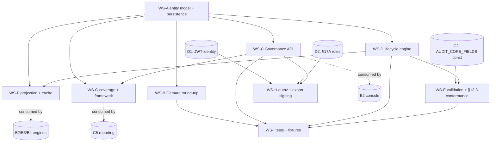

# A1 — Governance Model & Gemara Hierarchy — IMPLEMENTATION PLAN

**Component:** A1 · **Pairs with:** `SPEC.md`, `ADVERSARIAL-REVIEW.md`, `ALT-event-sourced.md`
**Goal:** ship the governance system-of-record (entities, lifecycle, API, lineage, Gemara round-trip) that
every other component traces into via `control_id`.

---

## 1. Workstream breakdown

| WS | Name | Deliverable | Owner discipline |
|---|---|---|---|
| **WS-A** | Entity model & persistence | Postgres schema, append-only revisions, temporal lineage edges, migrations | backend |
| **WS-B** | Gemara round-trip | YAML ↔ entity (de)serializer, schema validation, GitOps import/export, signed deterministic export | backend |
| **WS-C** | Governance API | CRUD + lifecycle transitions + query + coverage + lineage endpoints (§5) | backend/API |
| **WS-D** | Lifecycle engine | control state machine (§4) with guards (incl. §13.3 superset, coverage-gap, enforcement-points checks) | backend |
| **WS-E** | Validation & §13.3 conformance | `AUDIT_CORE_FIELDS` import from C2, superset validator, evidence-drift scanner (F5), orphan-implementation reconciler (F9) | backend |
| **WS-F** | Read projection & cache contract | `GovernanceProjection` publisher, subscription/webhook, staleness/versioning | backend/infra |
| **WS-G** | Coverage & framework cross-ref | FrameworkRequirement, CoverageLink, coverage matrix aggregate (§2.11) | backend |
| **WS-H** | AuthZ integration | server-side §17A role checks, read-scoping/redaction, export signing & hash chain | security |
| **WS-I** | Test harness & fixtures | scenario fixtures DT-01..04/HL-07, contract tests, golden Gemara files | QA |

---

## 2. Dependency DAG

**Hard external prerequisites (stubs acceptable to unblock):**
- C2 must publish `AUDIT_CORE_FIELDS@v1` (a frozen list) before WS-E can enforce A1-MUST-010. **Mitigation:**
  vendor a pinned copy of the §13.3 list as `AUDIT_CORE_FIELDS@v1` constant now (it is literally enumerated in
  §13.3), and replace with C2's published artifact when ready. This removes C2 from A1's critical path.
- D1/D2 needed for WS-H authz. **Mitigation:** behind an `AuthZ` interface with a dev stub (allow-all + audit
  warning) so WS-A..G proceed; real adapter lands when D1/D2 are ready.

---

## 3. What can be built concurrently / what blocks what

**Fully parallel from day 1 (only need the WS-A schema contract frozen):**
- WS-B (Gemara round-trip) and WS-C (API) and WS-D (lifecycle) and WS-G (coverage) all hang off WS-A's schema.
  Freeze the schema contract (entity field list from SPEC §2) in week 1; then B/C/D/G proceed in parallel.

**Blocks:**
- WS-E (validation) blocks the `draft→in_review` transition (it depends on the §13.3 const + WS-D state machine).
- WS-F (projection) blocks B2/B3/B4 caching but A1 itself can ship without it; it is on the *platform* critical
  path, not A1's internal one. Prioritize it because three downstream components wait on it.
- WS-H (export signing + hash chain) blocks the §23/auditor acceptance (AC re: independent verification) but not
  basic CRUD; sequence it after WS-C is stable.

**Critical path:** `WS-A schema → WS-D lifecycle engine → WS-E §13.3 validation → WS-I scenario tests (DT-01..04)`.
Everything else (B, C-query, F, G, H) parallelizes around it. **WS-F is the platform-critical sibling path**
(B2/B3/B4 depend on the projection), so staff it in parallel with the critical path, not after.

---

## 4. Milestones

| M | Milestone | Exit criteria | Scenarios green |
|---|---|---|---|
| **M0** | Schema frozen | Entity DDL reviewed; `control_id` regex + uniqueness index; Gemara YAML schema draft | — |
| **M1** | Authoring core | Create domain/objective/control + 4 requirements via API; `GET` returns inlined requirements | DT-01 (partial) |
| **M2** | Lifecycle + validation | State machine with all guards; §13.3 superset rejection; revisions | DT-01, DT-03 (requirement publish) |
| **M3** | Coverage + framework | Framework refs, CoverageLink, coverage matrix + badge, gap computation | DT-02 |
| **M4** | Deprecation + lineage | deprecate/retire guards, enforcement-points inventory, temporal lineage + `GET /lineage` | DT-04, AC-6 traceability |
| **M5** | Projection + cache | `GovernanceProjection` publish/subscribe; B-layer can cache ExceptionRequirement/claims | unblocks B2/B3/B4 |
| **M6** | AuthZ + signed export | server-side role checks; read-scoping/redaction; deterministic signed export + hash chain | DT-57 (export side), §23 |
| **M7** | Gemara GitOps + HIPAA | full YAML round-trip; new-domain flow with no cross-domain leakage | HL-07 |

---

## 5. Test strategy

1. **Contract tests (API):** every endpoint in §5 with a golden request/response; pagination, ETag/412 concurrency.
2. **State-machine property tests:** exhaustive legal/illegal transitions; assert guards (esp. §13.3 superset,
   coverage-gap, enforcement-points-empty-before-retire). Use a model-based test that random-walks the FSM and
   checks invariants (ID never reused, no destructive history edit).
3. **§13.3 conformance suite:** for each `AUDIT_CORE_FIELDS` field, a control whose EvidenceRequirement omits it
   MUST be rejected; a superset MUST pass. Re-run when C2 bumps the schema version (drives F5 evidence-drift).
4. **Gemara round-trip golden tests:** `yaml → entity → yaml` byte-stable; `x-platform-*` extension preserved;
   known OpenSSF Gemara sample files import without loss.
5. **Lineage/traceability tests:** build a control→rego→constraint→decision edge chain; assert `GET /lineage`
   at `at=T` returns the historically-correct subgraph after a deprecation closes edges (temporal correctness).
6. **Scenario acceptance (WS-I):** DT-01, DT-02, DT-03, DT-04, HL-07 wired end-to-end against the API with
   fixtures; each maps to the SPEC §11 acceptance criteria AC-1..AC-6.
7. **Resilience tests:** A1-down ⇒ enforcement engines keep enforcing from cache (F8/D9); projection staleness
   detection; concurrent-edit 412.
8. **Security tests:** authz negative tests (wrong role rejected), redaction correctness for Auditor/Developer
   scopes, export-tamper detection via hash chain.

---

## 6. Risks & mitigations (plan-level)

| Risk | Impact | Mitigation |
|---|---|---|
| C2 §13.3 list churns | A1 validation invalidated | Pin `@v1`, scan-and-flag (don't auto-edit) on bump (F5) |
| `control_id` scheme contested across domains | rework of join key | Lock D3 in M0; publish allocator + prefix registry early |
| Graph traversal cost on relational store | slow Graph View | Bounded-depth CTE + projection materialization; ALT-event-sourced kept as fallback |
| Two lifecycles (D7) confuse integrators | A2/B mis-wire | Document the event contract between governance-status and enforcement-mode in the DOMAIN-SUMMARY |
| Projection lag breaks exception enforcement | stale exception data at admission | Versioned monotonic projection + staleness alarm (A1-MUST-050) |

---

## 7. Parallelization summary (for the master plan)

- **A1 can start before any other component** (it defines `control_id`, the platform join key) — it is a
  *root* of the platform DAG.
- A1's only true upstream is the §13.3 field list (C2), and that is vendored as a constant, so **A1 is
  effectively unblocked on day 1**.
- A1's WS-F projection is the gating deliverable for B2/B3/B4/D3; prioritize it on the platform critical path.
- A1 ↔ A2 is bidirectional but cleanly event-mediated (status events out, policy_version/enforcement-inventory
  in); the two teams can work in lockstep without code coupling.
