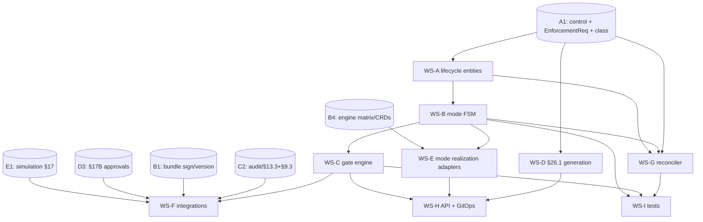

# A2 — Policy Lifecycle — IMPLEMENTATION PLAN

**Component:** A2 · **Pairs with:** `SPEC.md`, `ADVERSARIAL-REVIEW.md`
**Goal:** ship the gated, audited, reversible promotion workflow (draft→dry-run→warn→enforce + rollback) that
moves a Control's executable policy safely into production and back out.

---

## 1. Workstream breakdown

| WS | Name | Deliverable |
|---|---|---|
| **WS-A** | Lifecycle aggregate & persistence | PolicyLifecycle / PolicyImplementation / PromotionEvent entities; ordered immutable event trail |
| **WS-B** | Mode state machine | enforcement-mode FSM (Runtime ladder + Build-Time/Detective short paths); demotion semantics (ungated) |
| **WS-C** | Gate engine | G-AUTHOR/G-SIM-BASELINE/G-DIFF/G-SOAK/G-APPROVE/G-CLASS evaluation + artifact binding; class→gate-set selection |
| **WS-D** | Generation (§26.1) | Gemara→Rego full-vs-template decision, `template_todos`, metadata pre-fill, test scaffold (DT-09) |
| **WS-E** | Engine adapters (mode realization) | abstract `enforce`→concrete (Gatekeeper deny / Conftest fail / analytics emit) via B4; realized-mode readback |
| **WS-F** | Integrations | E1 simulation client, D3 approval client, B1 bundle sign/version client, C2 audit emit |
| **WS-G** | Reconciler | A1-status × A2-mode legality matrix; findings (`governed_not_enforced`, `zombie_enforcement`, `mode_drift`) |
| **WS-H** | API & GitOps | `:promote`/`:demote`/`:generate`/history/enforcement-points endpoints; GitOps commit correlation |
| **WS-I** | Tests & scenario harness | DT-05..09, HL-02/HL-07/HL-17 fixtures; FSM property tests; rollback timing test |

---

## 2. Dependency DAG

---

## 3. Concurrency / what blocks what

**Parallel from day 1 (need only A1's control/class contract + the SPEC mode enum):**
- WS-A, WS-B, WS-D can start immediately against A1 stubs. The mode FSM (WS-B) and generation (WS-D) are
  internal and don't need the live engines.

**Gated:**
- WS-C (gates) needs WS-B (FSM) and the *interfaces* of E1/D3 (not their full impls — stub the simulation/approval
  results to develop gate logic).
- WS-E (realization) needs B4's engine matrix to map abstract→concrete modes; until B4 lands, target a single
  engine (Gatekeeper) so the Runtime ladder is demonstrable.
- WS-F real integrations land as E1/D3/B1/C2 mature; develop against contract stubs first.
- WS-G reconciler needs both A1 status events and A2 mode state; build last but it is **high-value** (it owns the
  A1↔A2 seam the adversarial reviews flag).

**Critical path:** `A1 contract → WS-A → WS-B FSM → WS-C gates → WS-I DT-05 (the canonical promotion scenario)`.
Rollback (DT-06) rides on WS-B demotion semantics and is a fast follow.

---

## 4. Milestones

| M | Milestone | Exit criteria | Scenarios |
|---|---|---|---|
| **M0** | Mode model frozen | EnforcementMode enum, class×mode matrix (§4.4), gate→class mapping agreed with B4 | — |
| **M1** | FSM + Build/Detective short paths | draft→enforce for Conftest/analytics with G-AUTHOR; class-illegal transitions rejected | DT-07, DT-08 |
| **M2** | Generation §26.1 | full-vs-template decision; TODOs block promotion; test scaffold | DT-09 |
| **M3** | Runtime ladder + gates | draft→dry-run→warn→enforce with G-SIM-BASELINE/G-DIFF/G-SOAK/G-APPROVE; PromotionEvents | DT-05 |
| **M4** | Rollback | ungated demotion; <2 min realization; ordered trail + attached diff report | DT-06 |
| **M5** | Reconciler | governed_not_enforced / zombie_enforcement / mode_intent_conflict findings; retire-guard answer to A1 | AC-7 |
| **M6** | Multi-selector rollout | per-cluster modes (hipaa-dev→hipaa-prod); aggregate most-conservative | HL-02, HL-07 |

---

## 5. Test strategy

1. **FSM property tests:** random-walk promote/demote; invariants — (a) promotion only via passing gates,
   (b) demotion always available, (c) demotion preempts in-flight promotion (F5), (d) no class-illegal mode.
2. **Gate tests:** each gate's pass/fail with mocked E1/D3 artifacts; assert PromotionEvent records the binding
   artifact; assert G-DIFF blocks on outstanding `Requires review` rows (DT-05); assert G-AUTHOR blocks on
   `template_todos` (DT-09).
3. **Rollback timing test:** measure demote→realized deny-rate-zero ≤ 2 min against a Gatekeeper test cluster (DT-06).
4. **Separation-of-duties test:** promoter == approver ⇒ G-APPROVE fails; approver verified via JWT group not GUI role.
5. **Generation tests:** deterministic control ⇒ `full`; non-deterministic language ⇒ `template` + TODOs +
   scaffold with one fixture per declared outcome (DT-09).
6. **Reconciler tests:** active+dry-run past SLA ⇒ `governed_not_enforced`; retired+live impl ⇒
   `zombie_enforcement`; mode_intent vs realized conflict ⇒ most-restrictive wins + finding.
7. **Idempotency/atomicity:** `:promote` idempotent on (impl, version, mode); B1 signing failure mid-promote
   leaves no partial state (F3).
8. **Scenario acceptance:** DT-05/06/07/08/09, HL-02, HL-07, HL-17 wired against stubs+real engines.

---

## 6. Risks & mitigations

| Risk | Impact | Mitigation |
|---|---|---|
| E1 simulation not ready ⇒ gates can't evaluate | blocks DT-05 | develop gates against simulation *result contract* stubs; integrate when E1 lands |
| B4 engine matrix late ⇒ abstract→concrete mapping unknown | blocks WS-E | hardcode Gatekeeper mapping first; generalize via B4 adapter |
| Rollback SLA (<2 min) unmet by admission propagation | outage risk | measure early on a real cluster (WS-I); demotion writes constraint directly, bypassing slow GitOps if needed |
| A1↔A2 seam ownership disputed | drift, audit gap | A2 SPEC D5 claims ownership of the reconciler; confirm in DOMAIN-SUMMARY |
| `current_policy_version` authority split | sealed-hash wrong (A1-DEF) | A2 is sole authority (OQ-4); A1 mirrors read-only |

---

## 7. Parallelization summary (for the master plan)

- A2 starts as soon as A1's control/class contract is frozen — **early, alongside A1**.
- A2's gates depend on E1 (simulation) and D3 (approvals) at *runtime*, but the gate *logic* is buildable
  against result-contract stubs, so A2 is not blocked waiting for E1/D3 code.
- WS-E (mode realization) is the integration point with the B-layer; sequence after B4's engine matrix but
  bootstrap on Gatekeeper-only.
- **A2 owns the reconciler (WS-G)** that closes the A1↔A2 lifecycle seam — a cross-cutting deliverable worth
  surfacing to the master plan as a shared-risk item.
